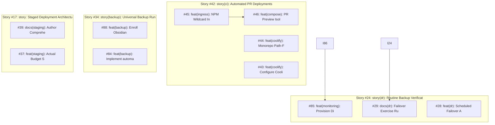

# 🏛️ Backlog Synthesis & Architectural Council Report

- **Repository**: `jacobmiller22/selfhosted`
- **Generated At**: `2026-09-19T15:49:55Z`
- **Engine**: `pm architect` v1.0.0
- **Backlog Health Score**: **100/100** 🟢 Healthy

---

## 1. Executive Summary & Inventory

| Metric | Count | Details |
| :--- | :--- | :--- |
| **Total Open Issues** | `24` | Tracked issues in repository backlog |
| **Parent Stories / Epics** | `4` | Monorepo feature epics (`type:story`) |
| **Shovel-Ready Candidates** | `16` | Unblocked leaf tasks ready for `pm ship` / `pm fleet` |
| **Blocked Tasks** | `3` | Tasks awaiting upstream technical prerequisites |
| **Codebase Fact-Check Clean** | `24` | Verified zero file/service path drift |
| **Asset / Spec Drift Warnings** | `0` | Tickets referencing missing files or spec contradictions |
| **Dependency Cycles** | `0` | None detected 🟢 |
| **Proposed New Tickets** | `2` | Research spikes & information reconciliation tickets |

---

## 2. Benevolent Dictator Homelab Governance Rulings

> The Benevolent Dictator arbitrates all persona deliberations against the User's **Four Non-Negotiable Operational Axioms** for single host `bjorn`:
> 1. **Maximum Server Uptime**: Rejects all-at-once migrations; mandates canary verification.
> 2. **Zero Tolerance for Data Loss**: Mandates verified pre-flight snapshots and rollback scripts for Actual, Vaultwarden, and Home Assistant.
> 3. **Minimal Maintenance Burden**: Vetoes complex orchestrators (k8s/nomad) in favor of simple, self-contained Docker Compose.
> 4. **Single-Server Catastrophe Risk**: Blast radius containment strictly enforced; unprivileged sockets mandated.

### Active Arbitration Rulings:

- **Issue #89**: **AMENDED_WITH_CONSTRAINTS**
  - *Summary*: The Benevolent Dictator intervened under Axiom 4: Single-Server Catastrophe Risk (No HA cluster exists; blast radius must be contained). Mandating 1 strict operational safeguard(s) to protect host 'bjorn'.
  - *Safeguard*: CONTAINMENT MANDATE: bjorn is a single standalone host with no standby failover. Any container requiring docker.sock must use read-only socket mount (:ro) or scoped socket-proxy.
- **Issue #87**: **AMENDED_WITH_CONSTRAINTS**
  - *Summary*: The Benevolent Dictator intervened under Axiom 2: Zero Tolerance for Data Loss (Databases require verified backups & atomic rollback). Mandating 1 strict operational safeguard(s) to protect host 'bjorn'.
  - *Safeguard*: DATA LOSS SAFEGUARD: Pre-flight verified backup and tested atomic rollback script MUST be executed prior to applying storage or schema changes.
- **Issue #45**: **AMENDED_WITH_CONSTRAINTS**
  - *Summary*: The Benevolent Dictator intervened under Axiom 4: Single-Server Catastrophe Risk (No HA cluster exists; blast radius must be contained). Mandating 0 strict operational safeguard(s) to protect host 'bjorn'.
- **Issue #44**: **AMENDED_WITH_CONSTRAINTS**
  - *Summary*: The Benevolent Dictator intervened under Axiom 2: Zero Tolerance for Data Loss (Databases require verified backups & atomic rollback). Mandating 1 strict operational safeguard(s) to protect host 'bjorn'.
  - *Safeguard*: DATA LOSS SAFEGUARD: Pre-flight verified backup and tested atomic rollback script MUST be executed prior to applying storage or schema changes.
- **Issue #43**: **AMENDED_WITH_CONSTRAINTS**
  - *Summary*: The Benevolent Dictator intervened under Axiom 2: Zero Tolerance for Data Loss (Databases require verified backups & atomic rollback). Mandating 1 strict operational safeguard(s) to protect host 'bjorn'.
  - *Safeguard*: DATA LOSS SAFEGUARD: Pre-flight verified backup and tested atomic rollback script MUST be executed prior to applying storage or schema changes.
- **Issue #42**: **AMENDED_WITH_CONSTRAINTS**
  - *Summary*: The Benevolent Dictator intervened under Axiom 2: Zero Tolerance for Data Loss (Databases require verified backups & atomic rollback). Mandating 1 strict operational safeguard(s) to protect host 'bjorn'.
  - *Safeguard*: DATA LOSS SAFEGUARD: Pre-flight verified backup and tested atomic rollback script MUST be executed prior to applying storage or schema changes.
- **Issue #39**: **AMENDED_WITH_CONSTRAINTS**
  - *Summary*: The Benevolent Dictator intervened under Axiom 4: Single-Server Catastrophe Risk (No HA cluster exists; blast radius must be contained). Mandating 0 strict operational safeguard(s) to protect host 'bjorn'.
- **Issue #37**: **AMENDED_WITH_CONSTRAINTS**
  - *Summary*: The Benevolent Dictator intervened under Axiom 2: Zero Tolerance for Data Loss (Databases require verified backups & atomic rollback). Mandating 1 strict operational safeguard(s) to protect host 'bjorn'.
  - *Safeguard*: DATA LOSS SAFEGUARD: Pre-flight verified backup and tested atomic rollback script MUST be executed prior to applying storage or schema changes.
- **Issue #24**: **AMENDED_WITH_CONSTRAINTS**
  - *Summary*: The Benevolent Dictator intervened under Axiom 1: Maximum Server Uptime ('bjorn' must remain online; reject all-at-once migrations). Mandating 1 strict operational safeguard(s) to protect host 'bjorn'.
  - *Safeguard*: UPTIME MANDATE: All migrations must execute in canary or parallel side-by-side mode. Immediate cutover without verified staging validation is forbidden.
- **Issue #17**: **AMENDED_WITH_CONSTRAINTS**
  - *Summary*: The Benevolent Dictator intervened under Axiom 4: Single-Server Catastrophe Risk (No HA cluster exists; blast radius must be contained). Mandating 2 strict operational safeguard(s) to protect host 'bjorn'.
  - *Safeguard*: CONTAINMENT MANDATE: bjorn is a single standalone host with no standby failover. Any container requiring docker.sock must use read-only socket mount (:ro) or scoped socket-proxy.
  - *Safeguard*: UPTIME MANDATE: All migrations must execute in canary or parallel side-by-side mode. Immediate cutover without verified staging validation is forbidden.
- **Issue #11**: **AMENDED_WITH_CONSTRAINTS**
  - *Summary*: The Benevolent Dictator intervened under Axiom 2: Zero Tolerance for Data Loss (Databases require verified backups & atomic rollback). Mandating 1 strict operational safeguard(s) to protect host 'bjorn'.
  - *Safeguard*: DATA LOSS SAFEGUARD: Pre-flight verified backup and tested atomic rollback script MUST be executed prior to applying storage or schema changes.
- **Issue #10**: **AMENDED_WITH_CONSTRAINTS**
  - *Summary*: The Benevolent Dictator intervened under Axiom 2: Zero Tolerance for Data Loss (Databases require verified backups & atomic rollback). Mandating 1 strict operational safeguard(s) to protect host 'bjorn'.
  - *Safeguard*: DATA LOSS SAFEGUARD: Pre-flight verified backup and tested atomic rollback script MUST be executed prior to applying storage or schema changes.
- **Issue #9**: **AMENDED_WITH_CONSTRAINTS**
  - *Summary*: The Benevolent Dictator intervened under Axiom 2: Zero Tolerance for Data Loss (Databases require verified backups & atomic rollback). Mandating 1 strict operational safeguard(s) to protect host 'bjorn'.
  - *Safeguard*: DATA LOSS SAFEGUARD: Pre-flight verified backup and tested atomic rollback script MUST be executed prior to applying storage or schema changes.

---

## 3. Shovel-Ready Execution Order (`pm ship` / `pm fleet`)

The following leaf issues have **zero open blockers** and have been prioritized by topological dependency rank and impact:

| Rank | Issue | Priority | Unblocks Downstream | Recommended Model & Tier |
| :---: | :--- | :---: | :---: | :--- |
| **1** | [#45: feat(ingress): NPM Wildcard Ingress & SSL Routing for Coolify PR Previews](https://github.com/jacobmiller22/selfhosted/issues/45) | `High` | `1 issue(s)` | Gemini 3.8 Flash (High Thinking) |
| **2** | [#9: feat(importer): Mobile-Optimized PWA / Web Upload Gateway for Transaction Ingestion](https://github.com/jacobmiller22/selfhosted/issues/9) | `High` | `Leaf endpoint` | Gemini 3.8 Flash (High Thinking) |
| **3** | [#37: feat(staging): Actual Budget Staging Target for Auto-Categorizer & Vision Importer Testing](https://github.com/jacobmiller22/selfhosted/issues/37) | `High` | `Leaf endpoint` | Gemini 3.8 Flash (High Thinking) |
| **4** | [#39: docs(staging): Author Comprehensive Staging Architecture and Operations Runbook](https://github.com/jacobmiller22/selfhosted/issues/39) | `High` | `Leaf endpoint` | Gemini 3.8 Flash (High Thinking) |
| **5** | [#43: feat(coolify): Configure Coolify FQDN and Register Dedicated GitHub App](https://github.com/jacobmiller22/selfhosted/issues/43) | `High` | `Leaf endpoint` | Gemini 3.8 Flash (High Thinking) |
| **6** | [#44: feat(coolify): Monorepo Path-Filtering & Watch Paths Configuration](https://github.com/jacobmiller22/selfhosted/issues/44) | `High` | `Leaf endpoint` | Gemini 3.8 Flash (High Thinking) |
| **7** | [#86: feat(monitoring): Deploy Blackbox HTTP/TLS exporter in VictoriaMetrics for continuous outside-in service probing](https://github.com/jacobmiller22/selfhosted/issues/86) | `Medium` | `1 issue(s)` | Gemini 3.8 Flash (Medium Thinking) |
| **8** | [#4: feat(backup): Implement automated backup pipelines for Home Assistant, Nginx Proxy Manager, and Coolify State](https://github.com/jacobmiller22/selfhosted/issues/4) | `Medium` | `Leaf endpoint` | Gemini 3.8 Flash (Medium Thinking) |
| **9** | [#10: feat(importer): Bank Transaction Notification & Alert Webhook Gateway (Passive Ingestion)](https://github.com/jacobmiller22/selfhosted/issues/10) | `Medium` | `Leaf endpoint` | Gemini 3.8 Flash (Medium Thinking) |
| **10** | [#11: feat(importer): Containerize Mobile Importer & Integrate into Docker Compose and Nginx Proxy Manager](https://github.com/jacobmiller22/selfhosted/issues/11) | `Medium` | `Leaf endpoint` | Gemini 3.8 Flash (Medium Thinking) |
| **11** | [#28: feat(dr): Scheduled Failover Automation, Dead Man's Snitch Ping & Discord Failure Alerting](https://github.com/jacobmiller22/selfhosted/issues/28) | `Medium` | `Leaf endpoint` | Gemini 3.8 Flash (Medium Thinking) |
| **12** | [#32: feat(backup): Standardize frictionless enrollment pattern for Home Assistant, NPM, and future containers](https://github.com/jacobmiller22/selfhosted/issues/32) | `Medium` | `Leaf endpoint` | Gemini 3.8 Flash (Medium Thinking) |
| **13** | [#33: docs(backup): Document universal backup runner architecture, declarative modes, and enrollment runbook](https://github.com/jacobmiller22/selfhosted/issues/33) | `Medium` | `Leaf endpoint` | Gemini 3.8 Flash (Medium Thinking) |
| **14** | [#84: feat(backup): Implement automated Backblaze B2 snapshot retention policy and archive pruning in backup runner](https://github.com/jacobmiller22/selfhosted/issues/84) | `Medium` | `Leaf endpoint` | Gemini 3.8 Flash (Medium Thinking) |
| **15** | [#87: feat(infra): Standardize Docker daemon log-driver max-size and max-file retention across all compose stacks](https://github.com/jacobmiller22/selfhosted/issues/87) | `Medium` | `Leaf endpoint` | Gemini 3.8 Flash (Medium Thinking) |
| **16** | [#88: feat(backup): Enroll Obsidian CouchDB LiveSync into universal backup runner](https://github.com/jacobmiller22/selfhosted/issues/88) | `Medium` | `Leaf endpoint` | Gemini 3.8 Flash (Medium Thinking) |

---

## 4. Reality Fact-Checking & Asset Verification

Audited all ticket descriptions against repository files, compose configurations, and architecture runbooks (`docs/`):

| Issue | Overall Status | Verified Assets | Flags & Contradictions |
| :---: | :---: | :--- | :--- |
| [#89](https://github.com/jacobmiller22/selfhosted/issues/89) | `🟢 VERIFIED` | • Planned deliverable: dictator.py<br>• Planned deliverable: tickets.py<br>• File: tools/pm_architect/engine | None (Clean) |
| [#88](https://github.com/jacobmiller22/selfhosted/issues/88) | `🟢 VERIFIED` | • File: tools/backup-runner<br>• File: docs/RESTORE.md<br>• File: obsidian/compose.yml | None (Clean) |
| [#87](https://github.com/jacobmiller22/selfhosted/issues/87) | `🟢 VERIFIED` | • File: vaultwarden/compose.yml<br>• Planned deliverable: etc/docker/daemon.json<br>• File: tests/test_remote_host_verification.py | None (Clean) |
| [#86](https://github.com/jacobmiller22/selfhosted/issues/86) | `🟢 VERIFIED` | • File: monitoring/victoriametrics/prometheus.yml<br>• File: monitoring/compose.yml<br>• File: tests/test_monitoring_compose.py | None (Clean) |
| [#85](https://github.com/jacobmiller22/selfhosted/issues/85) | `🟢 VERIFIED` | • File: monitoring/grafana/provisioning/dashboards/dashboards.yml<br>• File: tests/test_monitoring_grafana.py<br>• Planned deliverable: dr-drill.sh | None (Clean) |
| [#84](https://github.com/jacobmiller22/selfhosted/issues/84) | `🟢 VERIFIED` | • File: tools/backup-runner/backup-engine.sh<br>• File: tests/test_backup_runner_migration.py<br>• File: docs/BACKUP_ARCHITECTURE.md | None (Clean) |
| [#46](https://github.com/jacobmiller22/selfhosted/issues/46) | `🟢 VERIFIED` | • File: vaultwarden/compose.yml<br>• File: actual/compose.yml<br>• Service: vaultwarden (vaultwarden/compose.yml) | None (Clean) |
| [#45](https://github.com/jacobmiller22/selfhosted/issues/45) | `🟢 VERIFIED` | • Service: nginx-proxy-manager (nginx-proxy-manager/compose.yml) | None (Clean) |
| [#44](https://github.com/jacobmiller22/selfhosted/issues/44) | `🟢 VERIFIED` | • File: README.md<br>• Service: vaultwarden (vaultwarden/compose.yml)<br>• Service: homeassistant (homeassistant/compose.yml) | None (Clean) |
| [#43](https://github.com/jacobmiller22/selfhosted/issues/43) | `🟢 VERIFIED` | *None declared* | None (Clean) |
| [#42](https://github.com/jacobmiller22/selfhosted/issues/42) | `🟢 VERIFIED` | • Service: vaultwarden (vaultwarden/compose.yml)<br>• Service: homeassistant (homeassistant/compose.yml)<br>• Service: nginx-proxy-manager (nginx-proxy-manager/compose.yml) | None (Clean) |
| [#39](https://github.com/jacobmiller22/selfhosted/issues/39) | `🟢 VERIFIED` | • File: docs/STAGING_ARCHITECTURE.md<br>• Service: vaultwarden (vaultwarden/compose.yml) | None (Clean) |
| [#37](https://github.com/jacobmiller22/selfhosted/issues/37) | `🟢 VERIFIED` | • Planned deliverable: hydrate.sh<br>• Planned deliverable: tools/staging/test-actual-staging.sh<br>• Service: actual-auto-categorizer (actual/compose.yml) | None (Clean) |
| [#34](https://github.com/jacobmiller22/selfhosted/issues/34) | `🟢 VERIFIED` | • Planned deliverable: compose.yml<br>• Planned deliverable: entrypoint.sh<br>• File: tools/backup-runner/ | None (Clean) |
| [#33](https://github.com/jacobmiller22/selfhosted/issues/33) | `🟢 VERIFIED` | • File: tools/backup-runner<br>• File: tools/backup-runner/README.md<br>• File: docs/RESTORE.md | None (Clean) |
| [#32](https://github.com/jacobmiller22/selfhosted/issues/32) | `🟢 VERIFIED` | • Planned deliverable: keys.json<br>• Planned deliverable: hooks/pre-backup.sh<br>• Planned deliverable: home-assistant_v2.db | None (Clean) |
| [#29](https://github.com/jacobmiller22/selfhosted/issues/29) | `🟢 VERIFIED` | • Planned deliverable: docs/DISASTER_RECOVERY_EXERCISES.md<br>• File: docs/RESTORE.md<br>• File: docs/BACKUP_ARCHITECTURE.md | None (Clean) |
| [#28](https://github.com/jacobmiller22/selfhosted/issues/28) | `🟢 VERIFIED` | • Planned deliverable: tools/backup-dr/dr-drill.sh | None (Clean) |
| [#24](https://github.com/jacobmiller22/selfhosted/issues/24) | `🟢 VERIFIED` | • Service: vaultwarden (vaultwarden/compose.yml) | None (Clean) |
| [#17](https://github.com/jacobmiller22/selfhosted/issues/17) | `🟢 VERIFIED` | • Planned deliverable: tools/stage.sh<br>• Planned deliverable: compose.staging.yml<br>• File: tools/staging/hydrate.sh | None (Clean) |
| [#11](https://github.com/jacobmiller22/selfhosted/issues/11) | `🟢 VERIFIED` | • File: actual/compose.yml | None (Clean) |
| [#10](https://github.com/jacobmiller22/selfhosted/issues/10) | `🟢 VERIFIED` | *None declared* | None (Clean) |
| [#9](https://github.com/jacobmiller22/selfhosted/issues/9) | `🟢 VERIFIED` | *None declared* | None (Clean) |
| [#4](https://github.com/jacobmiller22/selfhosted/issues/4) | `🟢 VERIFIED` | • Planned deliverable: home-assistant_v2.db<br>• Planned deliverable: data/keys.json<br>• Planned deliverable: data/database.sqlite | None (Clean) |

---

## 5. Story Hierarchy & Dependency Graph



### Blocked Issues & Required Predecessors:

- **Issue #85** (feat(monitoring): Provision Disaster Recovery & Backup Health Dashboard in Grafana with RTO/RPO Metrics): Blocked by [#86](https://github.com/jacobmiller22/selfhosted/issues/86)
- **Issue #46** (feat(compose): PR Preview Isolation & Port Conflict Safeguards): Blocked by [#45](https://github.com/jacobmiller22/selfhosted/issues/45)
- **Issue #29** (docs(dr): Failover Exercise Runbook, Staging Verification Procedures & RTO/RPO SLAs): Blocked by [#24](https://github.com/jacobmiller22/selfhosted/issues/24)

---

## 6. Proposed New Tickets (Spikes & Reconciliation)

The Architectural Council proposes creating the following research and reconciliation tickets to prevent stalled execution:

### 1. 🔬 Research Spike: `spike(security): Validate unprivileged socket proxy for Issue #89`
- **Labels**: `type:research, priority:high, security`
- **Trigger**: CONTAINMENT MANDATE: bjorn is a single standalone host with no standby failover. Any container requiring docker.sock must use read-only socket mount (:ro) or scoped socket-proxy.
- **Related Issues**: #89

```markdown
## Security Containment Spike

### Dictator Mandate
CONTAINMENT MANDATE: bjorn is a single standalone host with no standby failover. Any container requiring docker.sock must use read-only socket mount (:ro) or scoped socket-proxy.

### Objectives
- [ ] Prototype scoped docker socket proxy (e.g. Tecnativa docker-socket-proxy) with read-only permissions.
- [ ] Verify target container functions without full root `docker.sock` mount.
- [ ] Update Issue #89 compose deliverable with hardened socket configuration.
```

### 2. 🔬 Research Spike: `spike(security): Validate unprivileged socket proxy for Issue #17`
- **Labels**: `type:research, priority:high, security`
- **Trigger**: CONTAINMENT MANDATE: bjorn is a single standalone host with no standby failover. Any container requiring docker.sock must use read-only socket mount (:ro) or scoped socket-proxy.
- **Related Issues**: #17

```markdown
## Security Containment Spike

### Dictator Mandate
CONTAINMENT MANDATE: bjorn is a single standalone host with no standby failover. Any container requiring docker.sock must use read-only socket mount (:ro) or scoped socket-proxy.

### Objectives
- [ ] Prototype scoped docker socket proxy (e.g. Tecnativa docker-socket-proxy) with read-only permissions.
- [ ] Verify target container functions without full root `docker.sock` mount.
- [ ] Update Issue #17 compose deliverable with hardened socket configuration.
```

---

## 7. Recommended Next Actions for TPM / User

1. **Execute Next Shovel-Ready Task**:
   ```bash
   pm ship #45
   ```
2. **Auto-Create Proposed Spikes** (Optional):
   ```bash
   pm architect --create-issues
   ```
3. **Update Issue Labels & Prerequisites** (Optional):
   ```bash
   pm architect --apply
   ```