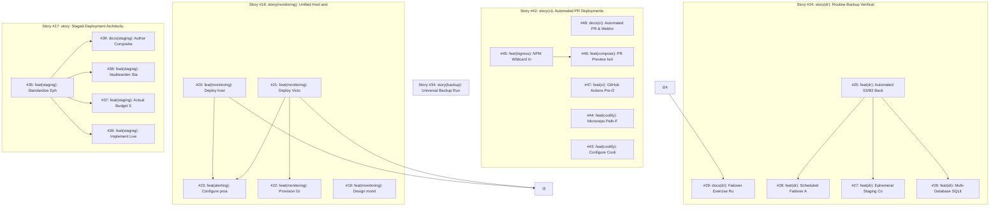

# 🏛️ Backlog Synthesis & Architectural Council Report

- **Repository**: `jacobmiller22/selfhosted`
- **Generated At**: `2026-09-18T16:48:57Z`
- **Engine**: `pm architect` v1.0.0
- **Backlog Health Score**: **79/100** 🟡 Needs Refinement

---

## 1. Executive Summary & Inventory

| Metric | Count | Details |
| :--- | :--- | :--- |
| **Total Open Issues** | `40` | Tracked issues in repository backlog |
| **Parent Stories / Epics** | `5` | Monorepo feature epics (`type:story`) |
| **Shovel-Ready Candidates** | `20` | Unblocked leaf tasks ready for `pm ship` / `pm fleet` |
| **Blocked Tasks** | `12` | Tasks awaiting upstream technical prerequisites |
| **Codebase Fact-Check Clean** | `0` | Verified zero file/service path drift |
| **Asset / Spec Drift Warnings** | `40` | Tickets referencing missing files or spec contradictions |
| **Dependency Cycles** | `0` | None detected 🟢 |
| **Proposed New Tickets** | `3` | Research spikes & information reconciliation tickets |

---

## 2. Benevolent Dictator Homelab Governance Rulings

> The Benevolent Dictator arbitrates all persona deliberations against the User's **Four Non-Negotiable Operational Axioms** for single host `bjorn`:
> 1. **Maximum Server Uptime**: Rejects all-at-once migrations; mandates canary verification.
> 2. **Zero Tolerance for Data Loss**: Mandates verified pre-flight snapshots and rollback scripts for Actual, Vaultwarden, and Home Assistant.
> 3. **Minimal Maintenance Burden**: Vetoes complex orchestrators (k8s/nomad) in favor of simple, self-contained Docker Compose.
> 4. **Single-Server Catastrophe Risk**: Blast radius containment strictly enforced; unprivileged sockets mandated.

### Active Arbitration Rulings:

- **Issue #48**: **AMENDED_WITH_CONSTRAINTS**
  - *Summary*: The Benevolent Dictator intervened under Axiom 4: Single-Server Catastrophe Risk (No HA cluster exists; blast radius must be contained). Mandating 0 strict operational safeguard(s) to protect host 'bjorn'.
- **Issue #45**: **AMENDED_WITH_CONSTRAINTS**
  - *Summary*: The Benevolent Dictator intervened under Axiom 4: Single-Server Catastrophe Risk (No HA cluster exists; blast radius must be contained). Mandating 0 strict operational safeguard(s) to protect host 'bjorn'.
- **Issue #44**: **VETOED**
  - *Summary*: The Benevolent Dictator has vetoed this issue under Axiom 3: Minimal Maintenance Burden ('Set-and-forget'; veto fragile over-engineering).
  - *Safeguard*: DATA LOSS SAFEGUARD: Pre-flight verified backup and tested atomic rollback script MUST be executed prior to applying storage or schema changes.
  - *Veto*: VETOED UNDER AXIOM 3: Heavy multi-node orchestration is strictly vetoed on single host bjorn. The user requires a low-maintenance, 'set-and-forget' stack using Docker Compose.
- **Issue #43**: **AMENDED_WITH_CONSTRAINTS**
  - *Summary*: The Benevolent Dictator intervened under Axiom 2: Zero Tolerance for Data Loss (Databases require verified backups & atomic rollback). Mandating 1 strict operational safeguard(s) to protect host 'bjorn'.
  - *Safeguard*: DATA LOSS SAFEGUARD: Pre-flight verified backup and tested atomic rollback script MUST be executed prior to applying storage or schema changes.
- **Issue #42**: **AMENDED_WITH_CONSTRAINTS**
  - *Summary*: The Benevolent Dictator intervened under Axiom 2: Zero Tolerance for Data Loss (Databases require verified backups & atomic rollback). Mandating 1 strict operational safeguard(s) to protect host 'bjorn'.
  - *Safeguard*: DATA LOSS SAFEGUARD: Pre-flight verified backup and tested atomic rollback script MUST be executed prior to applying storage or schema changes.
- **Issue #41**: **AMENDED_WITH_CONSTRAINTS**
  - *Summary*: The Benevolent Dictator intervened under Axiom 1: Maximum Server Uptime ('bjorn' must remain online; reject all-at-once migrations). Mandating 1 strict operational safeguard(s) to protect host 'bjorn'.
  - *Safeguard*: UPTIME MANDATE: All migrations must execute in canary or parallel side-by-side mode. Immediate cutover without verified staging validation is forbidden.
- **Issue #39**: **AMENDED_WITH_CONSTRAINTS**
  - *Summary*: The Benevolent Dictator intervened under Axiom 4: Single-Server Catastrophe Risk (No HA cluster exists; blast radius must be contained). Mandating 0 strict operational safeguard(s) to protect host 'bjorn'.
- **Issue #37**: **AMENDED_WITH_CONSTRAINTS**
  - *Summary*: The Benevolent Dictator intervened under Axiom 2: Zero Tolerance for Data Loss (Databases require verified backups & atomic rollback). Mandating 1 strict operational safeguard(s) to protect host 'bjorn'.
  - *Safeguard*: DATA LOSS SAFEGUARD: Pre-flight verified backup and tested atomic rollback script MUST be executed prior to applying storage or schema changes.
- **Issue #36**: **AMENDED_WITH_CONSTRAINTS**
  - *Summary*: The Benevolent Dictator intervened under Axiom 1: Maximum Server Uptime ('bjorn' must remain online; reject all-at-once migrations). Mandating 1 strict operational safeguard(s) to protect host 'bjorn'.
  - *Safeguard*: UPTIME MANDATE: All migrations must execute in canary or parallel side-by-side mode. Immediate cutover without verified staging validation is forbidden.
- **Issue #35**: **AMENDED_WITH_CONSTRAINTS**
  - *Summary*: The Benevolent Dictator intervened under Axiom 2: Zero Tolerance for Data Loss (Databases require verified backups & atomic rollback). Mandating 1 strict operational safeguard(s) to protect host 'bjorn'.
  - *Safeguard*: DATA LOSS SAFEGUARD: Pre-flight verified backup and tested atomic rollback script MUST be executed prior to applying storage or schema changes.
- **Issue #24**: **AMENDED_WITH_CONSTRAINTS**
  - *Summary*: The Benevolent Dictator intervened under Axiom 1: Maximum Server Uptime ('bjorn' must remain online; reject all-at-once migrations). Mandating 1 strict operational safeguard(s) to protect host 'bjorn'.
  - *Safeguard*: UPTIME MANDATE: All migrations must execute in canary or parallel side-by-side mode. Immediate cutover without verified staging validation is forbidden.
- **Issue #22**: **AMENDED_WITH_CONSTRAINTS**
  - *Summary*: The Benevolent Dictator intervened under Axiom 2: Zero Tolerance for Data Loss (Databases require verified backups & atomic rollback). Mandating 1 strict operational safeguard(s) to protect host 'bjorn'.
  - *Safeguard*: DATA LOSS SAFEGUARD: Pre-flight verified backup and tested atomic rollback script MUST be executed prior to applying storage or schema changes.
- **Issue #21**: **AMENDED_WITH_CONSTRAINTS**
  - *Summary*: The Benevolent Dictator intervened under Axiom 2: Zero Tolerance for Data Loss (Databases require verified backups & atomic rollback). Mandating 1 strict operational safeguard(s) to protect host 'bjorn'.
  - *Safeguard*: DATA LOSS SAFEGUARD: Pre-flight verified backup and tested atomic rollback script MUST be executed prior to applying storage or schema changes.
- **Issue #18**: **AMENDED_WITH_CONSTRAINTS**
  - *Summary*: The Benevolent Dictator intervened under Axiom 4: Single-Server Catastrophe Risk (No HA cluster exists; blast radius must be contained). Mandating 1 strict operational safeguard(s) to protect host 'bjorn'.
  - *Safeguard*: CONTAINMENT MANDATE: bjorn is a single standalone host with no standby failover. Any container requiring docker.sock must use read-only socket mount (:ro) or scoped socket-proxy.
- **Issue #17**: **AMENDED_WITH_CONSTRAINTS**
  - *Summary*: The Benevolent Dictator intervened under Axiom 4: Single-Server Catastrophe Risk (No HA cluster exists; blast radius must be contained). Mandating 2 strict operational safeguard(s) to protect host 'bjorn'.
  - *Safeguard*: CONTAINMENT MANDATE: bjorn is a single standalone host with no standby failover. Any container requiring docker.sock must use read-only socket mount (:ro) or scoped socket-proxy.
  - *Safeguard*: UPTIME MANDATE: All migrations must execute in canary or parallel side-by-side mode. Immediate cutover without verified staging validation is forbidden.
- **Issue #14**: **AMENDED_WITH_CONSTRAINTS**
  - *Summary*: The Benevolent Dictator intervened under Axiom 2: Zero Tolerance for Data Loss (Databases require verified backups & atomic rollback). Mandating 1 strict operational safeguard(s) to protect host 'bjorn'.
  - *Safeguard*: DATA LOSS SAFEGUARD: Pre-flight verified backup and tested atomic rollback script MUST be executed prior to applying storage or schema changes.
- **Issue #11**: **AMENDED_WITH_CONSTRAINTS**
  - *Summary*: The Benevolent Dictator intervened under Axiom 2: Zero Tolerance for Data Loss (Databases require verified backups & atomic rollback). Mandating 1 strict operational safeguard(s) to protect host 'bjorn'.
  - *Safeguard*: DATA LOSS SAFEGUARD: Pre-flight verified backup and tested atomic rollback script MUST be executed prior to applying storage or schema changes.
- **Issue #10**: **AMENDED_WITH_CONSTRAINTS**
  - *Summary*: The Benevolent Dictator intervened under Axiom 2: Zero Tolerance for Data Loss (Databases require verified backups & atomic rollback). Mandating 1 strict operational safeguard(s) to protect host 'bjorn'.
  - *Safeguard*: DATA LOSS SAFEGUARD: Pre-flight verified backup and tested atomic rollback script MUST be executed prior to applying storage or schema changes.
- **Issue #9**: **AMENDED_WITH_CONSTRAINTS**
  - *Summary*: The Benevolent Dictator intervened under Axiom 2: Zero Tolerance for Data Loss (Databases require verified backups & atomic rollback). Mandating 1 strict operational safeguard(s) to protect host 'bjorn'.
  - *Safeguard*: DATA LOSS SAFEGUARD: Pre-flight verified backup and tested atomic rollback script MUST be executed prior to applying storage or schema changes.
- **Issue #8**: **AMENDED_WITH_CONSTRAINTS**
  - *Summary*: The Benevolent Dictator intervened under Axiom 2: Zero Tolerance for Data Loss (Databases require verified backups & atomic rollback). Mandating 1 strict operational safeguard(s) to protect host 'bjorn'.
  - *Safeguard*: DATA LOSS SAFEGUARD: Pre-flight verified backup and tested atomic rollback script MUST be executed prior to applying storage or schema changes.
- **Issue #3**: **AMENDED_WITH_CONSTRAINTS**
  - *Summary*: The Benevolent Dictator intervened under Axiom 1: Maximum Server Uptime ('bjorn' must remain online; reject all-at-once migrations). Mandating 1 strict operational safeguard(s) to protect host 'bjorn'.
  - *Safeguard*: UPTIME MANDATE: All migrations must execute in canary or parallel side-by-side mode. Immediate cutover without verified staging validation is forbidden.

---

## 3. Shovel-Ready Execution Order (`pm ship` / `pm fleet`)

The following leaf issues have **zero open blockers** and have been prioritized by topological dependency rank and impact:

| Rank | Issue | Priority | Unblocks Downstream | Recommended Model & Tier |
| :---: | :--- | :---: | :---: | :--- |
| **1** | [#35: feat(staging): Standardize Ephemeral Staging Compose Profiles and Port Allocation Schema](https://github.com/jacobmiller22/selfhosted/issues/35) | `High` | `4 issue(s)` | Gemini 3.8 Flash (High Thinking) |
| **2** | [#25: feat(dr): Automated S3/B2 Backup Pull and Zero-Dependency Decryption Test Harness](https://github.com/jacobmiller22/selfhosted/issues/25) | `High` | `3 issue(s)` | Gemini 3.8 Flash (High Thinking) |
| **3** | [#20: feat(monitoring): Deploy host and container telemetry exporters (Node Exporter & cAdvisor)](https://github.com/jacobmiller22/selfhosted/issues/20) | `High` | `2 issue(s)` | Gemini 3.8 Flash (High Thinking) |
| **4** | [#45: feat(ingress): NPM Wildcard Ingress & SSL Routing for Coolify PR Previews](https://github.com/jacobmiller22/selfhosted/issues/45) | `High` | `1 issue(s)` | Gemini 3.8 Flash (High Thinking) |
| **5** | [#9: feat(importer): Mobile-Optimized PWA / Web Upload Gateway for Transaction Ingestion](https://github.com/jacobmiller22/selfhosted/issues/9) | `High` | `Leaf endpoint` | Gemini 3.8 Flash (High Thinking) |
| **6** | [#19: feat(monitoring): Design monitoring architecture & stack specification](https://github.com/jacobmiller22/selfhosted/issues/19) | `High` | `Leaf endpoint` | Gemini 3.8 Flash (High Thinking) |
| **7** | [#30: feat(backup): Build reusable Alpine backup runner image and declarative strategy engine in tools/backup-runner](https://github.com/jacobmiller22/selfhosted/issues/30) | `High` | `Leaf endpoint` | Gemini 3.8 Flash (High Thinking) |
| **8** | [#31: refactor(backup): Migrate Actual Budget & Vaultwarden to shared backup runner and eliminate duplicate scripts](https://github.com/jacobmiller22/selfhosted/issues/31) | `High` | `Leaf endpoint` | Gemini 3.8 Flash (High Thinking) |
| **9** | [#43: feat(coolify): Configure Coolify FQDN and Register Dedicated GitHub App](https://github.com/jacobmiller22/selfhosted/issues/43) | `High` | `Leaf endpoint` | Gemini 3.8 Flash (High Thinking) |
| **10** | [#44: feat(coolify): Monorepo Path-Filtering & Watch Paths Configuration](https://github.com/jacobmiller22/selfhosted/issues/44) | `High` | `Leaf endpoint` | Gemini 3.8 Flash (High Thinking) |
| **11** | [#47: feat(ci): GitHub Actions Pre-Deployment Gatekeeper & Validation Workflow](https://github.com/jacobmiller22/selfhosted/issues/47) | `High` | `Leaf endpoint` | Gemini 3.8 Flash (High Thinking) |
| **12** | [#21: feat(monitoring): Deploy VictoriaMetrics for lightweight time-series storage & scraping](https://github.com/jacobmiller22/selfhosted/issues/21) | `Medium` | `3 issue(s)` | Gemini 3.8 Flash (Medium Thinking) |
| **13** | [#32: feat(backup): Standardize frictionless enrollment pattern for Home Assistant, NPM, and future containers](https://github.com/jacobmiller22/selfhosted/issues/32) | `Medium` | `Leaf endpoint` | Gemini 3.8 Flash (Medium Thinking) |
| **14** | [#33: docs(backup): Document universal backup runner architecture, declarative modes, and enrollment runbook](https://github.com/jacobmiller22/selfhosted/issues/33) | `Medium` | `Leaf endpoint` | Gemini 3.8 Flash (Medium Thinking) |
| **15** | [#40: feat(ai): Establish remote host verification protocol & folder-level AI instructions](https://github.com/jacobmiller22/selfhosted/issues/40) | `Medium` | `Leaf endpoint` | Gemini 3.8 Flash (Medium Thinking) |
| **16** | [#48: docs(ci): Automated PR & Webhook Deployment Architecture Runbook](https://github.com/jacobmiller22/selfhosted/issues/48) | `Medium` | `Leaf endpoint` | Gemini 3.8 Flash (Medium Thinking) |
| **17** | [#4: feat(backup): Implement automated backup pipelines for Home Assistant, Nginx Proxy Manager, and Coolify State](https://github.com/jacobmiller22/selfhosted/issues/4) | `Unspecified` | `Leaf endpoint` | Gemini 3.8 Flash (Medium Thinking) |
| **18** | [#5: docs(backup): Author comprehensive Disaster Recovery & Cold-Storage Restoration Runbook (RESTORE.md)](https://github.com/jacobmiller22/selfhosted/issues/5) | `Unspecified` | `Leaf endpoint` | Gemini 3.8 Flash (Medium Thinking) |
| **19** | [#10: feat(importer): Bank Transaction Notification & Alert Webhook Gateway (Passive Ingestion)](https://github.com/jacobmiller22/selfhosted/issues/10) | `Unspecified` | `Leaf endpoint` | Gemini 3.8 Flash (Medium Thinking) |
| **20** | [#11: feat(importer): Containerize Mobile Importer & Integrate into Docker Compose and Nginx Proxy Manager](https://github.com/jacobmiller22/selfhosted/issues/11) | `Unspecified` | `Leaf endpoint` | Gemini 3.8 Flash (Medium Thinking) |

---

## 4. Reality Fact-Checking & Asset Verification

Audited all ticket descriptions against repository files, compose configurations, and architecture runbooks (`docs/`):

| Issue | Overall Status | Verified Assets | Flags & Contradictions |
| :---: | :---: | :--- | :--- |
| [#48](https://github.com/jacobmiller22/selfhosted/issues/48) | `🟡 DRIFT` | • Planned deliverable: CI/CD<br>• Planned deliverable: docs/CI_CD_COOLIFY_PIPELINE.md | ⚠️ Missing path: pm/HANDOFF.md<br>⚠️ Missing path: README.md |
| [#47](https://github.com/jacobmiller22/selfhosted/issues/47) | `🟡 DRIFT` | • File: tools/backup-runner/<br>• File: actual/backup<br>• File: tools/backup-runner | ⚠️ Missing path: github/workflows/ci.yml |
| [#46](https://github.com/jacobmiller22/selfhosted/issues/46) | `🟡 DRIFT` | • File: vaultwarden/compose.yml<br>• File: actual/compose.yml<br>• Service: vaultwarden (vaultwarden/compose.yml) | ⚠️ Missing path: Coolify/Traefik<br>⚠️ Missing path: untracked/dirty |
| [#45](https://github.com/jacobmiller22/selfhosted/issues/45) | `🟡 DRIFT` | • Service: nginx-proxy-manager (nginx-proxy-manager/compose.yml) | ⚠️ Missing path: HTTP/2<br>⚠️ Missing path: jc21/nginx-proxy-manager |
| [#44](https://github.com/jacobmiller22/selfhosted/issues/44) | `🟡 DRIFT` | • Service: nginx-proxy-manager (nginx-proxy-manager/compose.yml)<br>• Service: vaultwarden (vaultwarden/compose.yml)<br>• Service: homeassistant (homeassistant/compose.yml) | ⚠️ Missing path: jacobmiller22/selfhosted<br>⚠️ Missing path: README.md |
| [#43](https://github.com/jacobmiller22/selfhosted/issues/43) | `🟡 DRIFT` | *None declared* | ⚠️ Missing path: coolify.cloud.jacobmiller22.com/webhooks/source/github/events<br>⚠️ Missing path: jacobmiller22/selfhosted |
| [#42](https://github.com/jacobmiller22/selfhosted/issues/42) | `🟡 DRIFT` | • Service: nginx-proxy-manager (nginx-proxy-manager/compose.yml)<br>• Service: vaultwarden (vaultwarden/compose.yml)<br>• Service: homeassistant (homeassistant/compose.yml) | ⚠️ Missing path: jacobmiller22/selfhosted<br>⚠️ Missing path: 80/443 |
| [#41](https://github.com/jacobmiller22/selfhosted/issues/41) | `🟡 DRIFT` | • Planned deliverable: research/spike<br>• Planned deliverable: ~/.gemini/config/skills/pm/SKILL.md<br>• Planned deliverable: gemini/config/skills/pm/SKILL.md | ⚠️ Missing path: pm/BACKLOG_SYNTHESIS.md<br>⚠️ Missing path: creation/updates |
| [#40](https://github.com/jacobmiller22/selfhosted/issues/40) | `🟡 DRIFT` | • File: tools/<br>• File: tools/backup-runner<br>• File: obsidian/ | ⚠️ Missing path: agents/rules<br>⚠️ Missing path: docs/INFRASTRUCTURE_TOPOLOGY.md<br>❓ assume localhost**, and must systematically **verify which remote host a given service is hosted on** before executing runtime inspection, logs, restarts, or deployment commands |
| [#39](https://github.com/jacobmiller22/selfhosted/issues/39) | `🟡 DRIFT` | • Planned deliverable: docs/STAGING_ARCHITECTURE.md<br>• Service: vaultwarden (vaultwarden/compose.yml) | ⚠️ Missing path: memory/CPU<br>⚠️ Missing path: 80/443 |
| [#38](https://github.com/jacobmiller22/selfhosted/issues/38) | `🟡 DRIFT` | • Planned deliverable: tools/staging/verify-vaultwarden-upgrade.sh<br>• Planned deliverable: tools/staging/verify-vaultwarden-upgrade.sh <new-image-tag><br>• Service: vaultwarden (vaultwarden/compose.yml) | ⚠️ Missing path: 7278/alive<br>⚠️ Missing path: vw-stage-data/db.sqlite3 |
| [#37](https://github.com/jacobmiller22/selfhosted/issues/37) | `🟡 DRIFT` | • Planned deliverable: tools/staging/test-actual-staging.sh<br>• Service: actual-auto-categorizer (actual/compose.yml) | ⚠️ Missing path: ACTUAL_SERVER_URL=http://localhost:5006<br>⚠️ Missing path: categorizer/importer |
| [#36](https://github.com/jacobmiller22/selfhosted/issues/36) | `🟡 DRIFT` | • Planned deliverable: tools/staging/hydrate.sh<br>• Service: vaultwarden (vaultwarden/compose.yml) | ⚠️ Missing path: sends/<br>⚠️ Missing path: tools/staging/hydrate.sh actual [--start] |
| [#35](https://github.com/jacobmiller22/selfhosted/issues/35) | `🟡 DRIFT` | • File: vaultwarden/compose.yml<br>• File: actual/compose.yml<br>• Service: vaultwarden (vaultwarden/compose.yml) | ⚠️ Missing path: DOMAIN="http://localhost:7278" |
| [#34](https://github.com/jacobmiller22/selfhosted/issues/34) | `🟡 DRIFT` | • File: tools/backup-runner/<br>• Planned deliverable: compose.yml<br>• File: tools/backup-runner | ⚠️ Missing path: backup.sh<br>⚠️ Missing path: feat(backup): Build reusable Alpine backup runner image and declarative strategy engine in tools/backup-runner |
| [#33](https://github.com/jacobmiller22/selfhosted/issues/33) | `🟡 DRIFT` | • File: tools/backup-runner<br>• File: docs/BACKUP_ARCHITECTURE.md<br>• File: docs/RESTORE.md | ⚠️ Missing path: tools/backup-runner/README.md |
| [#32](https://github.com/jacobmiller22/selfhosted/issues/32) | `🟡 DRIFT` | • File: homeassistant/<br>• File: homeassistant/compose.yml<br>• File: nginx-proxy-manager/compose.yml | ⚠️ Missing path: config:/config:ro<br>⚠️ Missing path: hooks/pre-backup.sh |
| [#31](https://github.com/jacobmiller22/selfhosted/issues/31) | `🟡 DRIFT` | • File: actual/backup/entrypoint.sh<br>• File: tools/backup-runner<br>• File: actual/backup/Dockerfile | ⚠️ Missing path: tools/backup-runner/backup-engine.sh<br>⚠️ Missing path: BACKUP_SOURCE_DIR=/tmp/actual-data |
| [#30](https://github.com/jacobmiller22/selfhosted/issues/30) | `🟡 DRIFT` | • File: tools/backup-runner/<br>• File: tools/backup-runner<br>• File: docs/RESTORE.md | ⚠️ Missing path: run/secrets/env_vars<br>⚠️ Missing path: hooks/pre-backup.sh |
| [#29](https://github.com/jacobmiller22/selfhosted/issues/29) | `🟡 DRIFT` | • Planned deliverable: RTO/RPO<br>• File: docs/RESTORE.md<br>• Planned deliverable: manual/automated | ⚠️ Missing path: docs/DISASTER_RECOVERY_EXERCISES.md |
| [#28](https://github.com/jacobmiller22/selfhosted/issues/28) | `🟡 DRIFT` | • Planned deliverable: tools/backup-dr/dr-drill.sh | ⚠️ Missing path: RTO/RPO<br>⚠️ Missing path: stdout/stderr |
| [#27](https://github.com/jacobmiller22/selfhosted/issues/27) | `🟡 DRIFT` | • Service: vaultwarden (vaultwarden/compose.yml) | ⚠️ Missing path: curl -fsS http://localhost:7278/alive<br>⚠️ Missing path: 200/302 |
| [#26](https://github.com/jacobmiller22/selfhosted/issues/26) | `🟡 DRIFT` | • Service: vaultwarden (vaultwarden/compose.yml) | ⚠️ Missing path: sends/<br>⚠️ Missing path: tools/backup-dr/verify-db-integrity.sh |
| [#25](https://github.com/jacobmiller22/selfhosted/issues/25) | `🟡 DRIFT` | • File: tools/backup-runner/test-backup-restore.sh | ⚠️ Missing path: S3/B2<br>⚠️ Missing path: tools/backup-dr/pull-and-decrypt.sh |
| [#24](https://github.com/jacobmiller22/selfhosted/issues/24) | `🟡 DRIFT` | • Service: vaultwarden (vaultwarden/compose.yml) | ⚠️ Missing path: docs(dr): Failover Exercise Runbook, Staging Verification Procedures & RTO/RPO SLAs<br>⚠️ Missing path: S3/B2 |
| [#23](https://github.com/jacobmiller22/selfhosted/issues/23) | `🟡 DRIFT` | • Service: nginx-proxy-manager (nginx-proxy-manager/compose.yml)<br>• Service: vaultwarden (vaultwarden/compose.yml)<br>• Service: actual_server (actual/compose.yml) | ⚠️ Missing path: container/mount<br>⚠️ Missing path: monitoring/grafana/provisioning/alerting |
| [#22](https://github.com/jacobmiller22/selfhosted/issues/22) | `🟡 DRIFT` | • File: <br>• Service: nginx-proxy-manager (nginx-proxy-manager/compose.yml)<br>• Service: vaultwarden (vaultwarden/compose.yml) | ⚠️ Missing path: Read/write<br>⚠️ Missing path: upload/download |
| [#21](https://github.com/jacobmiller22/selfhosted/issues/21) | `🟡 DRIFT` | *None declared* | ⚠️ Missing path: monitoring/victoriametrics/prometheus.yml<br>⚠️ Missing path: etc/prometheus/prometheus.yml |
| [#20](https://github.com/jacobmiller22/selfhosted/issues/20) | `🟡 DRIFT` | • Service: vaultwarden (vaultwarden/compose.yml) | ⚠️ Missing path: dev/disk<br>⚠️ Missing path: metrics |
| [#19](https://github.com/jacobmiller22/selfhosted/issues/19) | `🟡 DRIFT` | • Service: nginx-proxy-manager (nginx-proxy-manager/compose.yml) | ⚠️ Missing path: monitoring/victoriametrics/prometheus.yml<br>⚠️ Missing path: docs/MONITORING_ARCHITECTURE.md |
| [#18](https://github.com/jacobmiller22/selfhosted/issues/18) | `🟡 DRIFT` | • File: <br>• Service: nginx-proxy-manager (nginx-proxy-manager/compose.yml)<br>• Service: vaultwarden (vaultwarden/compose.yml) | ⚠️ Missing path: rx/tx<br>⚠️ Missing path: grafana/grafana-oss |
| [#17](https://github.com/jacobmiller22/selfhosted/issues/17) | `🟡 DRIFT` | • File: docs/BACKUP_ARCHITECTURE.md<br>• Service: vaultwarden (vaultwarden/compose.yml)<br>• Service: actual-auto-categorizer (actual/compose.yml) | ⚠️ Missing path: CPU/memory<br>⚠️ Missing path: Passwords/2FA |
| [#14](https://github.com/jacobmiller22/selfhosted/issues/14) | `🟡 DRIFT` | • Planned deliverable: budget-upload<br>• Planned deliverable: agents/skills/budget-upload | ⚠️ Missing path: agents/skills/budget-upload/SKILL.md<br>⚠️ Missing path: @actual-app/api |
| [#11](https://github.com/jacobmiller22/selfhosted/issues/11) | `🟡 DRIFT` | • File: actual/compose.yml | ⚠️ Missing path: Node.js/TypeScript |
| [#10](https://github.com/jacobmiller22/selfhosted/issues/10) | `🟡 DRIFT` | *None declared* | ⚠️ Missing path: cleared/pending<br>⚠️ Missing path: push/email |
| [#9](https://github.com/jacobmiller22/selfhosted/issues/9) | `🟡 DRIFT` | *None declared* | ⚠️ Missing path: actual-app/api<br>⚠️ Missing path: @actual-app/api |
| [#8](https://github.com/jacobmiller22/selfhosted/issues/8) | `🟡 DRIFT` | *None declared* | ⚠️ Missing path: positive/negative<br>⚠️ Missing path: mappings.json |
| [#5](https://github.com/jacobmiller22/selfhosted/issues/5) | `🟡 DRIFT` | • Service: vaultwarden (vaultwarden/compose.yml) | ⚠️ Missing path: macOS/Linux |
| [#4](https://github.com/jacobmiller22/selfhosted/issues/4) | `🟡 DRIFT` | *None declared* | ⚠️ Missing path: data/keys.json<br>⚠️ Missing path: data/database.sqlite |
| [#3](https://github.com/jacobmiller22/selfhosted/issues/3) | `🟡 DRIFT` | • Planned deliverable: Coolify/Discord | ⚠️ Missing path: container/task |

---

## 5. Story Hierarchy & Dependency Graph



### Blocked Issues & Required Predecessors:

- **Issue #46** (feat(compose): PR Preview Isolation & Port Conflict Safeguards): Blocked by [#45](https://github.com/jacobmiller22/selfhosted/issues/45)
- **Issue #39** (docs(staging): Author Comprehensive Staging Architecture and Operations Runbook): Blocked by [#35](https://github.com/jacobmiller22/selfhosted/issues/35)
- **Issue #38** (feat(staging): Vaultwarden Staging Upgrade Sandbox & Safe Schema Migration Runbook): Blocked by [#35](https://github.com/jacobmiller22/selfhosted/issues/35)
- **Issue #37** (feat(staging): Actual Budget Staging Target for Auto-Categorizer & Vision Importer Testing): Blocked by [#35](https://github.com/jacobmiller22/selfhosted/issues/35)
- **Issue #36** (feat(staging): Implement Live Production Snapshot Hydration Engine (tools/staging/hydrate.sh)): Blocked by [#35](https://github.com/jacobmiller22/selfhosted/issues/35)
- **Issue #29** (docs(dr): Failover Exercise Runbook, Staging Verification Procedures & RTO/RPO SLAs): Blocked by [#24](https://github.com/jacobmiller22/selfhosted/issues/24)
- **Issue #28** (feat(dr): Scheduled Failover Automation, Dead Man's Snitch Ping & Discord Failure Alerting): Blocked by [#25](https://github.com/jacobmiller22/selfhosted/issues/25)
- **Issue #27** (feat(dr): Ephemeral Staging Container Spin-Up, Isolated Network Smoke Testing & Teardown): Blocked by [#25](https://github.com/jacobmiller22/selfhosted/issues/25)
- **Issue #26** (feat(dr): Multi-Database SQLite & PostgreSQL Automated Integrity, Foreign Key & Record Count Sanity Suite): Blocked by [#25](https://github.com/jacobmiller22/selfhosted/issues/25)
- **Issue #23** (feat(alerting): Configure proactive Discord threshold alerting for disk exhaustion and container failures): Blocked by [#20](https://github.com/jacobmiller22/selfhosted/issues/20), [#21](https://github.com/jacobmiller22/selfhosted/issues/21)
- **Issue #22** (feat(monitoring): Provision Grafana with service resource leaderboards and live host gauges): Blocked by [#21](https://github.com/jacobmiller22/selfhosted/issues/21)
- **Issue #3** (feat(alerting): Implement backup failure alerting and Dead Man's Snitch monitoring via Coolify/Discord): Blocked by [#20](https://github.com/jacobmiller22/selfhosted/issues/20), [#21](https://github.com/jacobmiller22/selfhosted/issues/21)

---

## 6. Proposed New Tickets (Spikes & Reconciliation)

The Architectural Council proposes creating the following research and reconciliation tickets to prevent stalled execution:

### 1. 🔬 Research Spike: `spike(research): Investigate assumption for Issue #40 (assume localhost**, and must systematically **veri)`
- **Labels**: `type:research, priority:medium`
- **Trigger**: assume localhost**, and must systematically **verify which remote host a given service is hosted on** before executing runtime inspection, logs, restarts, or deployment commands
- **Related Issues**: #40

```markdown
## Technical Research Spike (`type:research`)

### Context & Gap Analysis
Issue #40 contains an unverified technical assumption:
> "assume localhost**, and must systematically **verify which remote host a given service is hosted on** before executing runtime inspection, logs, restarts, or deployment commands"

To ensure execution velocity and eliminate downstream agent failures during `pm ship`, this dedicated research spike will prove or disprove the hypothesis.

### Spike Objectives
- [ ] Benchmark or verify expected runtime behavior / API contract in isolation.
- [ ] Document findings and concrete constraints in `docs/` or issue comments.
- [ ] Transition Issue #40 acceptance criteria from assumption to verified specification.

### Related Issues
- Prerequisites for: #40
```

### 2. 🔬 Research Spike: `spike(security): Validate unprivileged socket proxy for Issue #18`
- **Labels**: `type:research, priority:high, security`
- **Trigger**: CONTAINMENT MANDATE: bjorn is a single standalone host with no standby failover. Any container requiring docker.sock must use read-only socket mount (:ro) or scoped socket-proxy.
- **Related Issues**: #18

```markdown
## Security Containment Spike

### Dictator Mandate
CONTAINMENT MANDATE: bjorn is a single standalone host with no standby failover. Any container requiring docker.sock must use read-only socket mount (:ro) or scoped socket-proxy.

### Objectives
- [ ] Prototype scoped docker socket proxy (e.g. Tecnativa docker-socket-proxy) with read-only permissions.
- [ ] Verify target container functions without full root `docker.sock` mount.
- [ ] Update Issue #18 compose deliverable with hardened socket configuration.
```

### 3. 🔬 Research Spike: `spike(security): Validate unprivileged socket proxy for Issue #17`
- **Labels**: `type:research, priority:high, security`
- **Trigger**: CONTAINMENT MANDATE: bjorn is a single standalone host with no standby failover. Any container requiring docker.sock must use read-only socket mount (:ro) or scoped socket-proxy.
- **Related Issues**: #17

```markdown
## Security Containment Spike

### Dictator Mandate
CONTAINMENT MANDATE: bjorn is a single standalone host with no standby failover. Any container requiring docker.sock must use read-only socket mount (:ro) or scoped socket-proxy.

### Objectives
- [ ] Prototype scoped docker socket proxy (e.g. Tecnativa docker-socket-proxy) with read-only permissions.
- [ ] Verify target container functions without full root `docker.sock` mount.
- [ ] Update Issue #17 compose deliverable with hardened socket configuration.
```

---

## 7. Recommended Next Actions for TPM / User

1. **Execute Next Shovel-Ready Task**:
   ```bash
   pm ship #35
   ```
2. **Auto-Create Proposed Spikes** (Optional):
   ```bash
   pm architect --create-issues
   ```
3. **Update Issue Labels & Prerequisites** (Optional):
   ```bash
   pm architect --apply
   ```