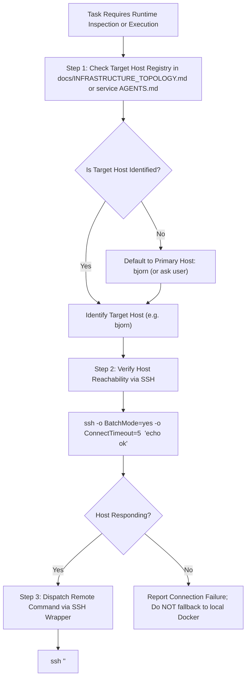
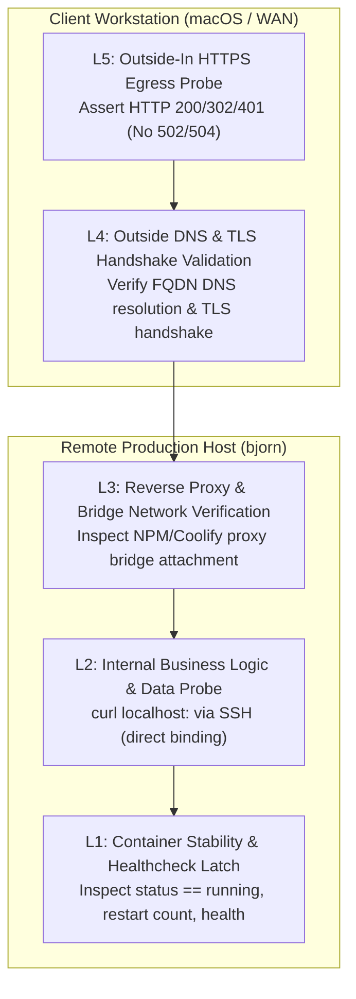

# Universal AI Agent Directives (`AGENTS.md`)

This file defines the mandatory operational protocols and constraints for all AI coding assistants (including Antigravity, Claude Code, Cursor, Copilot, and custom agentic runners) operating within the `selfhosted` repository.

---

## 1. Remote-First Operational Rule

> [!CRITICAL]
> **This repository manages REMOTE production server infrastructure.**
> **NEVER assume `localhost`, `127.0.0.1`, or local Docker daemon execution for runtime operations.**

- **Target Architecture**: All containers, volumes, reverse proxy routes, and system services execute on remote bare-metal Linux servers (primary host: **`bjorn`**).
- **Workstation Role**: The local machine running the AI coding assistant is a macOS development workstation. Local commands must only manipulate repository source files, run unit tests/linters, or dispatch commands remotely over SSH.
- **Port Assumption Trap**: Localhost ports (e.g. `localhost:8123`, `localhost:5006`, `localhost:81`) do NOT map to live self-hosted services unless an explicit SSH port-forward has been opened. Always use Tailscale MagicDNS (`http://bjorn:<port>`) or public proxy URLs (`https://*.cloud.jacobmiller22.com`).

---

## 2. Remote Host Verification Protocol (RHVP)

Before proposing or executing ANY runtime command (e.g., `docker`, `docker compose`, `systemctl`, `sqlite3`, curl checks, log inspections, service restarts), you MUST execute the following verification steps:

### Protocol Steps



### Standard Command Dispatch Patterns

| Operation | Canonical Remote Command Pattern |
| :--- | :--- |
| **Check Host Reachability** | `ssh -o BatchMode=yes -o ConnectTimeout=5 bjorn "echo ok"` |
| **Inspect Running Containers** | `ssh bjorn "docker ps --filter name=<service>"` |
| **View Container Logs** | `ssh bjorn "docker logs --tail 100 <container-name>"` |
| **Execute in Container** | `ssh bjorn "docker exec <container-name> <command>"` |
| **Restart Stack / Container** | `ssh bjorn "docker restart <container-name>"` |
| **Query Internal Endpoint** | `ssh bjorn "curl -fsS http://localhost:<port>/<path>"` |
| **Safe SQLite Snapshot** | `ssh bjorn "sqlite3 /path/to/db.sqlite '.backup /path/to/snapshot.sqlite'"` |
| **File Transfer / Hot Patch** | `scp -r <local-dist> bjorn:/tmp/<staging>/ && ssh bjorn "docker cp /tmp/<staging>/. <container>:<dest>"` |

---

## 3. Outside-In Remote Deployment Verification Protocol (ODVP)

> [!CRITICAL]
> **A container reporting status `running` locally on `bjorn` does NOT constitute a healthy deployment.**
> Runtime health must be proven across all 5 operational layers from bare-metal container execution to client-side HTTPS egress.

### The 5-Layer Verification Model



| Layer | Verification Name | Execution Scope | Verification Objective | Canonical Pattern / Tool Command |
| :--- | :--- | :--- | :--- | :--- |
| **L1** | **Container Stability & Healthcheck Latch** | Remote Host (`bjorn`) | Confirm container is `running`, zero restart loops, healthy | `ssh bjorn "docker inspect --format '{{.State.Status}}' <svc>"` |
| **L2** | **Internal Business Logic & Data Probe** | Remote Host (`bjorn`) | Verify daemon is bound to port and responding before proxy | `ssh bjorn "curl -fsS http://localhost:<port>/"` |
| **L3** | **Reverse Proxy & Bridge Network** | Remote Host (`bjorn`) | Verify container bridge network & NPM upstream routing | `ssh bjorn "docker network inspect bridge ..."` |
| **L4** | **Outside DNS & TLS Handshake Validation** | Client Workstation | Resolve public DNS records and validate valid TLS certificate | `dig +short <fqdn> && curl -vI https://<fqdn>` |
| **L5** | **Outside-In HTTPS Egress Probe** | Client Workstation | End-to-end client probe; assert 200/302/401; no 502/504 | `curl -fsS -o /dev/null -w "%{http_code}" https://<fqdn>` |

### Automated Verification Smoke Harness

All services can be verified end-to-end using the automated deployment smoke harness:
```bash
# Full 5-layer verification (L1-L5):
./tools/verify-deployment/verify_service.sh --host bjorn --service <container> --internal-port <port> --url <https-url>

# Client-only outside-in verification (L4-L5):
./tools/verify-deployment/verify_service.sh --skip-remote --url <https-url>

# Dry-run execution validation:
./tools/verify-deployment/verify_service.sh --service <container> --internal-port <port> --url <https-url> --dry-run
```

---

## 4. Git Worktree Protocol with Worktrunk (`wt`)

> [!IMPORTANT]
> **NEVER make code changes directly on the primary working tree or default branch (`main` or `master`).**
> Always spawn and switch to an isolated Git worktree using Worktrunk (`wt`).

### Operational Guidelines
1. **Verify Git Repository**: Check status via `git status` or `wt list`.
2. **Derive Branch Name**: Use descriptive kebab-case names: `feat/<name>`, `fix/<name>`, `feature/<issue-number>-<slug>`.
3. **Spawn Worktree**: Run `wt switch --create <branch-name>` (or `wt switch <branch-name>`).
4. **Confine Work to Worktree**:
   - Terminal commands (`run_command`) MUST have `Cwd` set to the worktree path (`../selfhosted.<branch-name>`).
   - All file operations (`view_file`, `write_to_file`, `replace_file_content`) MUST target files inside the worktree path.
   - Background tasks and subagents MUST inherit the worktree directory.
5. **Completion**: Commit changes, push branch, open PR, and inform the user of `wt merge`.

---

## 5. Zero Untracked Work Protocol (`pm`)

> [!IMPORTANT]
> **NEVER perform untracked "ghost work" that is lost to history.**
> All changes must be linked to a tracked task, GitHub issue, and Pull Request.

1. **Task Association / Auto-Creation**:
   - Check open issues via `gh issue list`. If an issue exists, associate with `Issue #<N>`.
   - If no issue exists, automatically create one before modifying code:
     ```bash
     gh issue create --title "<type>: <title>" --body "..." --label "status:in-progress"
     ```
   - Worktree branches should be named after the issue: `feature/<N>-<slug>` or `fix/<N>-<slug>`.
2. **Audit Trail & PR Linking**:
   - Post progress updates on the issue via `gh issue comment <N>`.
   - Open Pull Request with mandatory reference: `Fixes #<N>`.
3. **PR-Gated Closure**:
   - Never close an issue while its PR is open. Mark issue with `status:completed` and let the PR merge trigger issue closure.
4. **Session Continuity**:
   - Document in-flight state in the issue or `.pm/HANDOFF.md` so work can be resumed without context loss.

---

## 6. Security & Secret Hygiene

1. **Zero Plaintext Secrets in Git**:
   - Never commit `.env`, `secrets.yaml`, private keys (`rsa_key.pem`, `id_ed25519`), credentials, or raw unencrypted backup dumps.
   - Keep `.gitignore` strictly updated for all sensitive data files.
2. **Offline Master Passphrase Model**:
   - Encryption passphrases (`BACKUP_PASSPHRASE`) are stored in physical offline fireproof storage, NEVER in Git.
   - At runtime on `bjorn`, secrets are injected exclusively via Coolify environment variables or protected Docker secrets.
3. **Non-Destructive Operations**:
   - Never run `docker rm -f`, `docker system prune -a --volumes`, or raw filesystem `rm -rf` on persistent data volumes without explicit user confirmation.
   - Never perform direct file copying on active SQLite databases; always use `sqlite3 <db> ".backup <dest>"`.

---

## 7. Service & Subsystem Navigation

When working inside a specific service directory, consult its folder-level `AGENTS.md` and [docs/INFRASTRUCTURE_TOPOLOGY.md](file:///Users/jacobmiller22/projects/selfhosted.feature-task-40-remote-host-verification/docs/INFRASTRUCTURE_TOPOLOGY.md):

- [actual/AGENTS.md](file:///Users/jacobmiller22/projects/selfhosted.feature-task-40-remote-host-verification/actual/AGENTS.md) – Actual Budget server, auto-backup runner, TypeScript ML sidecar.
- [homeassistant/AGENTS.md](file:///Users/jacobmiller22/projects/selfhosted.feature-task-40-remote-host-verification/homeassistant/AGENTS.md) – Home Assistant, host networking mode, WebSocket requirements, trusted proxies.
- [vaultwarden/AGENTS.md](file:///Users/jacobmiller22/projects/selfhosted.feature-task-40-remote-host-verification/vaultwarden/AGENTS.md) – Bitwarden vault, SQLite locking, `rsa_key.pem` permissions, read-only backup mounts.
- [nginx-proxy-manager/AGENTS.md](file:///Users/jacobmiller22/projects/selfhosted.feature-task-40-remote-host-verification/nginx-proxy-manager/AGENTS.md) – Central reverse proxy, port 81 admin, SSL certificates in `/etc/letsencrypt`.
- [tools/backup-runner/AGENTS.md](file:///Users/jacobmiller22/projects/selfhosted.feature-task-40-remote-host-verification/tools/backup-runner/AGENTS.md) – Alpine backup container, OpenSSL AES-256-CBC PBKDF2, B2 rotation, Discord/Snitch monitoring.
- [obsidian/AGENTS.md](file:///Users/jacobmiller22/projects/selfhosted.feature-task-40-remote-host-verification/obsidian/AGENTS.md) – Obsidian CouchDB LiveSync backend.
- [reiner-cam/AGENTS.md](file:///Users/jacobmiller22/projects/selfhosted.feature-task-40-remote-host-verification/reiner-cam/AGENTS.md) – Motion camera daemon and hardware device passthrough.
