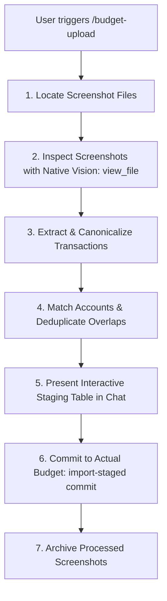

# Mobile Banking Screenshot & Statement Importer (`/budget-upload`)

This skill enables Antigravity to act as an authenticated, zero-setup financial optical scanner. It inspects mobile banking screenshots directly via **Antigravity native multimodal vision** (no separate Google AI Studio API key required), extracts and normalizes transaction data, presents an interactive staging review, and imports verified transactions into **Actual Budget** via `@actual-app/api`.

---

## 🚀 Invocation & Triggering

The user triggers this skill by typing:
- `/budget-upload` (or `/budget-upload <path-to-screenshot-or-folder>`)
- *"Import my bank screenshots"*
- Dragging and dropping screenshot images into the chat and saying *"Upload these to Actual"*

---

## 🧭 Step-by-Step Execution Workflow



---

### Step 1: Locate Target Screenshots or Statements

1. **Explicit Path / Chat Attachments**:
   If the user specified a path or attached images in the conversation, target those files immediately.
2. **Default Staging Directories**:
   If no path is provided, inspect the user's default budget staging directories:
   - `/Users/jacobmiller22/Downloads/budget/sep`
   - `/Users/jacobmiller22/Downloads/budget`
   - `~/Downloads` (filter for recent screenshot patterns like `Screen Shot *.png` or `IMG_*.PNG`)

Run a quick scan for unarchived files:
```bash
find /Users/jacobmiller22/Downloads/budget -maxdepth 2 -type f \( -name "*.png" -o -name "*.jpg" -o -name "*.jpeg" -o -name "*.webp" -o -name "*.heic" -o -name "*.csv" -o -name "*.ofx" -o -name "*.qfx" -o -name "*.qbo" -o -name "*.qif" \) -not -path "*/archived/*"
```

---

### Step 2: Native Multimodal Vision Inspection (`view_file`)

For each image file, call the native tool `view_file` on the file path.

> [!NOTE]
> Antigravity's active model natively sees the image without requiring an external Gemini API key.

Examine the image carefully for:
1. **Account Identification**:
   - Header title, card art, or account suffix (e.g. `360 Checking ...9661`, `Joint Savings ...6404`, `Quicksilver`, `Savor`, `Discover`, `Venture`).
2. **Date Entries**:
   - Relative strings: `'Today'`, `'Yesterday'`, day of week (`'Monday'`), short dates (`'Sep 15'`).
3. **Payee & Merchant Description**:
   - Clean title-cased payee name (e.g. `Trader Joe's`).
   - Original raw OCR line item (e.g. `TRADER JOES #542 SEATTLE WA`).
4. **Amount & Sign**:
   - **Expenses / Charges / Outflows**: MUST be **NEGATIVE** (e.g. -$42.50 / -4250 cents).
   - **Income / Deposits / Credits / Refunds**: MUST be **POSITIVE** (e.g. +$2,500.00 / +250000 cents).
5. **Status**:
   - `'pending'` if marked with Pending, Processing, or Hold; otherwise `'cleared'`.

---

### Step 3: Canonicalize & Normalize

1. **Date Resolution**:
   Resolve relative dates against the current system date (`$(date +%Y-%m-%d)`):
   - `'Today'` -> Current date (`YYYY-MM-DD`).
   - `'Yesterday'` -> Current date minus 1 day.
   - Weekdays (`'Monday'`, etc.) -> Most recent preceding day of week.
   - Short dates (`'Sep 15'`) -> Attach current year (`YYYY-09-15`).
2. **Account Matching**:
   Compare detected account clues against `mappings.json` and Actual Budget accounts:
   - `9661` / `checking` -> `360 Checking [J]` (`6fd7b088-005e-4254-9d3c-3eb231a3f66c`)
   - `6404` / `savings` -> `Savings Joint` (`6243aa92-178b-48cb-9332-197db4057b86`)
   - `savor` -> `Savor Card [J]` (`143958c8-f172-41f3-b6f6-5c4dac4b785b`)
   - `quicksilver` -> `Quicksilver Card [J]` (`32f64b7e-791b-43e5-a0ae-55d40be55821`)
   - `venture` -> `Venture Card [P]` (`b2d49378-ea68-4810-a5e0-fc96d0a82d68`)
   - `discover` -> `Discover Card [J]` (`5c9052d0-2b08-4c2b-b448-af95c66eb04a`)
3. **Intra-Batch Deduplication**:
   If the user captured multiple overlapping scrolling screenshots, remove duplicate rows sharing identical `(date, amount, normalized_payee)`.

---

### Step 4: Present Interactive Staging Review Table

Before modifying Actual Budget, output a clean, formatted review card in the chat:

```markdown
### 💳 Staged Transactions for Actual Budget

| # | Date | Account | Payee | Amount | Status | Notes |
|---|---|---|---|---|---|---|
| 1 | 2026-09-16 | 360 Checking [J] | Trader Joe's | -$42.50 | 🟢 Cleared | TRADER JOES #542 |
| 2 | 2026-09-15 | 360 Checking [J] | Payroll Deposit | +$2,500.00 | 🟢 Cleared | ACME CORP |
| 3 | 2026-09-14 | Savor Card [J] | Blue Bottle Coffee | -$6.75 | 🟡 Pending | Pending charge |

**Summary**: 3 transactions staged | **Net Flow**: +$2,450.75
```

---

### Step 5: Commit to Actual Budget

Execute the bridge CLI tool `import-staged` using `run_command` in `actual/tools/transaction-importer`:

```bash
npx tsx actual/tools/transaction-importer/src/import-staged.ts commit --json '[
  {
    "account_id": "6fd7b088-005e-4254-9d3c-3eb231a3f66c",
    "date": "2026-09-16",
    "amount_cents": -4250,
    "payee_name": "Trader Joe'\''s",
    "notes": "TRADER JOES #542",
    "cleared": true
  }
]'
```

*(If the user explicitly asked for `--dry-run`, append `--dry-run` to the command above).*

---

### Step 6: Post-Processing Archive

Once imported, move the processed screenshots into the `archived/` subfolder so they are never re-processed:

```bash
npx tsx actual/tools/transaction-importer/src/import-staged.ts archive /path/to/processed_screenshot.png
```

Deliver a final confirmation card to the user:
```markdown
✅ **Successfully Imported to Actual Budget**
- **Imported**: 3 transactions added (0 duplicates skipped)
- **Accounts**: 360 Checking [J] (2 txs), Savor Card [J] (1 tx)
- **Archived**: Moved 2 screenshots to `archived/`
```
