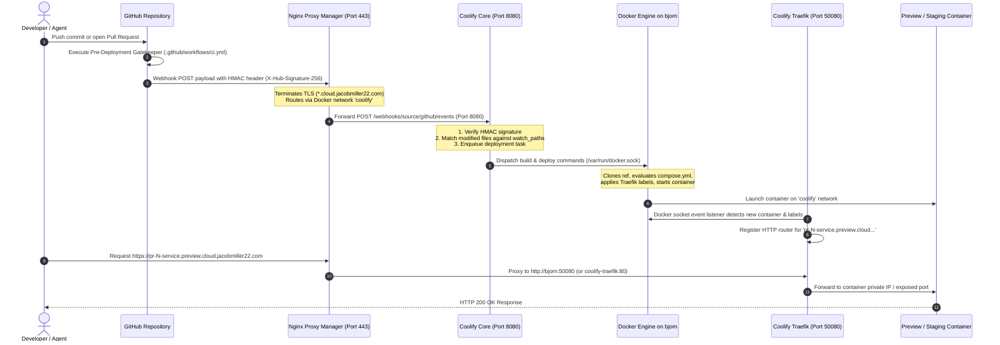
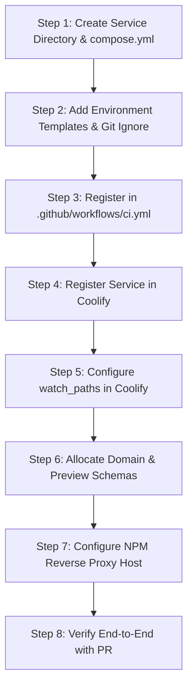
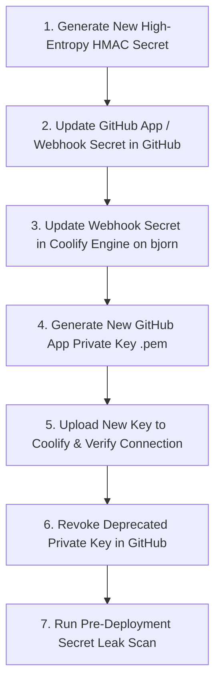

# Automated PR & Webhook Deployment Architecture Runbook (Coolify + NPM CI/CD)

This runbook defines the authoritative architectural specification, webhook event pipeline, service onboarding protocols, secret lifecycle management, and operational troubleshooting procedures for continuous deployment on host server **`bjorn`** using **GitHub**, **Coolify**, and **Nginx Proxy Manager (NPM)**.

---

## 1. Executive Summary & Core Principles

All production workloads and dynamic staging/preview instances managed in this repository run on remote host **`bjorn`**. The continuous deployment system automates deployments upon code changes while guaranteeing strict security boundaries, isolation between ephemeral environments, and zero manual proxy reconfiguration for temporary branches.

### Core Architectural Axioms
1. **Remote-First Homelab Architecture**: No deployment builds or container execution occur on local developer machines. All container lifecycles are orchestrated remotely by Coolify and Docker Engine on `bjorn`.
2. **Layered Ingress Separation**:
   - **Outer Ingress Router (Nginx Proxy Manager)**: Handles public internet traffic, DNS boundaries, wildcard Let's Encrypt SSL/TLS termination, access lists, and static subdomain routing.
   - **Inner Service Mesh Router (Coolify Traefik)**: Handles internal container discovery, dynamic routing labels, ephemeral PR preview container registration, and internal port forwarding.
3. **Selective Monorepo Build Triggering**: Through granular `watch_paths` rules, commits targeting one service (e.g. `actual/`) never trigger build churn or redeployment for unaffected services (e.g. `vaultwarden/`).
4. **Cryptographic Webhook Verification**: All GitHub webhook requests must pass HMAC-SHA256 signature verification (`X-Hub-Signature-256`) before Coolify accepts or enqueues any build jobs.
5. **PR-Gated Preview Deployments**: Feature branches automatically receive isolated ephemeral environments accessible via standardized wildcard domains (`https://pr-<PR_ID>-<service>.preview.cloud.jacobmiller22.com`).

---

## 2. End-to-End Architecture & Webhook Pipeline

### 2.1 Webhook Ingress Flow Diagram



### 2.2 Ingress Topology & Pipeline Step Walkthrough

```
[ GitHub PR Event ]
        │
        │ HTTPS POST (Port 443) + X-Hub-Signature-256
        ▼
┌────────────────────────────────────────────────────────────────────────────────────────┐
│ Host Server: bjorn (Primary Application & Storage Node)                                │
│                                                                                        │
│  ┌──────────────────────────────────────────────────────────────────────────────────┐  │
│  │ 1. Outer Ingress: Nginx Proxy Manager (jc21/nginx-proxy-manager)                  │  │
│  │    - Port: 80 / 443                                                              │  │
│  │    - SSL: Let's Encrypt (*.cloud.jacobmiller22.com, *.preview.cloud...)          │  │
│  │    - Ingress Rule: coolify.cloud.jacobmiller22.com ──▶ coolify:8080              │  │
│  │    - Wildcard Rule: *.preview.cloud.jacobmiller22.com ──▶ coolify-traefik:50080   │  │
│  └──────┬───────────────────────────────────────────────────────────┬───────────────┘  │
│         │ Internal Docker Network: coolify                          │                  │
│         ▼                                                           ▼                  │
│  ┌───────────────────────────────┐                       ┌──────────────────────────┐  │
│  │ 2. Coolify Core Engine        │                       │ 4. Coolify Traefik       │  │
│  │    - Port: 8080               │                       │    - Port: 50080 (Host)  │  │
│  │    - Webhook HMAC Validation  │                       │    - Dynamic Discovery   │  │
│  │    - Git diff vs watch_paths  │                       │    - Routes Host header  │  │
│  │    - Postgres queue dispatch  │                       │      to container IP     │  │
│  └──────┬────────────────────────┘                       └──────────▲───────────────┘  │
│         │ Docker API (/var/run/docker.sock)                         │                  │
│         ▼                                                           │ Docker Network   │
│  ┌──────────────────────────────────────────────────────────────────┴───────────────┐  │
│  │ 3. Docker Daemon on bjorn                                                        │  │
│  │    - Builds container from service context                                       │  │
│  │    - Attaches Traefik router labels                                              │  │
│  │    - Spawns: pr-48-actual (172.18.0.x:5006)                                      │  │
│  └──────────────────────────────────────────────────────────────────────────────────┘  │
└────────────────────────────────────────────────────────────────────────────────────────┘
```

1. **GitHub PR / Push Trigger**:
   - A developer pushes commits or opens a PR against `jacobmiller22/selfhosted`.
   - GitHub fires an HTTP POST webhook containing the event payload, serialized JSON, and cryptographic signature header `X-Hub-Signature-256`.
2. **NPM SSL Termination (Outer Router - Port 443)**:
   - External traffic reaches `bjorn` at `https://coolify.cloud.jacobmiller22.com/webhooks/...`.
   - NPM terminates TLS using the active Let's Encrypt certificate and routes the request over the internal bridge network `coolify` to `coolify:8080`.
3. **Coolify Webhook Evaluation (Port 8080)**:
   - Coolify reads the raw body and validates the `X-Hub-Signature-256` HMAC against its configured webhook secret using constant-time string comparison.
   - Coolify queries the GitHub commit diff to check which file paths were modified.
   - Coolify compares the modified files against each registered application's configured `watch_paths`. If no matching files were altered, the webhook is acknowledged with `HTTP 200` and discarded without queuing a build.
   - If files match, Coolify registers a new build in `application_deployments` and enqueues a background build job.
4. **Docker Engine Execution on `bjorn`**:
   - The Coolify queue worker spawns an ephemeral build execution task.
   - Pulls the specific commit SHA or PR branch ref (`refs/pull/<PR>/head`).
   - Executes `docker compose build` or `docker build` using the designated service directory and context.
   - Sets runtime environment variables from Coolify's encrypted configuration.
   - Injects Traefik labels into the container metadata:
     - `traefik.enable=true`
     - `traefik.http.routers.<container_id>.rule=Host("pr-<PR_ID>-<service>.preview.cloud.jacobmiller22.com")`
     - `traefik.http.routers.<container_id>.entrypoints=web`
     - `traefik.http.services.<container_id>.loadbalancer.server.port=<container_port>`
   - Starts the container and attaches it to Docker network `coolify`.
5. **Coolify Traefik Dynamic Service Discovery (Port 50080)**:
   - Traefik continuously listens to `/var/run/docker.sock`.
   - Upon detecting container initialization and inspection of the Traefik labels, Traefik hot-reloads its routing table in-memory without downtime.
   - Requests arriving on port 50080 with the matching `Host` header are proxied directly to the container's private bridge IP.
6. **NPM Wildcard Routing to Traefik**:
   - When a reviewer accesses `https://pr-48-actual.preview.cloud.jacobmiller22.com`, NPM resolves the wildcard host entry `*.preview.cloud.jacobmiller22.com`.
   - NPM terminates SSL using the wildcard Let's Encrypt certificate.
   - NPM forwards the raw request (preserving the `Host: pr-48-actual.preview.cloud.jacobmiller22.com` header) to `http://bjorn:50080` (or `coolify-traefik:80` inside the `coolify` Docker network).
   - Traefik inspects the `Host` header, identifies the matching router, and proxies to the running preview container.

---

### 2.3 Division of Responsibility: NPM vs. Traefik

| Capability / Concern | Nginx Proxy Manager (Outer Ingress) | Coolify Traefik (Inner Service Mesh) | Architectural Rationale |
| :--- | :--- | :--- | :--- |
| **Public Edge & Port Binding** | Binds to public host ports `80` & `443` | Binds to internal port `50080` (or Docker network only) | Isolates internal container discovery from public edge attacks. |
| **SSL / TLS Termination** | Primary SSL terminator; manages Let's Encrypt ACME renewal | HTTP only (or downstream TLS pass-through) | Centralizes certificate authority interactions and rate-limit tracking in one place. |
| **Static Production Domains** | Manages `budget.cloud.jacobmiller22.com`, `vw.cloud...` | Routes internal requests for managed apps | Stable production routes remain visible and auditable in NPM SQLite DB. |
| **Dynamic Ephemeral Routes** | Wildcard proxy host (`*.preview.cloud...`) forwards to Traefik | Automatically creates and destroys routers via Docker socket | Eliminates the need to automate NPM SQLite edits or API calls for every PR. |
| **Access Control & IP Filtering** | Enforces IP allowlists, HTTP basic auth, and rate limits | None (relies on upstream NPM filtering) | Defense-in-depth: untrusted external requests never hit Traefik uninspected. |
| **WebSockets & Buffering** | Configures WebSocket upgrade headers and client timeouts | Stream-through forwarding | Ensures Home Assistant and Vaultwarden WS connections remain resilient. |

---

### 2.4 Network Topology & Port Allocation

```yaml
# Core Port Map on bjorn
Port 80:     NPM HTTP Ingress (Redirects to 443)
Port 443:    NPM HTTPS Ingress (SSL Termination)
Port 81:     NPM Admin UI (Tailscale / LAN authenticated)
Port 8080:   Coolify Core Web & Webhook API
Port 50080:  Coolify Traefik Ingress (Internal HTTP Forwarder)
Port 5006:   Actual Budget Server (Internal)
Port 3080:   Actual ML Sidecar (Internal)
Port 7277:   Vaultwarden (Host port -> 80 Container)
Port 8123:   Home Assistant (Host network mode)
Port 5984:   Obsidian CouchDB LiveSync (Internal)
Port 8428:   VictoriaMetrics Influx/Prometheus TSDB (Internal)
Port 3000:   Grafana Telemetry Dashboard (Internal)
```

#### Docker Networks:
- **`nginx-proxy-manager`** (`bridge`): Shared network between NPM and statically routed backend containers.
- **`coolify`** (`bridge / overlay`): Shared network across Coolify core, Traefik, and dynamically provisioned application containers.

---

## 3. New Service Onboarding Guide

When introducing a new service to `jacobmiller22/selfhosted`, follow this step-by-step checklist to ensure full compatibility with the automated deployment pipeline.



### Step 1: Create Service Directory & Hardened Compose Definition
Create `<service>/compose.yml` following homelab production standards:

```yaml
# Example: <service>/compose.yml
services:
  <service-name>:
    image: <official-image>:<pinned-version>
    container_name: <service-name>
    restart: unless-stopped
    security_opt:
      - no-new-privileges:true
    deploy:
      resources:
        limits:
          cpus: '1.0'
          memory: 512M
    environment:
      - TZ=America/New_York
      - SERVICE_SECRET=${SERVICE_SECRET}
    volumes:
      - ./data:/data
    networks:
      - nginx-proxy-manager
      - coolify
    healthcheck:
      test: ["CMD-SHELL", "curl -fsS http://localhost:<port>/health || exit 1"]
      interval: 30s
      timeout: 10s
      retries: 3
      start_period: 15s

networks:
  nginx-proxy-manager:
    name: nginx-proxy-manager
    external: true
  coolify:
    name: coolify
    external: true
```

### Step 2: Environment Templates & Secret Hygiene
- Create `<service>/.env.example` documenting all required variables with placeholder values.
- **NEVER** commit real `.env` files, passwords, or keys to Git.
- Confirm `.gitignore` includes `<service>/.env` and persistent volume mounts (`<service>/data/`).

### Step 3: Register in GitHub Actions Pre-Deployment Gatekeeper
Add `<service>/compose.yml` to the validation matrix in `.github/workflows/ci.yml`:

```yaml
compose_files=(
  "actual/compose.yml"
  "vaultwarden/compose.yml"
  "homeassistant/compose.yml"
  "nginx-proxy-manager/compose.yml"
  "obsidian/compose.yml"
  "reiner-cam/compose.yml"
  "<service>/compose.yml"
)
```

### Step 4: Register Service in Coolify Dashboard
1. Open Coolify UI (`http://bjorn:8080` or `https://coolify.cloud.jacobmiller22.com`).
2. Navigate to **Projects** ──▶ **Default** ──▶ **Production** ──▶ **Add New Resource**.
3. Select **Public / Private Git Repository** ──▶ `jacobmiller22/selfhosted`.
4. Set **Branch**: `main`.
5. Set **Build Pack**: `Docker Compose`.
6. Set **Base Directory**: `/<service>`.
7. Set **Compose File Location**: `compose.yml`.

### Step 5: Configure Selective `watch_paths`
To prevent the service from building on unrelated commits:
1. In the application settings in Coolify, navigate to **General** ──▶ **Git / Source**.
2. Locate the **Watch Paths** field.
3. Configure path patterns:
   ```text
   <service>/**
   tools/backup-runner/**
   ```
4. Enable **Auto Deploy on Push** for `main`.
5. Enable **PR Previews (Deploy Previews)**.

### Step 6: Allocate Domain Schemas & Preview URL Templates
- **Production Domain**: `<service>.cloud.jacobmiller22.com`
- **Preview Template**: `pr-{{pr_id}}-<service>.preview.cloud.jacobmiller22.com`
- Enter these domain definitions into the Coolify Application Domains field.

### Step 7: Configure NPM Reverse Proxy Host
For production routing:
1. In NPM UI (`http://bjorn:81`), add a new **Proxy Host**:
   - **Domain Names**: `<service>.cloud.jacobmiller22.com`
   - **Scheme**: `http`
   - **Forward Hostname / IP**: `<service-container-name>` (or `172.17.0.1` if host-networked)
   - **Forward Port**: `<container-port>`
   - **Cache Assets**: Off (unless static site)
   - **Block Common Exploits**: On
   - **Websockets Support**: On (if real-time API)
   - **SSL**: Select Let's Encrypt certificate for `*.cloud.jacobmiller22.com`, enable **Force SSL** and **HTTP/2 Support**.
2. For Preview Routing: Verify the wildcard host `*.preview.cloud.jacobmiller22.com` points to `coolify-traefik:50080`.

---

## 4. Operational Troubleshooting & Diagnostics

When debugging webhooks, build failures, or routing anomalies, execute all commands on host **`bjorn`** via SSH.

### 4.1 Inspecting Webhook Deliveries in GitHub Developer Settings
If a push or PR does not trigger a build in Coolify:
1. In the repository, navigate to **Settings** ──▶ **Webhooks** (or GitHub App settings).
2. Select the Coolify webhook endpoint (`https://coolify.cloud.jacobmiller22.com/webhooks/...`).
3. Scroll down to **Recent Deliveries**:
   - **Green Checkmark (HTTP 200)**: Payload received, signature verified, deployment evaluated.
   - **Red Exclamation (HTTP 403 / 401)**: HMAC signature mismatch. Verify shared webhook secret.
   - **Red Exclamation (HTTP 502 / 504)**: NPM cannot connect to Coolify core (`coolify:8080`). Coolify is down.
   - **Red Exclamation (HTTP 404)**: Webhook path changed or Coolify webhook route is invalid.
4. Click on the delivery to inspect:
   - **Request Headers**: Verify `X-GitHub-Event: pull_request` or `push` and `X-Hub-Signature-256`.
   - **Request Payload**: Inspect commit SHA and modified files list.
   - **Response Body**: Coolify returns json diagnostic info (e.g. `{"message": "Deployment skipped because no watch_paths matched"}`).
5. Use the **Redeliver** button to replay the event after fixing configuration.

### 4.2 Querying Deployment Logs & Build Queues on Host `bjorn`
Always verify host connectivity first:
```bash
ssh -o BatchMode=yes -o ConnectTimeout=5 bjorn "echo ok"
```

#### View Coolify Core Application Logs
```bash
# Tail Coolify core logs for webhook intake and event processing
ssh bjorn "docker logs --tail 100 coolify"

# Grep for webhook processing entries
ssh bjorn "docker logs --tail 200 coolify | grep -iE '(webhook|github|deploy|watch_path)'"
```

#### Inspect Active or Stuck Build Containers
Coolify spawns temporary containers for building Docker images:
```bash
# List all active build containers
ssh bjorn "docker ps --filter name=coolify-build"

# Inspect logs of a running or recently failed build container
BUILD_ID=$(ssh bjorn "docker ps -aq --filter name=coolify-build | head -n 1")
ssh bjorn "docker logs --tail 100 $BUILD_ID"
```

#### Query Coolify Database for Deployment Status
Coolify stores deployment tasks in PostgreSQL (`coolify-db`):
```bash
# View the last 10 deployment tasks and their status
ssh bjorn "docker exec coolify-db psql -U coolify -d coolify -c \"
SELECT id, application_id, status, commit, created_at, updated_at 
FROM application_deployments 
ORDER BY created_at DESC 
LIMIT 10;\""
```

### 4.3 Diagnosing Preview Routing Issues (NPM & Traefik Logs)
When a preview URL returns an HTTP error:

#### Step 1: Diagnose HTTP Status Code
- **`502 Bad Gateway`**: NPM is reaching out to `coolify-traefik:50080`, but the port is unreachable or Traefik crashed.
- **`404 Not Found` (Traefik styled)**: Traefik is running, but no active container has labels matching the requested `Host` header. This indicates the preview container failed to start or exited with an error.
- **`521 Web Server Is Down`**: DNS resolves to NPM, but NPM container on `bjorn` is down.

#### Step 2: Inspect NPM Access & Error Logs
```bash
# Check if NPM is running
ssh bjorn "docker ps --filter name=nginx-proxy-manager"

# Inspect NPM error logs
ssh bjorn "docker exec nginx-proxy-manager tail -n 50 /data/logs/default-host_error.log"

# Search for the specific preview domain in proxy host logs
ssh bjorn "grep -rn 'pr-' /data/coolify/applications/low8ws4g0880kwk0gkwwwow4/data/logs/ 2>/dev/null || true"
```

#### Step 3: Inspect Traefik Internal Routers
```bash
# Tail Coolify Traefik logs
ssh bjorn "docker logs --tail 100 coolify-traefik"

# Verify Traefik port binding on host bjorn
ssh bjorn "curl -fsS http://localhost:50080/ping || echo 'Traefik ping failed'"
```

#### Step 4: Verify Container State & Traefik Labels
```bash
# Find preview containers
ssh bjorn "docker ps --filter label=coolify.managed=true"

# Inspect labels on a specific preview container
CONTAINER_NAME="<preview-container-name>"
ssh bjorn "docker inspect $CONTAINER_NAME --format '{{json .Config.Labels}}' | jq ."
```

---

### 4.4 Emergency Procedures

#### 1. Manually Triggering an Emergency Deployment
If webhooks fail or GitHub is experiencing outages:
- **Via Coolify Web UI**:
  1. Open `http://bjorn:8080` (or `https://coolify.cloud.jacobmiller22.com`).
  2. Navigate to the application.
  3. Click **Force Redeploy** (with or without cache).
- **Via Direct Docker Compose on `bjorn`**:
  ```bash
  # Locate the application directory on bjorn
  APP_DIR=$(ssh bjorn "find /data/coolify/applications -name 'compose.yml' -exec grep -l '<service-name>' {} + | xargs -n 1 dirname | head -n 1")
  echo "Deploying in $APP_DIR"
  ssh bjorn "cd $APP_DIR && docker compose pull && docker compose up -d --force-recreate"
  ```

#### 2. Canceling Stuck Builds & Unfreezing the Queue
If a build hangs indefinitely in `in_progress` state and blocks subsequent deploys:
```bash
# 1. Terminate all lingering build containers on bjorn
ssh bjorn "docker ps -q --filter name=coolify-build | xargs -r docker kill"
ssh bjorn "docker ps -aq --filter name=coolify-build | xargs -r docker rm"

# 2. Reset database deployment state in Coolify PostgreSQL
ssh bjorn "docker exec coolify-db psql -U coolify -d coolify -c \"
UPDATE application_deployments 
SET status = 'cancelled', updated_at = NOW() 
WHERE status = 'in_progress' OR status = 'queued';\""

# 3. Restart Coolify queue processor container
ssh bjorn "docker restart coolify"
```

---

## 5. Secret Management & Webhook Security

### 5.1 HMAC Signature Verification (`X-Hub-Signature-256`)
GitHub signs every webhook request using a SHA256 HMAC digest generated from the raw HTTP payload body and the shared secret.

```
                  ┌──────────────────────┐
                  │ Webhook Payload Body │
                  └──────────┬───────────┘
                             │
                             ├──────────────▶ [ HMAC-SHA256 ] ──▶ "sha256=<hex_digest>"
                             │                                         │
                  ┌──────────┴───────────┐                             │
                  │ Shared Secret Key    │                             │
                  └──────────────────────┘                             │
                                                                       ▼
                                                          HTTP Header: X-Hub-Signature-256
```

#### Coolify Verification Process:
1. Coolify intercepts incoming POST requests at `/webhooks/source/github/events`.
2. Reads raw, unparsed request body string.
3. Computes `expected_signature = "sha256=" + hash_hmac("sha256", raw_body, configured_secret)`.
4. Compares `expected_signature` with the incoming `X-Hub-Signature-256` header using timing-attack safe comparison:
   ```php
   if (!hash_equals($expected_signature, $received_signature)) {
       abort(401, 'Invalid signature.');
   }
   ```
5. If signatures match, event processing proceeds; otherwise, Coolify immediately halts with `HTTP 401 Unauthorized` and logs an authentication failure.

---

### 5.2 Secret & GitHub App Key Rotation Runbook

Rotate secrets every 90 days, or immediately if an exposure is suspected.



#### Step 1: Generate New High-Entropy HMAC Secret
On local developer workstation:
```bash
NEW_WEBHOOK_SECRET=$(openssl rand -hex 32)
echo "Generated Secret: $NEW_WEBHOOK_SECRET"
```

#### Step 2: Update Secret in GitHub
1. Navigate to GitHub: **Repository Settings** ──▶ **Webhooks** (or GitHub App configuration).
2. Paste `NEW_WEBHOOK_SECRET` into the **Secret** field.
3. Save changes.

#### Step 3: Update Secret in Coolify on `bjorn`
1. Access Coolify UI (`http://bjorn:8080`).
2. Go to **Settings** ──▶ **Sources** ──▶ **GitHub App** (or custom Webhook setting).
3. Update the **Webhook Secret** field with `NEW_WEBHOOK_SECRET`.
4. Click **Save**.
5. Test delivery by triggering a test ping from GitHub Webhook settings. Confirm HTTP 200 response.

#### Step 4: Rotate GitHub App Private Key (`.pem`)
1. In GitHub App Settings, navigate to **Private keys** ──▶ **Generate a private key**.
2. Save the resulting file securely on your workstation: `~/.ssh/coolify-github-app-new.pem`.
3. **NEVER** commit this `.pem` file to the git repository.
4. In Coolify UI:
   - Navigate to **Settings** ──▶ **Sources** ──▶ Select App.
   - Paste the contents of the new `.pem` file into the **Private Key** field.
   - Click **Save**.
5. Test repository access by fetching branches or clicking **Check Connection**.
6. Once validated, return to GitHub App Settings and **Delete** the old private key.

#### Step 5: Verify Local & Remote Secret Hygiene
Ensure no accidental secret artifacts remain in the Git workspace:
```bash
# Check git status for untracked secret files
git status

# Run the repository secret scan
python3 -c '
import subprocess, sys
res = subprocess.run(["git", "grep", "-I", "-i", "BEGIN.*PRIVATE KEY", "--", ":!tests/**", ":!*.md"], capture_output=True, text=True)
if res.stdout:
    sys.exit("Leak detected:\n" + res.stdout)
print("✓ No private key leaks detected.")
'
```

---

## 6. Verification & Automated Pre-Deployment Gates

All pull requests must pass the automated gatekeeper workflow before merging and continuous deployment:

```bash
# 1. Validate Docker Compose Syntax
docker compose -f actual/compose.yml config --quiet
docker compose -f nginx-proxy-manager/compose.yml config --quiet
docker compose -f vaultwarden/compose.yml config --quiet
docker compose -f homeassistant/compose.yml config --quiet
docker compose -f obsidian/compose.yml config --quiet
docker compose -f reiner-cam/compose.yml config --quiet

# 2. Run Shell Script Linting
shellcheck tools/backup-runner/test-backup-restore.sh

# 3. Run Repository Unit Tests
python3 -m unittest discover -s tests -p "test_*.py"

# 4. Run Backup & Disaster Recovery Architecture Verification
./tools/backup-runner/test-backup-restore.sh
```

---

## 7. Operational Quick-Reference Card

| Task | Canonical Command / Action |
| :--- | :--- |
| **Verify Host Reachability** | `ssh -o BatchMode=yes -o ConnectTimeout=5 bjorn "echo ok"` |
| **Coolify Core Logs** | `ssh bjorn "docker logs --tail 100 coolify"` |
| **Traefik Ingress Logs** | `ssh bjorn "docker logs --tail 100 coolify-traefik"` |
| **NPM Ingress Logs** | `ssh bjorn "docker logs --tail 100 nginx-proxy-manager"` |
| **Active Build Containers** | `ssh bjorn "docker ps --filter name=coolify-build"` |
| **Check Traefik Port Binding** | `ssh bjorn "curl -fsS http://localhost:50080/ping"` |
| **List Queued Deployments** | `ssh bjorn "docker exec coolify-db psql -U coolify -d coolify -c 'SELECT id, status, commit FROM application_deployments ORDER BY created_at DESC LIMIT 5;'"` |
| **Kill Stuck Build Containers** | `ssh bjorn "docker ps -q --filter name=coolify-build \| xargs -r docker kill"` |
| **Emergency Restart Coolify** | `ssh bjorn "docker restart coolify coolify-traefik"` |
| **Reload NPM Nginx Config** | `ssh bjorn "docker exec nginx-proxy-manager nginx -s reload"` |
