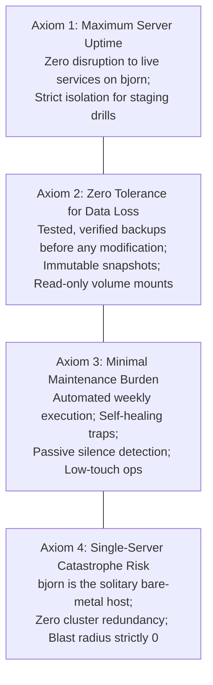
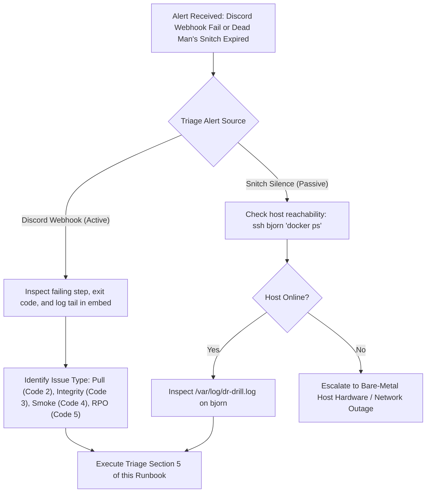
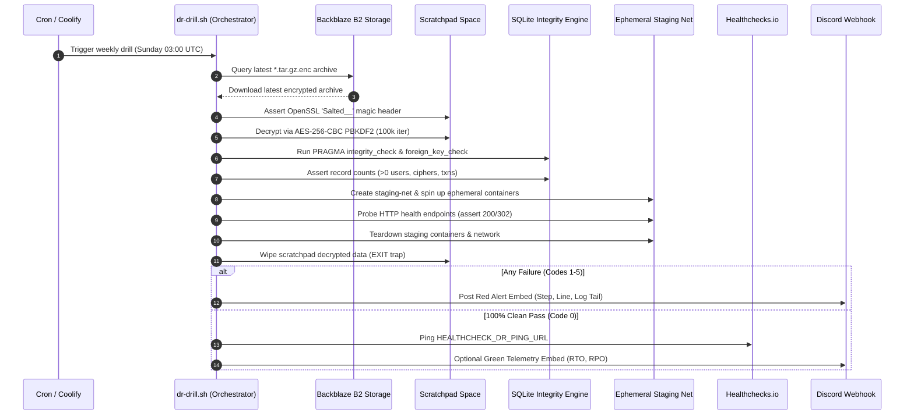

# Disaster Recovery Exercises, Staging Verification Procedures & RTO/RPO SLAs

This document establishes the operational disaster recovery (DR) runbooks, staging failover drill procedures, logging and triage playbooks, and formal Service-Level Agreements (SLAs) for the self-hosted infrastructure running on host server **`bjorn`**.

> [!IMPORTANT]
> **The Golden Rule of Backups**: Backups that are not routinely restored and validated are merely hypotheses. This operational runbook codifies automated weekly verification drills, quarterly manual bare-metal simulations, and deterministic failure triage.

---

## 1. Homelab Operational Governance & Axioms

All disaster recovery operations adhere to the User's **Four Non-Negotiable Operational Axioms**:



1. **Maximum Server Uptime**: Production services must remain online without service degradation. Ephemeral staging drills use isolated bridge networks (`staging-net`) and dedicated, non-colliding host ports (`5006` for Actual Budget, `7278` for Vaultwarden).
2. **Zero Tolerance for Data Loss**: Decryption and inspection occur in scratchpad directories. Live database files are never touched directly; SQLite `.backup` online locking API is strictly enforced during generation.
3. **Minimal Maintenance Burden**: Verification is fully automated. Weekly runs alert via Discord webhooks on failure and ping Dead Man's Snitch (Healthchecks.io) on success. Operators intervene only on alert.
4. **Single-Server Catastrophe Risk**: Because there is no secondary standby server, every disaster recovery procedure must be fully executable on non-production workstations (macOS / Linux WSL) with zero proprietary tool dependencies.

---

## 2. Formally Defined RTO & RPO SLAs

### 2.1 Recovery Point Objective (RPO)

| Metric | Target SLA | Warning / Alert Threshold | Enforcement Mechanism |
| :--- | :--- | :--- | :--- |
| **All Primary Services** | **< 24 Hours** | **26 Hours** | `dr-drill.sh --fail-on-rpo` (Exit Code 5) |

- **Formula**:
  $$\text{RPO} = t_{\text{current}} - t_{\text{backup\_timestamp}}$$
- **Timestamp Discovery**: Extracted directly from standard backup archive naming:
  `<service>-backup-%Y-%m-%d_%H-%M-%S.tar.gz.enc`
- **SLA Breach**: If the newest backup archive in cloud storage (Backblaze B2) is older than 26 hours, an alert is triggered immediately via Discord, signaling a failure in the daily cron or sidecar runner.

### 2.2 Recovery Time Objective (RTO)

| Recovery Scenario | Target SLA | Measurement Boundary | Verification Mechanism |
| :--- | :--- | :--- | :--- |
| **Automated Staging Drill** | **< 5 Minutes** (< 300s) | Download start to healthy HTTP 200/302 response | `dr-drill.sh --calculate-rto` |
| **Single-Service Cold Restore** | **< 10 Minutes** (< 600s) | Download start to live container restart on `bjorn` | `docs/RESTORE.md` procedures |
| **Bare-Metal Disaster Recovery** | **< 30 Minutes** (< 1800s) | Clean OS boot to full stack restored and routed | Full bare-metal failover drill |

- **Formula**:
  $$\text{RTO} = t_{\text{probe\_healthy}} - t_{\text{drill\_start}}$$

### 2.3 Allowable Data Loss Tolerances by Service

| Service | Data Loss Tolerance | Operational Impact & Mitigation |
| :--- | :--- | :--- |
| **Actual Budget** (`actual_server`) | **< 24 Hours** | Recent bank statement entries can be re-fetched via SimpleFIN / bank statement file upload. Budget structure and category rules remain intact. |
| **Vaultwarden** (`vaultwarden`) | **< 24 Hours** | Newly generated passwords created in the last 24h might be lost. Client-side offline browser extensions retain local caches for emergency export. |
| **Home Assistant** (`homeassistant`) | **< 24 Hours** | Sensor history and ephemeral state metrics lost; automations, YAML configs, and entity registries remain 100% intact. |
| **Nginx Proxy Manager** (`npm`) | **0 Hours** | Proxy routes change infrequently. SQLite database and Let's Encrypt certificates are fully restored. |
| **Obsidian LiveSync** (`obsidian`) | **< 24 Hours** | Note edits are preserved on local desktop/mobile client devices; CouchDB re-syncs bidirectionally once service resumes. |

### 2.4 Incident Escalation & Response Protocols



---

## 3. Automated Disaster Recovery Verification Suite (`dr-drill.sh`)

The automated drill orchestrator executes without human intervention, testing the complete restoration pipeline from cold storage to running container.



### 3.1 Execution Flags & Syntax

```bash
# Full automated drill across all supported services:
./tools/backup-dr/dr-drill.sh --service all

# Enforce RPO SLA (fails with exit code 5 if backup older than 26h):
./tools/backup-dr/dr-drill.sh --service all --fail-on-rpo

# Dry-run execution (simulates download, integrity, and smoke without Docker launch):
./tools/backup-dr/dr-drill.sh --dry-run

# Local verification against pre-decrypted test data:
./tools/backup-dr/dr-drill.sh --skip-pull --data-dir /tmp/extracted --dry-run
```

### 3.2 Scheduled Automated Cron Configuration

On remote host **`bjorn`**, the drill runs weekly under `/etc/cron.d/dr-drill`:

```cron
SHELL=/bin/bash
PATH=/usr/local/sbin:/usr/local/bin:/usr/sbin:/usr/bin:/sbin:/bin

# Run disaster recovery drill weekly at 03:00 UTC
0 3 * * 0 root /data/coolify/source/tools/backup-dr/dr-drill.sh --service all >> /var/log/dr-drill.log 2>&1
```

---

## 4. Step-by-Step Disaster Recovery Drill Procedures

### 4.1 Procedure A: Automated DR Drill Execution (Remote Host `bjorn`)

Follow this procedure when testing or initiating an on-demand drill on the production server:

1. **Verify Host Reachability (Remote Host Verification Protocol)**:
   ```bash
   ssh -o BatchMode=yes -o ConnectTimeout=5 bjorn "echo ok"
   ```
2. **Execute Drill in Dry-Run Mode (Pre-Flight Safety Check)**:
   ```bash
   ssh bjorn "bash /data/coolify/source/tools/backup-dr/dr-drill.sh --service all --dry-run"
   ```
   *Expected Output*: Displays phase checks for Actual Budget and Vaultwarden with `DRY RUN: skipping container start`.
3. **Execute Live Drill with RPO Enforcement**:
   ```bash
   ssh bjorn "bash /data/coolify/source/tools/backup-dr/dr-drill.sh --service all --fail-on-rpo"
   ```
4. **Verify Healthchecks Ping & Audit Trail**:
   - Check the [Healthchecks.io Dashboard](https://healthchecks.io) to ensure the DR check latched green.
   - Inspect drill logs on `bjorn`:
     ```bash
     ssh bjorn "tail -n 50 /var/log/dr-drill.log"
     ```

---

### 4.2 Procedure B: Manual Failover Drill (macOS Development Workstation / Local Machine)

Follow this procedure quarterly to simulate a complete bare-metal restoration on a developer machine independent of `bjorn`.

#### Phase 1: Environment Setup & Passphrase Injection
1. Retrieve the physical backup card from the home fireproof document safe.
2. Securely export the decryption passphrase into the active shell:
   ```bash
   read -s -p "Enter Backup Passphrase: " BACKUP_PASSPHRASE
   export BACKUP_PASSPHRASE
   echo ""
   ```
3. Create an isolated scratchpad directory:
   ```bash
   DRILL_DIR="/tmp/dr-exercise-$(date +%Y%m%d)"
   mkdir -p "$DRILL_DIR/extracted"
   cd "$DRILL_DIR"
   ```

#### Phase 2: Pull Archive from Cloud Storage
Download the latest encrypted archive from Backblaze B2:
```bash
# Example for Actual Budget:
aws s3 cp s3://jacobmiller22-secure-backup/backups/actual/ . \
  --endpoint-url https://s3.us-east-005.backblazeb2.com \
  --recursive \
  --exclude "*" \
  --include "*.tar.gz.enc"
```
Select the latest timestamped archive:
```bash
ARCHIVE=$(ls -t actual-backup-*.tar.gz.enc 2>/dev/null | head -n 1)
echo "Testing archive: $ARCHIVE"
```

#### Phase 3: Decrypt and Extract
Verify the OpenSSL 8-byte magic header and unpack:
```bash
# Assert 'Salted__' magic header:
head -c 8 "$ARCHIVE" | grep -q "Salted__" && echo "✓ Valid OpenSSL Header"

# Decrypt using zero-dependency OpenSSL command:
openssl enc -d -aes-256-cbc -pbkdf2 -iter 100000 \
  -in "$ARCHIVE" \
  -pass env:BACKUP_PASSPHRASE | \
  tar -xz -C ./extracted
```

#### Phase 4: Multi-Database Integrity Validation
Run SQLite page integrity, foreign key checks, and record counts:
```bash
# Run automated database integrity suite:
./tools/backup-dr/verify-db-integrity.sh \
  --service actual \
  --dir ./extracted \
  --verbose
```
*Expected Output*:
```
✓ PRAGMA integrity_check: ok
✓ PRAGMA foreign_key_check: clean
✓ Account database record counts: accounts > 0
✓ User budget databases verified
```

#### Phase 5: Ephemeral Staging Smoke Test
Boot an isolated staging container and probe endpoint health:
```bash
./tools/backup-dr/staging-smoke-test.sh \
  --service actual \
  --data-dir ./extracted \
  --port 5006 \
  --timeout 30
```
*Expected Output*:
```
✓ Created isolated network staging-net
✓ Booted ephemeral container staging-actual-smoke
✓ Health probe http://localhost:5006 responded HTTP 200/302
✓ Cleaned up staging container and network
```

#### Phase 6: Teardown & Scratchpad Wipe
Ensure no decrypted database contents remain on disk:
```bash
cd ~
rm -rf "$DRILL_DIR"
unset BACKUP_PASSPHRASE
echo "✓ Drill scratchpad cleanly wiped."
```

---

## 5. Log Inspection & Failure Triage Playbook

When a failure is signaled via Discord embed (`DISCORD_WEBHOOK_URL`) or missed Dead Man's Snitch (`HEALTHCHECK_DR_PING_URL`), triage using the following exit codes:

| Exit Code | Constant | Meaning | Immediate Action |
| :---: | :--- | :--- | :--- |
| **`0`** | `EXIT_OK` | Drill passed 100% cleanly | No action required. Verify green Discord embed or Snitch ping. |
| **`1`** | `EXIT_USAGE_ERR` | CLI argument syntax error | Verify cron command syntax and flags. |
| **`2`** | `EXIT_PULL_FAIL` | Backup download or decryption failed | Check B2 network egress, S3 credentials, or invalid passphrase. |
| **`3`** | `EXIT_INTEGRITY_FAIL`| SQLite corrupt or missing records | Corrupted backup archive! Do NOT overwrite existing backups. |
| **`4`** | `EXIT_SMOKE_FAIL` | Staging container failed healthcheck | Container crash-loop, missing assets, or port collision. |
| **`5`** | `EXIT_RPO_FAIL` | Backup older than 26 hours | Backup runner sidecar stopped or failed on host `bjorn`. |
| **`6`** | `EXIT_PING_FAIL` | Healthchecks.io ping failed | Outbound network failure reaching `healthchecks.io`. |

---

### 5.1 Triage Runbook: Exit Code 2 (`EXIT_PULL_FAIL`)

#### Symptoms:
- Discord Alert: `Phase: pull-and-decrypt failed with exit code 2`.
- Error in log: `bad decrypt` or `Failed to download archive from B2`.

#### Diagnostic Steps:
1. Check S3 credentials and endpoint reachability:
   ```bash
   ssh bjorn "aws s3 ls s3://jacobmiller22-secure-backup/ --endpoint-url https://s3.us-east-005.backblazeb2.com"
   ```
2. Verify OpenSSL header on archive:
   ```bash
   ssh bjorn "head -c 8 /tmp/dr-drill-*/<archive>.tar.gz.enc"
   # Must output 'Salted__'
   ```
3. Test decryption passphrase manually:
   ```bash
   ssh bjorn "openssl enc -d -aes-256-cbc -pbkdf2 -iter 100000 -in <archive> -pass env:BACKUP_PASSPHRASE | tar -tz | head -n 5"
   ```

---

### 5.2 Triage Runbook: Exit Code 3 (`EXIT_INTEGRITY_FAIL`)

#### Symptoms:
- Discord Alert: `Phase: verify-db-integrity failed with exit code 3`.
- Error in log: `integrity_check failed` or `0 records found`.

#### Diagnostic Steps:
1. **Isolate Decrypted Database**:
   ```bash
   sqlite3 /tmp/dr-drill-*/extracted/db.sqlite3 "PRAGMA integrity_check;"
   sqlite3 /tmp/dr-drill-*/extracted/db.sqlite3 "PRAGMA foreign_key_check;"
   ```
2. **Inspect File Size**:
   If database file size is 0 bytes or significantly smaller than historical averages, inspect the backup runner log on `bjorn`:
   ```bash
   ssh bjorn "docker logs --tail 100 actual-backup"
   ```
3. **Verify WAL Locks**:
   Check if the database was snapshotted while an active WAL transaction was incomplete without `.backup` API locking.

---

### 5.3 Triage Runbook: Exit Code 4 (`EXIT_SMOKE_FAIL`)

#### Symptoms:
- Discord Alert: `Phase: staging-smoke-test failed with exit code 4`.
- Error in log: `Probe failed: http://localhost:5006 did not respond within 30s`.

#### Diagnostic Steps:
1. **Inspect Staging Container Crash Logs**:
   ```bash
   ssh bjorn "docker logs staging-actual-smoke"
   ```
2. **Common Culprit: UID/GID File Permissions**:
   - Actual Budget requires UID/GID `1000:1000`. If extracted files are `root:root`, the node process crashes with `EACCES`.
   - Vaultwarden requires `rsa_key.pem` to be `chmod 0600`.
3. **Common Culprit: Port Collision**:
   Verify no production or other preview container is bound to staging port `5006` or `7278`:
   ```bash
   ssh bjorn "lsof -i :5006 || ss -tulpn | grep 5006"
   ```

---

### 5.4 Triage Runbook: Exit Code 5 (`EXIT_RPO_FAIL`)

#### Symptoms:
- Discord Alert: `RPO SLA Breached: Newest archive is 31.4 hours old (Max: 26h)`.

#### Diagnostic Steps:
1. Check when the last backup ran on `bjorn`:
   ```bash
   ssh bjorn "docker ps -a --filter name=backup"
   ssh bjorn "docker logs --tail 50 actual-backup"
   ```
2. Verify host cron daemon status:
   ```bash
   ssh bjorn "systemctl status cron || systemctl status crond"
   ```
3. Force manual backup execution:
   ```bash
   ssh bjorn "docker restart actual-backup"
   ```

---

## 6. Disaster Recovery Drill Retrospective & Audit Matrix

Every quarterly manual failover drill must be recorded in the repository audit log:

### Drill Execution Log Template

```markdown
### 📋 DR Drill Record: [YYYY-MM-DD]
- **Drill Type**: [Automated Weekly | Manual Staging | Bare-Metal Disaster Simulation]
- **Target Services**: [Actual Budget, Vaultwarden, Home Assistant, NPM, Obsidian]
- **Target Host**: [bjorn | local workstation]
- **Evaluator**: [Jacob Miller / Antigravity Agent]

#### 📊 Telemetry & SLAs
- **Archive Tested**: `<service>-backup-YYYY-MM-DD_HH-MM-SS.tar.gz.enc`
- **Measured RTO**: [X] seconds (Target: < 300s)
- **Measured RPO**: [Y] hours (Target: < 24h, Max: 26h)
- **Database Integrity**: [PASS / FAIL] (PRAGMA integrity_check: ok)
- **Container Smoke Test**: [PASS / FAIL] (HTTP 200/302 verified)

#### 📝 Findings & Corrective Actions
- *Notes on permissions, key formats, or test execution anomalies.*
- *GitHub Issue created for follow-ups (if any).*
```

---

## 7. Cross-References & Related Documentation

- [`docs/RESTORE.md`](RESTORE.md): Step-by-step cold-storage restoration runbooks for all individual services.
- [`docs/BACKUP_ARCHITECTURE.md`](BACKUP_ARCHITECTURE.md): Declarative backup runner engine, OpenSSL encryption spec, and B2 retention.
- [`tools/backup-dr/README.md`](../tools/backup-dr/README.md): CLI options, exit codes, and test suite execution.
- [`docs/INFRASTRUCTURE_TOPOLOGY.md`](INFRASTRUCTURE_TOPOLOGY.md): Complete host, network, and port map for server `bjorn`.
