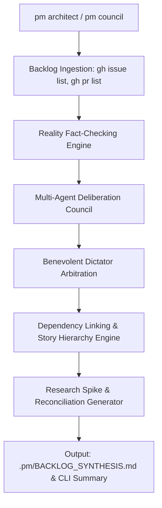

# PM Architectural Council & Reality Fact-Checking Engine (`pm architect`)

The `pm architect` workflow (aliases: `pm council`, `pm plan --deep`) formalizes the partnership between the **Senior Technical Project Manager (TPM)** and the **Senior Architect / Principal Software Engineer**.

Before autonomous AI agents execute tasks in isolated Git worktrees (`pm ship #<N>` or `pm fleet`), the backlog must be structurally planned, ground-truthed against real codebase assets, and evaluated against the non-negotiable operational realities of the homelab.

---

## 1. Core Architecture



### 1.1 Reality Fact-Checking Engine
Every open issue is audited against actual repository assets:
- **File & Directory Verification**: Checks whether referenced files and scripts actually exist on disk or are explicitly tagged as new deliverables.
- **Docker Compose & Port Validation**: Inspects all `compose.yml` configurations across services (`actual`, `vaultwarden`, `homeassistant`, `nginx-proxy-manager`, `obsidian`, `reiner-cam`) to detect port collisions, unbound services, or invalid environment variable interpolations.
- **Documentation Drift**: Confirms that issue specifications align with authoritative architecture runbooks (`docs/BACKUP_ARCHITECTURE.md`, `docs/RESTORE.md`).
- **Assumption Flagging**: Highlights unverified external APIs or unmeasured performance assumptions that require research spikes.

### 1.2 The 5-Persona Deliberation Council
Generous reasoning is allocated across five specialized senior personas:
1. **Senior Systems & Infrastructure Architect**: Evaluates Linux host internals, networking topologies, Coolify configurations, volume persistence, and kernel constraints.
2. **Senior Software & Integration Engineer**: Evaluates code modularity, API designs, TypeScript/Python idioms, error handling, and unit test harnesses.
3. **Security & Data Integrity Specialist**: Scrutinizes encryption standards (AES-256-CBC, OpenSSL), secret isolation, permission models, and zero-data-loss guarantees.
4. **Site Reliability Engineer (SRE)**: Evaluates failure blast radiuses, telemetry/monitoring probes, crash-loop recovery, and service uptime.
5. **Pragmatic Senior TPM**: Enforces scope boundaries, eliminates bikeshedding, sequences critical dependencies, and ensures every issue has verifiable acceptance criteria.

### 1.3 The Benevolent Dictator Homelab Governance
When technical debate or over-engineering creates an impasse, the **Benevolent Dictator** intervenes as the ultimate arbiter, enforcing the User's **Four Non-Negotiable Operational Axioms**:
1. **Maximum Server Uptime**: Host `bjorn` must remain online and accessible. High-risk, all-at-once migrations are strictly rejected in favor of safe, incremental changes.
2. **Zero Tolerance for Data Loss**: Data integrity is paramount. All databases (Actual Budget, Vaultwarden, Home Assistant) and persistent storage volumes must have verified, tested backups and atomic rollback plans before any modification.
3. **Minimal Maintenance Burden**: The user has limited time. Architecture must be rock-solid, automated, self-healing, and low-touch ("set-and-forget"). Fragile multi-node complexity is vetoed.
4. **Single-Server Catastrophe Risk**: There is only **one** server (`bjorn`). No redundant standby node or high-availability failover cluster exists. Blast radius containment strictly overrides theoretical architectural elegance.

---

## 2. CLI Usage

### Basic Execution
Run from repository root:
```bash
python3 tools/pm_architect/architect.py
```
Or via global PM skill:
```bash
~/.gemini/config/skills/pm/scripts/architect.py
```

### Options & Flags
- `--repo <owner/repo>`: Target repository (auto-detected if omitted).
- `--output <path>`: Path for synthesis report (default: `.pm/BACKLOG_SYNTHESIS.md`).
- `--json`: Output raw telemetry as JSON for programmatic consumption.
- `--dry-run`: Run full analysis without writing files or calling mutating GitHub endpoints.
- `--create-issues`: Automatically create proposed research spike and reconciliation tickets on GitHub via `gh issue create`.
- `--apply`: Automatically sync inferred prerequisite links and missing priority labels on GitHub.

---

## 3. Automated Artifacts & Outputs

- **Report Path**: `.pm/BACKLOG_SYNTHESIS.md`
- Contains:
  - Backlog Health Score (0-100)
  - Executive Inventory & Metrics
  - Active Dictator Homelab Rulings & Mandated Safeguards
  - Shovel-Ready Execution Order (Ranked sequence for `pm ship` / `pm fleet`)
  - Reality Fact-Checking Audit Table
  - Interactive Mermaid Dependency Graph & Story Hierarchy
  - Proposed Research Spikes (`type:research`) and Information Reconciliation Tickets (`type:reconciliation`)
