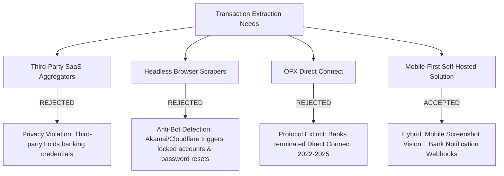
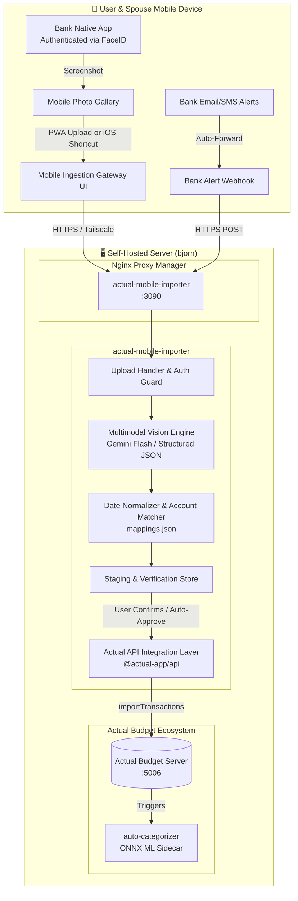
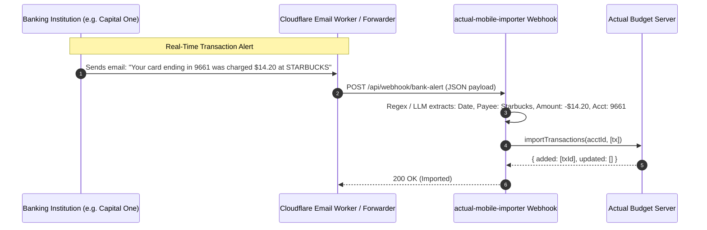

# Research & Architecture: Mobile-First Bank Transaction Extraction & Ingestion for Actual Budget

**Document Version**: 1.0.0  
**Target Repository**: `jacobmiller22/selfhosted`  
**Related Epic**: Issue [#7](https://github.com/jacobmiller22/selfhosted/issues/7)  
**Cataloged Follow-ups**: [#8](https://github.com/jacobmiller22/selfhosted/issues/8), [#9](https://github.com/jacobmiller22/selfhosted/issues/9), [#10](https://github.com/jacobmiller22/selfhosted/issues/10), [#11](https://github.com/jacobmiller22/selfhosted/issues/11)  
**Author / TPM**: AI Systems Architect  
**Date**: September 2026  

---

## 1. Executive Summary & Problem Space

### 1.1 The Budgeting Latency Problem
In modern personal finance, the failure of budgeting systems (such as [Actual Budget](https://actualbudget.org/)) is rarely caused by categorization logic, report rendering, or ledger arithmetic. Rather, **the primary point of failure is data acquisition latency**. 

In the current workflow:
1. The user must sit down at a desktop or laptop computer.
2. The user must sequentially log into 3 to 5 distinct banking and investment portals (e.g., Capital One Checking, Joint Savings, credit cards, brokerage/Vanguard across husband and wife).
3. The user must authenticate through multi-factor authentication (SMS/App 2FA) on each portal.
4. The user must navigate to transaction activity screens, download statement files (`.csv`, `.qif`, `.ofx`), and save them locally.
5. The user must execute the CLI importer tool (`actual/tools/transaction-importer`) against the downloads directory.

This high-friction loop creates a compounding psychological barrier. Days become weeks; transactions accumulate; statements get delayed; and the budget becomes stale. 

### 1.2 Non-Negotiable Constraints & Disqualifications



1. **Strict Rejection of Third-Party Cloud Aggregators**:
   - Solutions like Plaid, Yodlee, MX, Teller, or SimpleFIN require handing over account credentials, OAuth tokens, or financial identity to closed-source commercial entities.
   - *Constraint*: Only 100% self-hosted, user-controlled solutions are acceptable.
2. **Strict Rejection of Headless Web Scrapers**:
   - Automated headless browser scrapers (Playwright, Puppeteer, Selenium) logging into bank web portals are exceptionally brittle.
   - Modern financial institutions deploy advanced anti-bot platforms (Akamai Bot Manager, Cloudflare Bot Management / Turnstile, Shape Security, Arkose Labs) that fingerprint TLS handshakes (JA3/JA4), canvas/WebGL rendering, and CDP automation flags.
   - Bot detection triggers forced password resets, security lockouts, and mandatory telephone verification, creating unacceptable administrative burden.
3. **Multi-Account & Multi-User Reality**:
   - Accounts are distributed across spouses (checking, savings, multiple credit cards).
   - Any solution must support fast switching or automatic identification of the target account from the payload without tedious manual configuration per run.
4. **Mobile-First Paradigm**:
   - The user carries their smartphone at all times.
   - Mobile banking apps support frictionless biometric authentication (Face ID / Touch ID) in under 2 seconds without triggering bot detection.

---

## 2. Comprehensive Evaluation of Extraction Methodologies

We evaluate six potential architectures across seven key criteria:
- **User Friction**: Time and cognitive effort required to capture transactions.
- **Anti-Bot Immunity**: Resistance to bank security countermeasures and account lockouts.
- **Privacy & Credential Isolation**: Whether bank credentials or session tokens are stored on servers.
- **Institution Universality**: Ability to work across major banks, credit unions, and brokerages.
- **Deduplication Resilience**: Ability to prevent duplicate transactions when ingestion overlaps.
- **Maintenance Overhead**: Susceptibility to breaking changes when bank UI or APIs update.
- **Spouse Feasibility**: Ease of use for a non-technical partner.

### 2.1 Comparative Analysis Matrix

| Criterion | 1. Mobile Screenshot + Multimodal Vision | 2. Bank Alert Email / Push Webhook | 3. Mobile Statement Share Sheet | 4. Headless Browser Scraping | 5. Commercial Aggregators (SimpleFIN/Plaid) | 6. OFX Direct Connect |
| :--- | :--- | :--- | :--- | :--- | :--- | :--- |
| **User Friction** | **Very Low** (~10s: FaceID + screenshot + tap upload) | **Zero** (100% passive once configured) | **Low** (~20s: Navigate to statement export in bank app) | **Medium** (Hands-off until 2FA/captcha breaks) | **Zero** (Automatic background pull) | **Zero** (Background automated pull) |
| **Anti-Bot Immunity** | **100% Immune** (Native mobile app with FaceID) | **100% Immune** (Official bank outbound alerts) | **100% Immune** (Official mobile app export) | **0% (Fails)** (Triggers lockouts & password resets) | **High** (Official financial aggregator contracts) | **N/A (Obsolete)** |
| **Privacy / Security** | **Air-Gapped** (Zero bank credentials stored) | **Air-Gapped** (Zero credentials stored; alert metadata only) | **Air-Gapped** (Official statement files only) | **Very Low** (Plaintext credentials stored in scrapers) | **Low** (Credentials or financial tokens stored on SaaS) | **Medium** (OFX user/pass stored locally) |
| **Universality** | **100% Universal** (Any screen with transactions) | **Partial** (~80% of banks offer instant charge alerts) | **Partial** (~50% of mobile apps export CSV/QIF) | **Low** (Different scraper needed per bank) | **High** (Covered by aggregator networks) | **Near 0%** (Deprecated by US banks) |
| **Deduplication** | **Native** (Deduplicated via Actual Budget API) | **Native** (Deduplicated by bank transaction ID or timestamp/amount) | **Native** (Deduplicated via Actual Budget API) | **Native** | **Native** | **Native** |
| **Maintenance** | **Near Zero** (LLM vision parses diverse layouts) | **Low** (Regex/LLM parse standard notification templates) | **Low** (Parser updates for file headers) | **Extreme** (DOM updates break selectors weekly) | **Low** (Aggregator maintains upstream) | **Dead** |
| **Spouse Usability**| **High** (Screenshot + Share sheet or upload link) | **High** (No action required if alerts forward) | **Medium** (Requires finding export menu) | **N/A** | **High** | **N/A** |
| **Verdict** | 🟢 **PRIMARY RECOMMENDED** | 🟢 **SECONDARY PASSIVE** | 🟡 **OPTIONAL FALLBACK** | 🔴 **STRICTLY REJECTED** | 🔴 **STRICTLY REJECTED** | 🔴 **UNAVAILABLE** |

---

## 3. Deep-Dive: Why Mobile Screenshot Vision is the Winning Paradigm

### 3.1 The Biometric Air-Gap Advantage
Mobile banking apps on iOS and Android represent the highest-trust client environments for financial institutions. Banks invest millions into mobile app security (biometric enclave validation, hardware keystore device binding, push-based risk scoring). 

When a user opens their banking app:
1. **Face ID / Touch ID authenticates locally** in the Secure Enclave in < 1 second.
2. The bank's risk engine assigns a low risk score (trusted device + biometrics).
3. The transaction ledger renders on screen instantly.
4. **No bot detection is ever triggered.**
5. **No bank passwords or 2FA secrets are ever saved in our self-hosted infrastructure.**

By taking a screenshot and uploading it to our self-hosted service, we utilize the user's phone as an **authenticated optical scanner**. We decouple authentication from data extraction.

### 3.2 Operating System Screenshot Feasibility
- **Apple iOS**: iOS **does not** enforce `FLAG_SECURE` on screen captures. Banking apps (Capital One, Chase, American Express, Citi, Fidelity, Vanguard, Schwab) freely permit screenshots of transaction history.
- **Android**: Most banks allow screenshots on account transaction lists, though some apply `FLAG_SECURE` on sensitive login/card-number screens. If a specific Android bank app enforces `FLAG_SECURE`, the user can utilize the secondary mechanisms (Email alerts or mobile statement sharing).

### 3.3 Multimodal LLM Extraction Performance (Gemini Flash)
Modern multimodal vision models (specifically Gemini 2.5 / 3.x Flash) possess extraordinary OCR and semantic extraction capabilities on financial tables and UI screenshots:
- **Sub-cent OCR Accuracy**: Accurately disambiguates `.` vs `,`, currency symbols (`$`, `€`), negative indicators (`-$42.50`, `42.50 CR`, `-$15.00`), and decimal alignments.
- **Relative Date Resolution**: Banking apps frequently show relative timestamps ("Today", "Yesterday", "Monday", "Sep 14"). The vision engine can be given a reference anchor (`current_date: 2026-09-16`) to deterministically resolve relative dates to canonical ISO 8601 strings (`YYYY-MM-DD`).
- **Account Disambiguation**: Bank app screenshots almost always include an account header or card snippet (e.g., `360 Checking ...6341`, `Joint Savings ...6404`, `Venture Card ...9661`). The model extracts this hint, enabling automatic mapping to Actual Budget accounts.
- **Pending vs. Cleared State**: The model detects visual badges (e.g., "Pending", "Processing", "Posted") and sets the `cleared` boolean accordingly.
- **Cost & Latency**: A Gemini Flash vision call costs approximately $0.0001 per image and executes in under 1.2 seconds—significantly faster and cheaper than heavyweight desktop browser automation.

---

## 4. Architectural Design: Self-Hosted Mobile Ingestion Gateway



### 4.1 Component Breakdown

#### Component A: Mobile Ingestion PWA (`actual-mobile-importer`)
- **Technology**: Fastify / Node.js backend with a lightweight, responsive Tailwind / TypeScript frontend optimized for mobile Safari and Chrome.
- **PWA Capabilities**: 
  - Installable to iOS / Android Home Screen (`manifest.json`, apple-touch-icons).
  - Registered as an **iOS / Web Share Target**, allowing users to share screenshots directly from the Photos app or bank apps without opening a browser tab.
- **Security & Network Access**:
  - Accessible via internal Tailscale network (`http://bjorn:3090` or MagicDNS `http://actual-import.tailscale`) or via HTTPS domain behind Nginx Proxy Manager (`https://budget-import.cloud.jacobmiller22.com`) with HTTP Basic Auth / API token headers.

#### Component B: Multimodal Vision Parser
- **Engine**: Google GenAI SDK (`@google/genai`) invoking Gemini Flash with native structured outputs (`responseSchema`).
- **Input**: Image buffer (JPEG, PNG, HEIC, WebP).
- **Prompt Specification**:
  ```text
  You are an expert financial OCR assistant. Analyze this mobile banking screenshot and extract all transaction records.
  The current system date is: {CURRENT_DATE_ISO}.
  
  Rules:
  1. Resolve all relative dates (e.g., 'Today', 'Yesterday', day of week) against the current date.
  2. Identify the bank account from any visible headers, last 4 digits, or card nicknames.
  3. Extract all transactions with date (YYYY-MM-DD), raw payee name, clean payee name, amount in cents (negative for outflow/spending, positive for deposits/credits/inflow), and status (cleared or pending).
  4. Preserve raw payee strings in notes for downstream ML categorization.
  ```
- **Schema Output**:
  ```json
  {
    "account_hint": "360 Checking ...6341",
    "account_last_4": "6341",
    "transactions": [
      {
        "date": "2026-09-15",
        "payee_raw": "TRADER JOES #542 SEATTLE WA",
        "payee_clean": "Trader Joe's",
        "amount_cents": -4250,
        "cleared": true,
        "notes": "Original: TRADER JOES #542 SEATTLE WA"
      }
    ]
  }
  ```

#### Component C: Account Matcher & Configuration Integration
- Reuses the existing configuration format from `actual/tools/transaction-importer/config/mappings.json`:
  ```json
  {
    "accountNumbers": {
      "6404": "6243aa92-178b-48cb-9332-197db4057b86",
      "9661": "6fd7b088-005e-4254-9d3c-3eb231a3f66c",
      "6341": "a1b2c3d4-e5f6-7890-abcd-1234567890ab"
    },
    "accountAliases": {
      "checking": "a1b2c3d4-e5f6-7890-abcd-1234567890ab",
      "savings": "6243aa92-178b-48cb-9332-197db4057b86"
    }
  }
  ```
- Automatically resolves `account_last_4` (`6341`) or keyword tokens (`checking`) to the exact Actual Budget account UUID.

#### Component D: Interactive Mobile Review & Confirmation
- When the user uploads a screenshot, the mobile UI presents a **Staging Card**:
  1. **Account Pill**: Shows detected account (e.g., `🟢 Capital One 360 Checking (...6341)`), with a dropdown to switch if ambiguous.
  2. **Transaction List**: Clean card view showing Date, Payee, Amount (colored red/green), and Cleared badge.
  3. **Edit / Toggle Controls**: Checkboxes to omit any unwanted transactions (e.g., an unverified pending hold).
  4. **One-Tap Commit Button**: `[ Import 4 Transactions to Actual ]`.

#### Component E: Actual Budget Sync & Native Deduplication
- Calls `@actual-app/api` method `importTransactions(accountId, transactions)`.
- **Deduplication Mechanics**:
  - Actual Budget's synchronization engine performs automated deduplication based on `(date, amount, imported_id / payee_name)`.
  - Even if the user screenshots the same 5 transactions over three consecutive days, Actual Budget imports only the newly posted records and skips existing transactions without creating duplicates.
- **Triggering Auto-Categorization**:
  - Once imported into Actual Budget, the existing `actual-auto-categorizer` sidecar (or inline ONNX engine) automatically infers categories using historical training data and rules.

---

## 5. Secondary Architecture: Bank Notification Webhook Gateway

For transactions that can be captured completely hands-off, the mobile gateway includes an optional passive webhook receiver.



### 5.1 Push / Email Alert Pipeline Details
- **Email Forwarding**: User sets up a forwarding rule from their personal email (or registers a direct alias `budget-alerts@domain.com` with the bank).
- **Processing Options**:
  1. **Cloudflare Email Worker**: Free, serverless, parses incoming email and executes HTTPS POST to `https://budget-import.cloud.jacobmiller22.com/api/webhook/bank-alert`.
  2. **iOS Shortcut Automation**: An iOS Personal Automation triggered on "When I receive an email/notification from Bank", which sends the notification text to the webhook.
- **Reconciliation**:
  - Bank push alerts arrive as "pending" transactions.
  - When the user later uploads a weekly screenshot or statement, Actual Budget's reconciliation matches the cleared record with the previously inserted pending record.

---

## 6. Security, Privacy & Compliance Assessment

| Security Dimension | Implementation Specification |
| :--- | :--- |
| **Bank Credential Exposure** | **Zero exposure**. No bank usernames, passwords, API secrets, or 2FA authenticators are stored on any disk, container, or environment variable. |
| **Transport Security** | All ingress traffic is encrypted via HTTPS with TLS 1.3 certificates provisioned by Nginx Proxy Manager / Let's Encrypt, or routed exclusively through encrypted Tailscale WireGuard tunnels. |
| **Authentication & Access Control** | Gateway UI requires bearer token authentication or HTTP Basic Auth. PWA stores the token in local encrypted browser storage. |
| **Image Retention Policy** | Screenshots are processed in-memory or in ephemeral temp directories (`/tmp/uploads`) and deleted immediately after extraction. No images of bank statements are persisted permanently to disk. |
| **Vision Provider Privacy** | Google Gemini API with commercial API tier guarantees that enterprise API data is **not** used to train foundation models, maintaining strict financial data privacy. For 100% offline environments, a local vision model (e.g., Qwen2-VL or Llama-3.2-Vision via Ollama) can be substituted as a drop-in provider. |

---

## 7. Implementation Roadmap & Issue Traceability

To ensure tracked, disciplined delivery without scope creep, work is partitioned into discrete, shovel-ready GitHub issues:

```mermaid
gantt
    title Mobile Transaction Extraction Implementation Roadmap
    dateFormat  YYYY-MM-DD
    section Epic
    Story #7 : Research, Architecture & Specs :done, 2026-09-16, 2026-09-17
    section Core Deliverables
    Issue #8 : Vision-Based Extraction Engine :active, 2026-09-18, 2026-09-21
    Issue #9 : Mobile PWA / Web Upload Gateway :2026-09-22, 2026-09-25
    Issue #10: Notification Alert Webhook Gateway :2026-09-26, 2026-09-28
    Issue #11: Containerization & Docker Compose :2026-09-29, 2026-09-30
```

### 7.1 Cataloged Issues & Acceptance Criteria

#### 1. Issue [#8](https://github.com/jacobmiller22/selfhosted/issues/8): Vision-Based Transaction Extraction Engine
- **Title**: `feat(importer): Vision-Based Transaction Extraction Engine using Gemini Multimodal Structured Outputs`
- **Scope**:
  - Implement `@google/genai` vision parser module with typed schema (`TransactionExtractionResponse`).
  - Implement relative date resolution logic using reference timestamps.
  - Implement account matching against `mappings.json`.
  - Add test harness evaluating mock bank screenshots against expected JSON outputs.

#### 2. Issue [#9](https://github.com/jacobmiller22/selfhosted/issues/9): Mobile-Optimized PWA / Web Upload Gateway
- **Title**: `feat(importer): Mobile-Optimized PWA / Web Upload Gateway for Transaction Ingestion`
- **Scope**:
  - Build mobile-responsive web UI with drag-and-drop, camera roll selector, and PWA manifest.
  - Build interactive review screen displaying parsed transactions with account selector, amount editor, and checkboxes.
  - Wire submission button to invoke `@actual-app/api` `importTransactions()`.
  - Add deduplication summary banner (e.g., "3 transactions added, 4 duplicates skipped").

#### 3. Issue [#10](https://github.com/jacobmiller22/selfhosted/issues/10): Bank Alert Webhook Gateway
- **Title**: `feat(importer): Bank Transaction Notification & Alert Webhook Gateway (Passive Ingestion)`
- **Scope**:
  - Build `/api/webhook/bank-alert` endpoint with API key authentication.
  - Add regex and structured parsers for Capital One, Chase, and American Express transaction notification emails.
  - Ingest alerts as pending transactions into Actual Budget.

#### 4. Issue [#11](https://github.com/jacobmiller22/selfhosted/issues/11): Containerization & Docker Compose Deployment
- **Title**: `feat(importer): Containerize Mobile Importer & Integrate into Docker Compose and Nginx Proxy Manager`
- **Scope**:
  - Write multi-stage `Dockerfile` for the combined importer gateway.
  - Update `actual/compose.yml` to include `actual-mobile-importer`.
  - Add healthcheck and proxy routing through `nginx-proxy-manager`.
  - Document deployment and environment variables in `actual/README.md`.

---

## 8. Conclusion & Immediate Recommendations

The proposed **Mobile Screenshot & Vision Gateway** directly addresses the root cause of budget neglect by reducing transaction acquisition friction from a 15-minute multi-login desktop chore to a **10-second Face ID screenshot upload from a phone**.

It completely circumvents the failure modes of previous attempts:
- **Zero bank bot detection risk** (authentication occurs naturally via official mobile apps).
- **Zero third-party SaaS credential exposure** (100% self-hosted).
- **Zero brittle DOM scraping** (multimodal vision naturally handles UI refreshes).

**Recommended Next Step**: Begin execution of **Issue [#8](https://github.com/jacobmiller22/selfhosted/issues/8)** (`feat(importer): Vision-Based Transaction Extraction Engine`) to validate the extraction engine against representative screenshots of Capital One, credit cards, and investment accounts.
