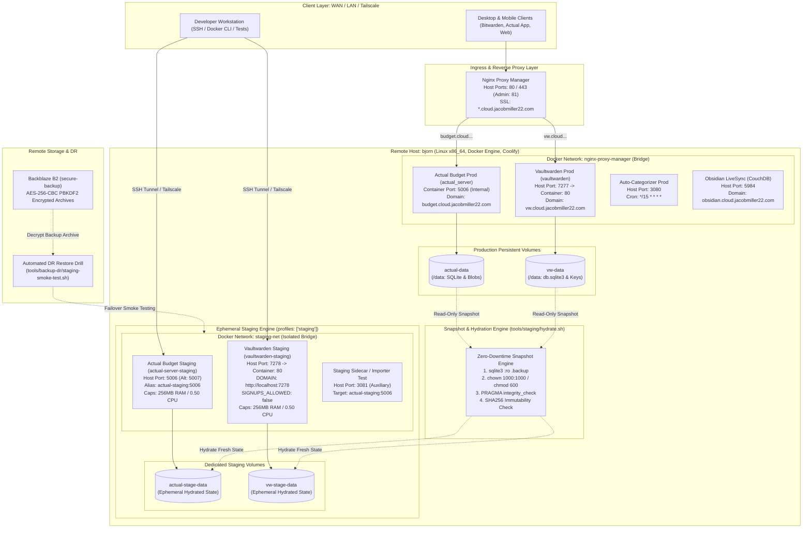
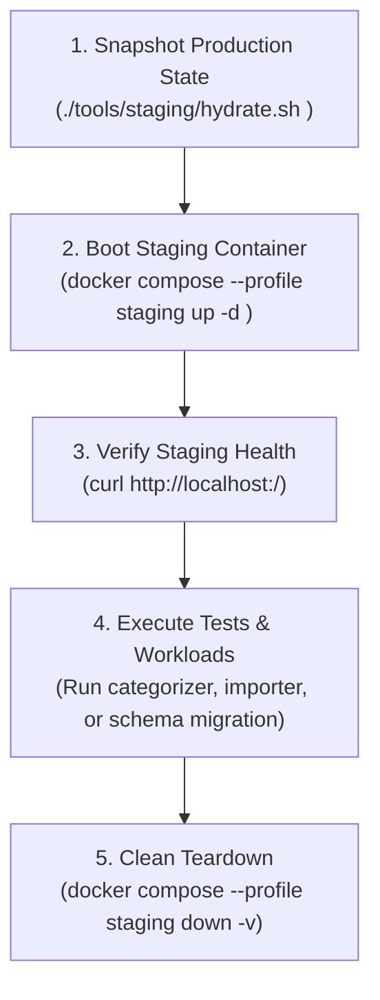
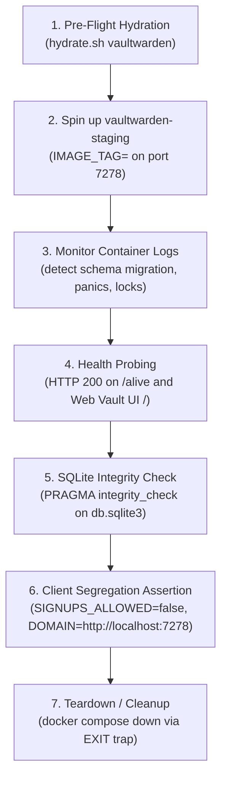
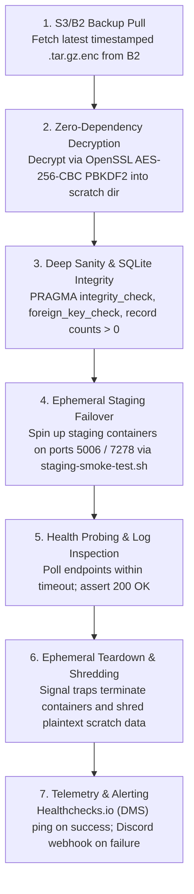
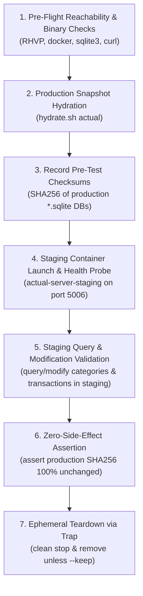

# Staging Architecture & Operations Runbook

This document defines the comprehensive architecture, single-host governance, port allocation schema, service suitability matrix, isolation guarantees, and operational runbooks for ephemeral staging environments across the `selfhosted` infrastructure on remote host `bjorn`.

---

## 1. Executive Summary & Design Principles

In alignment with the core governance philosophy of this infrastructure—specifically **Axiom 1 (Reproducibility & Declarative State)**, **Axiom 2 (Zero Tolerance for Data Loss)**, and **Axiom 3 (Radical Simplicity & Operational Humility)**—staging environments must satisfy four non-negotiable guarantees:

1. **Zero Runtime Overhead When Idle**: Staging services leverage native Docker Compose profiles (`profiles: ["staging"]`). By default, standard `docker compose up -d` invocations initialize only production workloads. When inactive, staging containers remain completely stopped, consuming **0% CPU and 0 MB RAM**.
2. **Strict Hard Kernel Resource Caps**: Every staging container is constrained by hard cgroup limits (`mem_limit: 256m`, `cpus: 0.50`), ensuring that experimental workloads, intensive data migrations, or runaway scripts cannot starve production services or trigger host out-of-memory (OOM) events.
3. **Complete Data & Network Isolation**: Staging containers write exclusively to dedicated staging volumes (`actual-stage-data`, `vw-stage-data`) and communicate through an isolated Docker bridge network (`staging-net`). Production databases, persistent directories, and ingress networks are inaccessible from staging instances.
4. **Deterministic Non-Conflicting Port Schema**: Static, deterministic host ports are allocated to staging workloads (Actual Budget on host port `5006` or auxiliary `5007`, Vaultwarden on host port `7278`), strictly avoiding collisions with production reverse proxies and internal routing.

---

## 2. Architecture & Topography Overview

### 2.1 Single-Host Multi-Tenancy Governance on `bjorn`

All production workloads and staging containers execute on a single physical host: **`bjorn`** (Linux x86_64, Docker Engine, Coolify orchestrator). Because production and staging share physical CPU cores, RAM, network interfaces, and NVMe/SSD storage, staging must be architected as an **ephemeral guest**:

- **No Public DNS or Ingress Routes**: Staging containers are never registered in public DNS (`*.cloud.jacobmiller22.com`), Nginx Proxy Manager (NPM), or Cloudflare tunnels. They are bound strictly to host loopback interfaces (`127.0.0.1`) and the private `staging-net` Docker network.
- **Independent Failure Domains**: A catastrophic crash, database corruption, or infinite loop inside a staging container cannot propagate to production containers or persistent storage.
- **Ephemeral Lifecycle**: Staging environments are spun up on demand for verification, testing, or disaster recovery drills, and are decommissioned immediately upon test completion.

### 2.2 System Architecture & Topography Diagram



### 2.3 Staging Port & Service Allocation Schema

To eliminate port contention with production services and reverse proxy routes on `bjorn`, the following deterministic port schema is strictly enforced:

| Service | Staging Container Name | Staging Host Port | Container Port | Production Host Port / Ingress | Resource Cap (RAM / CPU) | Persistent Volume |
| :--- | :--- | :--- | :--- | :--- | :--- | :--- |
| **Actual Budget** | `actual-server-staging` | **`5006`** *(Alt: `5007`)* | `5006` | Internal NPM routing (`https://budget.cloud.jacobmiller22.com`) | `256m` / `0.50` | `actual-stage-data` (`/data`) |
| **Actual Auto-Categorizer** | `actual-auto-categorizer-stage` | **`3081`** | `3080` | Host `3080:3080` | `256m` / `0.50` | `actual-analytics-data` |
| **Vaultwarden** | `vaultwarden-staging` | **`7278`** | `80` | Host `7277` (`https://vw.cloud.jacobmiller22.com`) | `256m` / `0.50` | `vw-stage-data` (`/data`) |

*Port Notes*:
- **Actual Budget Primary Staging Port (`5006`)**: Production Actual Budget exposes no host port; it connects solely to the `nginx-proxy-manager` Docker bridge network. Therefore, host port `5006` is allocated directly to `actual-server-staging`.
- **Secondary / Auxiliary Fallback (`5007` / `3081`)**: If a developer requires running multiple staging instances concurrently, host port `5007` is reserved as the secondary Actual Budget staging port, and `3081` is reserved for auxiliary staging sidecars (e.g., test auto-categorizer instances).
- **Vaultwarden Staging Port (`7278`)**: Production Vaultwarden is exposed on host port `7277`. Staging Vaultwarden is pinned to host port `7278`.

### 2.4 Resource Consumption Policies on Single-Host `bjorn`

1. **Ephemeral Compose Profiles**:
   All staging services declare `profiles: ["staging"]`. The Docker Compose engine completely ignores these declarations during standard deployment routines (`docker compose up -d`). Staging containers are created and started only when `--profile staging` is explicitly supplied.
2. **Hard Kernel Memory and CPU Limits**:
   Each staging container specification includes:
   ```yaml
   mem_limit: 256m
   cpus: 0.50
   ```
   - `mem_limit: 256m`: Prevents memory leaks or runaway buffer allocations in staging workloads from starving production processes.
   - `cpus: 0.50`: Restricts staging container execution to a maximum of 50% of a single CPU core, preserving host responsiveness.
3. **Linux OOM Killer Protection**:
   Production containers and critical system daemons maintain lower OOM scores (`oom_score_adj`). Staging containers run with standard user process scores, ensuring the kernel terminates staging workloads first if extreme system-wide memory exhaustion occurs.
4. **Storage Reclamation & Disk Hygiene**:
   - Staging volumes (`actual-stage-data`, `vw-stage-data`) are completely ephemeral. They are safely wiped and re-hydrated prior to each test cycle using `./tools/staging/hydrate.sh --reset <service>`.
   - Post-test decommissioning via `docker compose --profile staging down -v` immediately destroys staging containers and associated volumes.
   - Automated maintenance routines execute `docker image prune -f` to clean up dangling layers after upstream upgrade validation tests.
   - Storage thresholds on `bjorn` root filesystem (`/var/lib/docker/volumes`) are monitored to ensure staging snapshots never consume more than 5 GB of aggregate disk space.

---

## 3. Service Justification & Suitability Matrix

Not all services in a homelab infrastructure are suitable or safe for staging replication. Running duplicate instances of services that interface with physical hardware, broadcast on host networks, or manage WAN ingress creates severe operational hazards.

### 3.1 Classification Tiers

- **Tier 1 (Immediate / Mandatory)**: Core stateful services storing business logic, financial data, or credentials. High update frequency, frequent schema migrations, or active automation development. Pure software/database isolation.
- **Tier 2 (Deferred / Ineligible for Staging)**: Services with physical hardware coupling or host network requirements where duplicate instances cause hardware bus contention, state collisions, or external side-effects.
- **Tier 3 (Ineligible / Monolithic Ingress)**: Edge ingress routing, real-time video capture, or services where declarative git-managed configuration replaces the need for staging container duplication.

### 3.2 Service Suitability Matrix

| Service Directory | Staging Eligibility | Justification Tier | Primary Rationale & Operational Hazards | Isolation & Testing Strategy |
| :--- | :--- | :--- | :--- | :--- |
| **`actual/`** (Actual Budget) | **Eligible** | **Tier 1 (Immediate)** | High-risk financial application. Constant development of ONNX auto-categorizer sidecars, batch statement vision ingest, and upstream server releases. Risk of corrupting ledger data or categorization rules if tested in prod. | **Full Staging**: Online SQLite snapshot to `actual-stage-data`. Host port `5006` (or `5007`), isolated `staging-net`. Bit-for-bit SHA256 immutability assertion on prod. |
| **`vaultwarden/`** (Vaultwarden) | **Eligible** | **Tier 1 (Immediate)** | Critical credential store. Upstream container updates frequently include Diesel SQLite schema migrations. A failed migration risks locking `db.sqlite3` or corrupting cipher blobs. | **Full Staging**: Snapshot hydration to `vw-stage-data`. Host port `7278`, `SIGNUPS_ALLOWED=false`, `DOMAIN=http://localhost:7278`. Run `PRAGMA integrity_check` before prod deployment. |
| **`homeassistant/`** (Home Assistant) | **Ineligible** | **Tier 2 (Deferred)** | **Hardware & Network Hazard**: Home Assistant requires direct USB serial controller passthrough for Zigbee (`/dev/ttyUSB0`) and Z-Wave (`/dev/ttyACM0`). Linux permits only one process to hold an open serial descriptor; a staging instance will crash or steal hardware access. Furthermore, Home Assistant requires `network_mode: host` for mDNS/SSDP device discovery; a staging instance causes port 8123 collision and sends conflicting control packets to physical smart switches. | **No Staging Container**: Configuration changes validated locally via `hass --script check_config` or isolated unit tests. Hardware testing performed on dedicated bench hardware, never co-located on `bjorn`. |
| **`nginx-proxy-manager/`** (NPM) | **Ineligible** | **Tier 3 (Ineligible)** | **Ingress Port Hazard**: Binds directly to public host ports `80` and `443`. A staging reverse proxy cannot bind to ports 80/443 on the same IP. Dual proxies would also collide on ACME Let's Encrypt HTTP-01 challenge routing. | **Declarative Git Rollback**: NPM configuration is managed declaratively via reverse proxy configurations. Route updates are atomic and instantly reversible via git or admin UI rollback. |
| **`reiner-cam/`** (Motion Cam) | **Ineligible** | **Tier 3 (Ineligible)** | **V4L2 Device Hazard**: Requires exclusive access to `/dev/video0` video capture device. Multiple daemons cannot read from the same video capture buffer simultaneously. Continuous live RTSP capture does not benefit from snapshot hydration. | **Local Mock Testing**: Test video parsing using pre-recorded MP4 clips on local development workstation rather than remote staging. |
| **`obsidian/`** (CouchDB LiveSync) | **Deferred** | **Tier 3 (As Needed)** | Lightweight markdown document synchronization using CouchDB 3.3.3. Document updates are append-only with built-in MVCC revision control. Upstream CouchDB schema changes are exceptionally rare. | **Ad-Hoc Testing**: Ephemeral CouchDB staging container can be spun up on port `5985` if a major CouchDB version upgrade is evaluated; routine staging is unnecessary. |

---

## 4. Service Declarations & Compose Profile Configuration

Staging containers are declared directly within their respective subsystem Compose files (`actual/compose.yml` and `vaultwarden/compose.yml`) under `profiles: ["staging"]`.

### 4.1 Actual Budget Staging (`actual/compose.yml`)

```yaml
services:
  actual-server-staging:
    image: docker.io/actualbudget/actual-server:26.9.0
    container_name: actual-server-staging
    profiles: ["staging"]
    restart: unless-stopped
    ports:
      - "5006:5006"
    volumes:
      - actual-stage-data:/data
    networks:
      staging-net:
        aliases:
          - actual-staging
    mem_limit: 256m
    cpus: 0.50

networks:
  staging-net:

volumes:
  actual-stage-data:
```

### 4.2 Vaultwarden Staging (`vaultwarden/compose.yml`)

```yaml
services:
  vaultwarden-staging:
    image: ${VAULTWARDEN_IMAGE:-vaultwarden/server:${IMAGE_TAG:-1.35.4}}
    container_name: vaultwarden-staging
    profiles: ["staging"]
    restart: unless-stopped
    environment:
      DOMAIN: "http://localhost:7278"
      SIGNUPS_ALLOWED: "false"
    volumes:
      - vw-stage-data:/data
    ports:
      - "7278:80"
    networks:
      - staging-net
    mem_limit: 256m
    cpus: 0.50

networks:
  staging-net:

volumes:
  vw-stage-data:
```

### 4.3 Staging Network Resolution & Sidecar Redirection

The `actual-auto-categorizer` sidecar connects to both `nginx-proxy-manager` and `staging-net`. This dual-homed configuration enables the sidecar to test categorizations and batch statement imports against `http://actual-staging:5006` over `staging-net` without exposing staging to production ingress routes.

---

## 5. Isolation, Security & Client Segregation Safeguards

### 5.1 Volume Segregation
- **Production Volumes**: `actual-data` and `vw-data` are mounted by production containers and automated backup runners (`actual-backup`, `vw-backup`). Production volumes are NEVER mounted read-write by staging containers.
- **Staging Volumes**: `actual-stage-data` and `vw-stage-data` are dedicated exclusively to staging containers.
- **Backup Runner Isolation**: Automated backup runners never mount staging volumes, preventing test artifacts from polluting production Backblaze B2 snapshots.

### 5.2 Network Containment
- Staging containers attach to `staging-net` (an isolated bridge network).
- Production containers attach to `nginx-proxy-manager` for SSL ingress routing.
- This network boundary ensures staging containers cannot intercept production traffic or resolve production internal service names.

### 5.3 Staging Environment Safety Guards
- **Vaultwarden**: `SIGNUPS_ALLOWED: "false"` prevents unauthorized registration during staging tests. `DOMAIN` is bound strictly to `http://localhost:7278`.
- **Actual Budget**: Default authentication protects staging data access; no ingress SSL certificates are provisioned for staging ports.

### 5.4 Actual Budget Client & Sync Segregation Safeguards

To safeguard personal financial records during automated batch categorization, machine learning model validation, and vision-assisted statement ingestion, Actual Budget staging enforces multi-layer segregation:

1. **Ingress Route Isolation**:
   - **Production Endpoint**: Public desktop and mobile clients (iOS, Android, macOS Electron) strictly resolve `https://budget.cloud.jacobmiller22.com`. Nginx Proxy Manager routes this domain exclusively to the production container (`actual_server`) on port 5006 via the internal `nginx-proxy-manager` network.
   - **Staging Containment**: The staging instance (`actual-server-staging`) is bound strictly to `localhost:5006` (`127.0.0.1:5006`) and the private `staging-net` Docker network (with internal alias `actual-staging`). No public DNS records, reverse proxy routes, or Cloudflare tunnels expose `actual-server-staging`. Public clients cannot reach or discover the staging server.

2. **Sync ID & Blob Segregation**:
   - Production synchronization operates via CRDT messages stored in `actual-data/user-files/*.blob` and SQLite databases.
   - When staging is hydrated from a live snapshot, budget files and sync metadata are cloned into `actual-stage-data`. Any subsequent transactions, category updates, or rule additions created during testing are written exclusively to `actual-stage-data`.
   - Client sync requests sent to `http://localhost:5006` or `http://actual-staging:5006` mutate only staging SQLite files and blobs. Because production clients connect solely to `https://budget.cloud.jacobmiller22.com`, test mutations never synchronize back to production clients.

3. **Guidelines for Test Sync IDs**:
   - **Redirection via Environment**: Both the ONNX ML auto-categorizer sidecar and the vision transaction importer support redirection via `ACTUAL_SERVER_URL=http://localhost:5006` (or `http://actual-staging:5006`).
   - **Standard Hydrated Test**: For quick categorization and import testing against existing accounts and payee rules, services can point to `ACTUAL_SERVER_URL=http://localhost:5006` using the existing `ACTUAL_SYNC_ID`. Mutations are isolated within `actual-stage-data`.
   - **Isolated Sandbox Budget**: For extended destructive testing or schema changes, create a dedicated test budget on staging with a separate sync ID (`ACTUAL_SYNC_ID=staging-test-sync-id`).
   - **Cryptographic Immutability Assertion**: Automation test runs enforce bit-for-bit zero side-effects by computing pre-test and post-test SHA256 checksums on all production database files (`account.sqlite`, `user-files/*.sqlite`).

### 5.5 Vaultwarden Client Segregation Safeguards

1. **Web Vault Domain Binding**: Vaultwarden staging sets `DOMAIN="http://localhost:7278"`. Mobile apps and browser extensions configured for production (`https://vw.cloud.jacobmiller22.com`) will reject any connection or token from staging due to domain origin mismatch.
2. **Push Notification Isolation**: Production push notifications (via Bitwarden push servers) require valid production domain registration. Staging containers cannot dispatch push notifications to mobile devices.
3. **Read-Only Master Key Snapshot**: During snapshot hydration, `rsa_key.pem` is copied to staging and locked to file mode `600`. The production private key is never modified or exposed.

---

## 6. Developer Operations & Quickstart Runbook

All commands execute on remote host `bjorn` via SSH wrappers per the Remote Host Verification Protocol (RHVP).

### 6.1 Developer Quickstart Workflow



#### Step 1: Snapshot Production State
Hydrate a clean, point-in-time snapshot of production databases and companion state into staging volumes:
```bash
# On bjorn (or from local workstation via SSH):
ssh bjorn "/path/to/selfhosted/tools/staging/hydrate.sh actual"
ssh bjorn "/path/to/selfhosted/tools/staging/hydrate.sh vaultwarden"
```

#### Step 2: Boot Staging Container
Launch the staging container using Compose profiles:
```bash
# Launch Actual Budget staging
ssh bjorn "docker compose -f /path/to/actual/compose.yml --profile staging up -d actual-server-staging"

# Launch Vaultwarden staging
ssh bjorn "docker compose -f /path/to/vaultwarden/compose.yml --profile staging up -d vaultwarden-staging"
```

#### Step 3: Verify Staging Health
Verify that the service is running, listening on the expected port, and healthy:
```bash
# Check running status and resource usage
ssh bjorn "docker ps --filter name=staging"
ssh bjorn "docker stats actual-server-staging vaultwarden-staging --no-stream"

# Health check Actual Budget (assert 200 or 302)
ssh bjorn "curl -fsS -o /dev/null -w '%{http_code}\n' http://localhost:5006/"

# Health check Vaultwarden (assert 200)
ssh bjorn "curl -fsS -o /dev/null -w '%{http_code}\n' http://localhost:7278/alive"
```

#### Step 4: Execute Development & Test Workloads
Run local scripts, test sidecars, or debug imports pointing to staging endpoints:
- Set `ACTUAL_SERVER_URL=http://localhost:5006` (or `http://actual-staging:5006` from within Docker).
- Query staging databases directly inside `actual-stage-data` or `vw-stage-data`.

#### Step 5: Teardown & Storage Reclamation
Once testing is complete, tear down staging containers and destroy ephemeral volumes:
```bash
# Stop containers and remove ephemeral staging volumes
ssh bjorn "docker compose -f /path/to/actual/compose.yml --profile staging down -v"
ssh bjorn "docker compose -f /path/to/vaultwarden/compose.yml --profile staging down -v"
```

---

## 7. Upstream Container Upgrade Pre-Flight Runbook

Before upgrading any production container image (such as `vaultwarden/server` or `actualbudget/actual-server`), developers must execute the upstream upgrade pre-flight procedure in staging.

### 7.1 Upgrade Validation Workflow



### 7.2 Step-by-Step Pre-Flight Procedure

1. **Hydrate Fresh Production Snapshot**:
   Clones live `db.sqlite3` and cryptographic keys into `vw-stage-data`.
2. **Boot Candidate Image in Staging**:
   Parameterize `IMAGE_TAG=<candidate-version>` and launch `vaultwarden-staging` on port `7278`.
3. **Log Scanning for Schema Migration Issues**:
   Monitor logs for Diesel migration notices, table lock warnings (`database is locked`), or Rust runtime panics.
4. **Endpoint Health & Asset Probing**:
   Assert `http://localhost:7278/alive` returns HTTP 200 and Web Vault frontend assets (`http://localhost:7278/`) load cleanly within 30 seconds.
5. **Deep SQLite Integrity Validation**:
   Execute `sqlite3 vw-stage-data/db.sqlite3 "PRAGMA integrity_check;"` to confirm zero corruption.
6. **Teardown & Production Promotion**:
   If all 5 checks pass:
   - Update `image:` tag in `vaultwarden/compose.yml`.
   - Deploy production container on `bjorn`: `docker compose -f vaultwarden/compose.yml up -d vaultwarden`.
   - Run Outside-In Remote Deployment Verification Protocol (ODVP):
     ```bash
     ./tools/verify-deployment/verify_service.sh --host bjorn --service vaultwarden --internal-port 7277 --url https://vw.cloud.jacobmiller22.com
     ```

### 7.3 Automated Pre-Flight Script (`tools/staging/verify-vaultwarden-upgrade.sh`)

The entire procedure is automated via `tools/staging/verify-vaultwarden-upgrade.sh`:

```bash
# Dry-run validation of upgrade to candidate version:
./tools/staging/verify-vaultwarden-upgrade.sh --dry-run 1.35.5

# Standard upgrade test on target host bjorn:
./tools/staging/verify-vaultwarden-upgrade.sh --host bjorn 1.35.5

# Test candidate image without re-hydrating snapshot:
./tools/staging/verify-vaultwarden-upgrade.sh --skip-hydrate 1.35.5

# Validate and keep staging container running for manual UI testing:
./tools/staging/verify-vaultwarden-upgrade.sh --keep 1.35.5
```

---

## 8. Automated Disaster Recovery (DR) Restore Drill Integration

> [!IMPORTANT]
> **Axiom: Backups that are not routinely restored are merely hypotheses.**
> (Coordinated with Story #24, Task #27, and Task #28)

Staging environments serve as the execution ground for automated Disaster Recovery (DR) restore drills. Rather than waiting for real hardware failure to test backup integrity, an automated runner routinely fetches Backblaze B2 encrypted backups, decrypts them, and verifies them inside isolated staging containers.

### 8.1 Disaster Recovery Verification Pipeline



### 8.2 DR Pipeline Execution Stages

1. **Automated Ingestion**:
   Fetches the latest `.tar.gz.enc` archive for each service from `s3://secure-backup/backups/<service>/`.
2. **POSIX Decryption**:
   Decrypts the archive using POSIX OpenSSL PBKDF2 (`openssl enc -d -aes-256-cbc -pbkdf2 -iter 100000`) into a secure ephemeral scratch directory (`/tmp/dr-drill-XXXXXX`).
3. **Multi-Database Integrity & Deep Sanity Suite**:
   Runs deep SQL checks on decrypted databases:
   - `PRAGMA integrity_check;` (must return `ok`).
   - `PRAGMA foreign_key_check;` (must return zero violations).
   - Record count assertions: `SELECT COUNT(*) FROM users;` > 0, `SELECT COUNT(*) FROM ciphers;` > 0.
   - Cryptographic key validation: Asserts RSA private key matches public key exponent.
4. **Ephemeral Staging Container Failover**:
   The `tools/backup-dr/staging-smoke-test.sh` utility mounts the decrypted data directory directly into ephemeral staging containers:
   - Actual Budget: Bound to host port `5006:5006`, network `staging-net`.
   - Vaultwarden: Bound to host port `7278:80`, network `staging-net`.
5. **Health Probing**:
   Polls `http://localhost:5006/` and `http://localhost:7278/alive` asserting HTTP 200/302 responses within `--timeout 30`.
6. **Guaranteed Teardown Traps**:
   Traps on `EXIT`, `ERR`, `INT`, and `TERM` guarantee container destruction (`docker stop`, `docker rm -f`) and secure file shredding.
7. **Telemetry & Alerting**:
   - **Success**: Pings Dead Man's Snitch (Healthchecks.io), recording Recovery Time Objective (RTO) and Recovery Point Objective (RPO) metrics.
   - **Failure**: Emits an alert with exit code, error traces, and log snippets to the Discord operations webhook.

### 8.3 CLI Invocations for DR Staging Smoke Tests

```bash
# Run staging smoke tests for all services locally
./tools/backup-dr/staging-smoke-test.sh

# Run staging smoke test for Actual Budget only
./tools/backup-dr/staging-smoke-test.sh --service actual

# Run staging smoke test for Vaultwarden only
./tools/backup-dr/staging-smoke-test.sh --service vaultwarden

# Execute remotely on production host bjorn
./tools/backup-dr/staging-smoke-test.sh --host bjorn --timeout 30

# Test restored backup data directory and retain containers for debugging
./tools/backup-dr/staging-smoke-test.sh --data-dir /path/to/decrypted --keep

# Deterministic pre-flight simulation (no Docker daemon required)
./tools/backup-dr/staging-smoke-test.sh --dry-run
```

---

## 9. Live Production Snapshot Hydration Engine (`tools/staging/hydrate.sh`)

The `tools/staging/hydrate.sh` utility automates fast, zero-downtime online snapshotting of production databases into dedicated staging volumes with guaranteed zero blast-radius to production.

### 9.1 Architectural Guarantees
1. **Online SQLite Snapshots**: Uses `sqlite3 <db> ".backup <dest>"` rather than raw file copies, guaranteeing clean page consistency without pausing active production services.
2. **Blast Radius Protection**: Enforces strict inequality between `PROD_DATA_DIR` and `STAGE_DATA_DIR`, rejecting unsafe root directories.
3. **Companion State Hydration**:
   - **Actual Budget**: Snapshots `account.sqlite` (or `server-files/account.sqlite`) and `user-files/*.sqlite`; copies `user-files/*.blob` client sync objects and metadata; enforces `1000:1000` filesystem ownership.
   - **Vaultwarden**: Snapshots `db.sqlite3`; copies `rsa_key.pem` (enforces `chmod 600`), `rsa_key.pub`, `attachments/`, `sends/`, and `config.json`.
4. **Integrity Validation**: Executes `PRAGMA integrity_check;` on all hydrated databases prior to declaring ready.

### 9.2 CLI Syntax & Invocations
```bash
# Hydrate Actual Budget staging volume
./tools/staging/hydrate.sh actual

# Hydrate and immediately boot staging container
./tools/staging/hydrate.sh actual --start

# Hydrate Vaultwarden staging volume and boot container
./tools/staging/hydrate.sh vaultwarden --start

# Wipe staging volume and re-hydrate fresh snapshot
./tools/staging/hydrate.sh --reset actual
./tools/staging/hydrate.sh --reset vaultwarden

# Stop staging container
./tools/staging/hydrate.sh --stop actual
./tools/staging/hydrate.sh --stop vaultwarden

# Dry-run preflight inspection
./tools/staging/hydrate.sh actual --dry-run
```

---

## 10. Actual Budget Staging Target Automation Verification (`tools/staging/test-actual-staging.sh`)

The `tools/staging/test-actual-staging.sh` harness validates the Actual Budget staging environment as an isolated test target for high-side-effect automation features—specifically the ONNX ML auto-categorizer and the mobile vision transaction importer—allowing batch categorization and statement ingestion testing against real financial data with zero risk of corrupting production.

### 10.1 Verification Pipeline



1. **Pre-flight Reachability Checks**: Asserts target host connectivity via SSH (RHVP if remote), checks binary availability (`docker`, `sqlite3`, `curl`), and verifies Compose specifications.
2. **Snapshot Hydration**: Executes `tools/staging/hydrate.sh actual` to clone live production databases (`account.sqlite`, `user-files/*.sqlite`, blobs) into `actual-stage-data`.
3. **Pre-Test SHA256 Checksum Recording**: Computes cryptographic SHA256 hashes for all production SQLite databases in `PROD_DATA_DIR` (`actual-data`).
4. **Staging Container Launch & Health Probe**: Boots `actual-server-staging` on port `5006` under Compose profile `staging` and polls `http://<host>:5006/` until HTTP 200/302 is confirmed.
5. **Staging Query & Modification Verification**: Inspects the staging database in `actual-stage-data`, validates `PRAGMA integrity_check == ok`, queries transactions and categories, executes a test insertion, and verifies the update in staging.
6. **Zero-Side-Effect Assertion**: Re-computes SHA256 checksums of all production database files and asserts 100% bit-for-bit identical matching between pre-test and post-test states.
7. **Guaranteed Ephemeral Teardown**: Automatically stops and removes the staging container on `EXIT`, `ERR`, `INT`, or `TERM` via a bash trap, unless `--keep` is explicitly requested.

### 10.2 CLI Syntax & Invocations

```bash
# Deterministic dry-run preflight inspection:
./tools/staging/test-actual-staging.sh --dry-run

# Run full staging target verification locally:
./tools/staging/test-actual-staging.sh

# Run staging target verification remotely on production host bjorn:
./tools/staging/test-actual-staging.sh --host bjorn --timeout 30

# Verify staging and keep container running for interactive importer testing:
./tools/staging/test-actual-staging.sh --keep

# Run verification with custom timeout and skip re-hydration:
./tools/staging/test-actual-staging.sh --timeout 45 --skip-hydrate
```

---

## 11. Operational Troubleshooting & Failure Remediation Matrix

| Symptom | Root Cause | Remediation Procedure |
| :--- | :--- | :--- |
| **Port Collision (`bind: address already in use`)** | An orphaned staging container or another process is binding port `5006` or `7278`. | 1. Identify offending process: `ssh bjorn "lsof -i :5006"` or `docker ps --filter publish=5006`.<br>2. Terminate rogue container: `ssh bjorn "docker rm -f actual-server-staging"`.<br>3. If using an auxiliary staging instance, rebind to alternate port `5007` or `3081`. |
| **Permission Denied in Staging Volume** | User UID/GID mismatch on mounted files inside `actual-stage-data` or `vw-stage-data`. | 1. For Actual Budget: Run `chown -R 1000:1000 /path/to/actual-stage-data`.<br>2. For Vaultwarden: Ensure `rsa_key.pem` is mode `600`: `chmod 600 /path/to/vw-stage-data/rsa_key.pem`.<br>3. Re-run `./tools/staging/hydrate.sh <service>` to enforce correct permissions automatically. |
| **Database Locked Error (`DatabaseLocked`)** | Multiple processes accessing SQLite without write-ahead logging (WAL), or improper raw file copy. | 1. Never copy active SQLite files directly using `cp`. Always use `sqlite3 <db> ".backup <dest>"`.<br>2. Ensure no zombie staging processes are holding open database locks: `ssh bjorn "fuser /path/to/db.sqlite3"`. |
| **Stale Staging Data / Desync** | Staging volume contains stale data from previous test runs. | 1. Wipe and re-hydrate fresh snapshot: `./tools/staging/hydrate.sh --reset <service>`.<br>2. Verify schema version matches production before starting test suite. |
| **Host Disk Space Warning on `bjorn`** | Accumulated dangling images or old staging volumes consuming NVMe storage. | 1. Inspect Docker volume usage: `ssh bjorn "docker system df -v"`.<br>2. Prune dangling images: `ssh bjorn "docker image prune -f"`.<br>3. Remove orphaned volumes: `ssh bjorn "docker volume prune -f"`. |
| **Staging Container OOM Kill** | Staging workload exceeded `mem_limit: 256m`. | 1. Inspect container exit code: `docker inspect actual-server-staging --format '{{.State.OOMKilled}}'`.<br>2. For intensive tests (e.g. batch model inference), temporarily run with `mem_limit: 512m` via compose override. |
