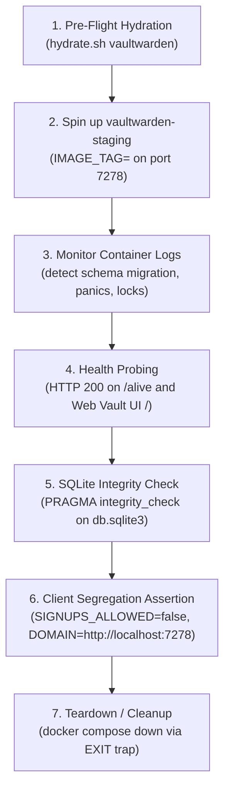

# Ephemeral Staging Architecture & Compose Profile Specification

This document defines the architecture, port allocation schema, isolation guarantees, and operational procedures for ephemeral staging environments across the `selfhosted` infrastructure on remote host `bjorn`.

---

## 1. Executive Summary & Design Principles

To adhere to **Axiom 2 (Zero Tolerance for Data Loss)** and **Axiom 3 (Radical Simplicity & Operational Humility)** of homelab governance, staging environments must fulfill four non-negotiable guarantees:

1. **Zero Runtime Overhead When Idle**: Staging services utilize native Docker Compose profiles (`profiles: ["staging"]`). By default, normal `docker compose up -d` invocations start only production workloads. Staging containers remain stopped when inactive, consuming 0% CPU and 0 MB RAM.
2. **Strict Resource Caps**: Every staging container is bound by hard kernel limits (`mem_limit: 256m`, `cpus: 0.50`), guaranteeing that experimental workloads or runaway scripts cannot starve production services.
3. **Complete Data & Network Isolation**: Staging containers write exclusively to isolated staging volumes (`actual-stage-data`, `vw-stage-data`) and communicate across an isolated bridge network (`staging-net`). Production databases and ingress networks are inaccessible from staging.
4. **Deterministic Port Schema**: Non-conflicting static host ports are assigned to staging services, avoiding collisions with production reverse proxies and internal routing.

---

## 2. Staging Port & Service Allocation Schema

| Service | Staging Container Name | Staging Host Port | Container Port | Production Host Port / Ingress | Resource Cap (RAM / CPU) | Persistent Volume |
| :--- | :--- | :--- | :--- | :--- | :--- | :--- |
| **Actual Budget** | `actual-server-staging` | **`5006`** | `5006` | Internal NPM routing (`https://budget.cloud.jacobmiller22.com`) | `256m` / `0.50` | `actual-stage-data` (`/data`) |
| **Vaultwarden** | `vaultwarden-staging` | **`7278`** | `80` | Host `7277` (`https://vw.cloud.jacobmiller22.com`) | `256m` / `0.50` | `vw-stage-data` (`/data`) |

---

## 3. Service Declarations & Compose Profile Configuration

Staging containers are declared directly within their respective subsystem Compose files (`actual/compose.yml` and `vaultwarden/compose.yml`) under `profiles: ["staging"]`.

### 3.1 Actual Budget Staging (`actual/compose.yml`)

```yaml
services:
  actual-server-staging:
    image: docker.io/actualbudget/actual-server:26.9.0
    container_name: actual-server-staging
    profiles: ["staging"]
    restart: unless-stopped
    ports:
      - "5006:5006"
    volumes:
      - actual-stage-data:/data
    networks:
      - staging-net
    mem_limit: 256m
    cpus: 0.50

networks:
  staging-net:

volumes:
  actual-stage-data:
```

### 3.2 Vaultwarden Staging (`vaultwarden/compose.yml`)

```yaml
services:
  vaultwarden-staging:
    image: vaultwarden/server:1.35.4
    container_name: vaultwarden-staging
    profiles: ["staging"]
    restart: unless-stopped
    environment:
      DOMAIN: "http://localhost:7278"
      SIGNUPS_ALLOWED: "false"
    volumes:
      - vw-stage-data:/data
    ports:
      - "7278:80"
    networks:
      - staging-net
    mem_limit: 256m
    cpus: 0.50

networks:
  staging-net:

volumes:
  vw-stage-data:
```

---

## 4. Isolation & Security Safeguards

### 4.1 Volume Segregation
- **Production Volumes**: `actual-data` and `vw-data` are mounted by production containers and automated backup runners (`actual-backup`, `vw-backup`).
- **Staging Volumes**: `actual-stage-data` and `vw-stage-data` are dedicated strictly to staging instances.
- **Backup Runner Isolation**: Automated backup runners never mount staging volumes, preventing test artifacts from polluting production Backblaze B2 snapshots.

### 4.2 Network Containment
- Staging containers attach to `staging-net` (an isolated bridge network).
- Production containers attach to `nginx-proxy-manager` for SSL ingress routing.
- This network boundary ensures staging containers cannot intercept production traffic or resolve production internal service names.

### 4.3 Staging Environment Safety Guards
- **Vaultwarden**: `SIGNUPS_ALLOWED: "false"` prevents unauthorized registration during staging tests. `DOMAIN` is bound to `http://localhost:7278`.
- **Actual Budget**: Default authentication protects staging data access; no ingress SSL certificates are provisioned for staging ports.

---

## 5. Operational Procedures & Remote Runbook

All commands execute on remote host `bjorn` via SSH wrappers per the Remote Host Verification Protocol (RHVP).

### 5.1 Syntax Verification
```bash
# Verify base production config (staging omitted)
docker compose -f actual/compose.yml config
docker compose -f vaultwarden/compose.yml config

# Verify staging profile config (staging included)
docker compose -f actual/compose.yml --profile staging config
docker compose -f vaultwarden/compose.yml --profile staging config
```

### 5.2 Launching Staging Containers
```bash
# Start Actual Budget staging container
ssh bjorn "docker compose -f /path/to/actual/compose.yml --profile staging up -d actual-server-staging"

# Start Vaultwarden staging container
ssh bjorn "docker compose -f /path/to/vaultwarden/compose.yml --profile staging up -d vaultwarden-staging"
```

### 5.3 Inspecting Staging Containers
```bash
# Check running status
ssh bjorn "docker ps --filter name=staging"

# Inspect staging container resource consumption
ssh bjorn "docker stats actual-server-staging vaultwarden-staging --no-stream"

# View staging logs
ssh bjorn "docker logs --tail 50 actual-server-staging"
ssh bjorn "docker logs --tail 50 vaultwarden-staging"
```

### 5.4 Stopping & Decommissioning Staging
```bash
# Stop staging containers (retains staging data in volume)
ssh bjorn "docker compose -f /path/to/actual/compose.yml --profile staging stop actual-server-staging"
ssh bjorn "docker compose -f /path/to/vaultwarden/compose.yml --profile staging stop vaultwarden-staging"

# Teardown staging container and destroy ephemeral volume
ssh bjorn "docker compose -f /path/to/actual/compose.yml --profile staging down -v"
```

---

## 6. Live Production Snapshot Hydration Engine (`tools/staging/hydrate.sh`)

The `tools/staging/hydrate.sh` utility automates fast, zero-downtime online snapshotting of production databases into dedicated staging volumes with guaranteed zero blast-radius to production.

### 6.1 Architectural Guarantees
1. **Online SQLite Snapshots**: Uses `sqlite3 <db> ".backup <dest>"` rather than raw file copies, guaranteeing clean page consistency without pausing active production services.
2. **Blast Radius Protection**: Enforces strict inequality between `PROD_DATA_DIR` and `STAGE_DATA_DIR`, rejecting unsafe root directories.
3. **Companion State Hydration**:
   - **Actual Budget**: Snapshots `account.sqlite` (or `server-files/account.sqlite`) and `user-files/*.sqlite`; copies `user-files/*.blob` client sync objects and metadata; enforces `1000:1000` filesystem ownership.
   - **Vaultwarden**: Snapshots `db.sqlite3`; copies `rsa_key.pem` (enforces `chmod 600`), `rsa_key.pub`, `attachments/`, `sends/`, and `config.json`.
4. **Integrity Validation**: Executes `PRAGMA integrity_check;` on all hydrated databases prior to declaring ready.

### 6.2 CLI Syntax & Invocations
```bash
# Hydrate Actual Budget staging volume
./tools/staging/hydrate.sh actual

# Hydrate and immediately boot staging container
./tools/staging/hydrate.sh actual --start

# Hydrate Vaultwarden staging volume and boot container
./tools/staging/hydrate.sh vaultwarden --start

# Wipe staging volume and re-hydrate fresh snapshot
./tools/staging/hydrate.sh --reset actual
./tools/staging/hydrate.sh --reset vaultwarden

# Stop staging container
./tools/staging/hydrate.sh --stop actual
./tools/staging/hydrate.sh --stop vaultwarden

# Dry-run preflight inspection
./tools/staging/hydrate.sh actual --dry-run
```

---

## 7. Vaultwarden Staging Upgrade & Schema Migration Runbook (`tools/staging/verify-vaultwarden-upgrade.sh`)

The `tools/staging/verify-vaultwarden-upgrade.sh` helper automates pre-flight staging upgrade testing, SQLite schema migration validation, and client segregation assertion against live snapshots before production deployment.

### 7.1 Upgrade Validation Steps



1. **Pre-flight Hydration**: Runs `tools/staging/hydrate.sh vaultwarden` to snapshot production `db.sqlite3`, `rsa_key.pem` (600), `rsa_key.pub`, attachments, and sends into `vw-stage-data`.
2. **Container Launch**: Boots `vaultwarden-staging` with candidate image tag on port `7278` (`IMAGE_TAG=<tag> docker compose -f vaultwarden/compose.yml --profile staging up -d vaultwarden-staging`).
3. **Log Monitoring**: Scans container logs for SQLite schema migration output, database lock errors (`DatabaseLocked`), or Rust panics.
4. **Health Probe**: Probes `http://localhost:7278/alive` for HTTP 200 OK and asserts Web Vault UI assets (`http://localhost:7278/`) load within timeout.
5. **SQLite Integrity Check**: Executes `PRAGMA integrity_check;` on the staging database (`vw-stage-data/db.sqlite3`), asserting output is `ok`.
6. **Client Segregation Validation**: Confirms staging configuration has `SIGNUPS_ALLOWED=false` and isolated domain `http://localhost:7278` so production mobile/browser clients do not receive push notifications or attempt sync.
7. **Guaranteed Teardown**: Automatically cleans up containers (`docker compose --profile staging down`) in a bash `EXIT` trap unless `--keep` is specified.

### 7.2 CLI Syntax & Operational Patterns

```bash
# Dry-run validation of upgrade to candidate version:
./tools/staging/verify-vaultwarden-upgrade.sh --dry-run 1.35.5

# Standard upgrade test on target host bjorn:
./tools/staging/verify-vaultwarden-upgrade.sh --host bjorn 1.35.5

# Test candidate image without re-hydrating snapshot:
./tools/staging/verify-vaultwarden-upgrade.sh --skip-hydrate 1.35.5

# Validate and keep staging container running for manual UI testing:
./tools/staging/verify-vaultwarden-upgrade.sh --keep 1.35.5
```

---

## 8. Ephemeral Staging Smoke Test Runner (`tools/backup-dr/staging-smoke-test.sh`)

The `tools/backup-dr/staging-smoke-test.sh` utility automates end-to-end failover drill verification. It spins up ephemeral staging containers on isolated networks, executes HTTP health probes, and guarantees complete cleanup via signal and exit traps.

### 8.1 Architecture & Verification Pipeline
1. **Isolated Network Provisioning**: Creates or attaches to isolated bridge network `staging-net`, ensuring zero network traffic escapes into production or reverse proxies.
2. **Resource Capping & Port Segregation**: Runs containers with 256m memory limits, 0.50 CPU, mapping ports `5006:5006` (Actual Budget) and `7278:80` (Vaultwarden).
3. **HTTP Health Probing**:
   - **Actual Budget**: Polls `http://localhost:5006/` asserting HTTP 200 or 302 within `--timeout <sec>` (default: 30s).
   - **Vaultwarden**: Polls `http://localhost:7278/alive` asserting HTTP 200 within `--timeout <sec>` (default: 30s).
4. **Log Inspection**: Inspects container logs for fatal panics or SQLite lock errors (`panic:`, `fatal error:`, `database is locked`).
5. **Guaranteed Teardown Traps**: Binds `ERR`, `EXIT`, `INT`, and `TERM` traps to guarantee container termination (`docker stop`, `docker rm -f`) and ephemeral network deletion, unless `--keep` is specified.
6. **Remote Host Execution**: Wraps commands in SSH when `--host <hostname>` is supplied, adhering to the Remote Host Verification Protocol (RHVP).

### 8.2 CLI Syntax & Invocations
```bash
# Run staging smoke tests for all services locally
./tools/backup-dr/staging-smoke-test.sh

# Run staging smoke test for Actual Budget only
./tools/backup-dr/staging-smoke-test.sh --service actual

# Run staging smoke test for Vaultwarden only
./tools/backup-dr/staging-smoke-test.sh --service vaultwarden

# Execute remotely on production host bjorn
./tools/backup-dr/staging-smoke-test.sh --host bjorn --timeout 30

# Test restored backup data directory and retain containers for debugging
./tools/backup-dr/staging-smoke-test.sh --data-dir /path/to/decrypted --keep

# Deterministic pre-flight simulation (no Docker daemon required)
./tools/backup-dr/staging-smoke-test.sh --dry-run
```

