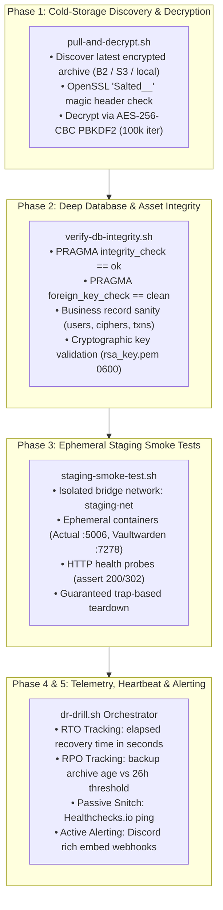

# Disaster Recovery (DR) Automated Drill & Verification Suite (`tools/backup-dr`)

A comprehensive, zero-blast-radius disaster recovery verification engine for self-hosted services. Automates cold-storage archive restoration, deep SQLite integrity analysis, and ephemeral staging container smoke tests with integrated RTO/RPO telemetry, active Discord failure alerting, and passive Dead Man's Snitch (Healthchecks.io) heartbeat detection.

---

## 1. Architecture Overview

The DR suite consists of three specialized validation layers orchestrated by the master drill runner:



### Components

1. **`pull-and-decrypt.sh`**:
   - Queries Backblaze B2, AWS S3, or local storage for the newest encrypted archive (`<service>-backup-%Y-%m-%d_%H-%M-%S.tar.gz.enc`).
   - Verifies the OpenSSL 8-byte `Salted__` magic header before decrypting.
   - Decrypts and unpacks into an isolated temporary scratchpad.
2. **`verify-db-integrity.sh`**:
   - Inspects decrypted SQLite databases across all services (`account.sqlite`, `user-files/*.sqlite`, `db.sqlite3`, `home-assistant_v2.db`, `database.sqlite`).
   - Asserts page integrity, foreign key consistency, business record counts, JSON syntax, and RSA private key permissions (`0600`).
3. **`staging-smoke-test.sh`**:
   - Creates an isolated Docker bridge network (`staging-net`).
   - Boots ephemeral containers with decrypted volumes on non-colliding staging ports (`5006`, `7278`).
   - Probes service endpoints for valid HTTP responses within configurable timeouts.
   - Cleans up ephemeral containers and networks upon exit or interrupt.
4. **`dr-drill.sh`**:
   - Master orchestrator driving Phases 1, 2, and 3.
   - Calculates Recovery Time Objective (RTO) and Recovery Point Objective (RPO).
   - Alerts if RPO exceeds 26 hours.
   - Posts failure alerts to Discord on errors and pings Healthchecks.io on success.

---

## 2. RTO & RPO Telemetry Tracking

- **Recovery Time Objective (RTO)**:
  - Measures the exact start-to-finish elapsed time in seconds from initial archive discovery to successful health check response.
  - Formula: $\text{RTO} = t_{\text{completion}} - t_{\text{start}}$
- **Recovery Point Objective (RPO)**:
  - Measures data freshness by calculating the age of the newest decrypted backup archive:
    $$\text{RPO} = t_{\text{current}} - t_{\text{backup\_timestamp}}$$
  - **SLA Threshold**: A warning alert is raised if the backup archive is older than **26 hours** (`RPO_MAX_HOURS=26`), ensuring daily backup schedules are functioning as expected.
  - With `--fail-on-rpo`, the drill exits with code `5` if the RPO SLA is breached.

---

## 3. Monitoring & Alerting Mechanics

### Active Failure Alerting (Discord Webhooks)
- Trapped on bash `ERR`, `EXIT`, `INT`, and `TERM`.
- When an assertion or command fails in any step:
  1. The failing step name (e.g. `pull-and-decrypt-actual`, `verify-db-integrity-vaultwarden`, `staging-smoke-test`), exit code, and line number are captured.
  2. The last 20 lines of the drill log are extracted.
  3. A rich red Discord embed is dispatched to `DISCORD_WEBHOOK_URL` containing host metadata, error trace, and log snippet.

### Passive Silence Detection (Dead Man's Snitch / Healthchecks.io)
- Upon 100% clean drill completion, the orchestrator pings `HEALTHCHECK_DR_PING_URL`:
  ```bash
  curl -fsS -m 10 --retry 3 "${HEALTHCHECK_DR_PING_URL}"
  ```
- If the drill crashes, hangs, or fails to run due to host downtime or cron daemon failure, Healthchecks.io alerts on-call operators when the scheduled heartbeat window expires.

### Success Telemetry Embed
- On clean completion, an optional green Discord embed reports:
  - RTO duration in seconds
  - RPO backup age in hours and seconds
  - Verified service list
  - Execution host and UTC timestamp

---

## 4. CLI Usage & Options

```bash
./tools/backup-dr/dr-drill.sh [OPTIONS]
```

### Options Reference

| Option | Argument | Description | Default |
| :--- | :--- | :--- | :--- |
| `-s, --service` | `<name>` | Service to drill: `actual`, `vaultwarden`, or `all` | `all` |
| `--source` | `<type>` | Archive source: `b2`, `s3`, `local`, `file` | Auto-detected |
| `-b, --backup-dir`| `<path>` | Directory containing local backup archives | `/backups` |
| `-f, --file` | `<path>` | Path to a specific backup archive file | None |
| `-d, --data-dir` | `<path>` | Path to pre-decrypted test data (used with `--skip-pull`) | None |
| `--skip-pull` | None | Skip archive download & decryption; test data in `--data-dir` | `false` |
| `--dry-run` | None | Simulate drill pipeline without starting Docker containers | `false` |
| `--host` | `<hostname>` | Remote host for execution via SSH (Remote Host Verification Protocol) | `local` |
| `-t, --timeout` | `<sec>` | Timeout in seconds for container health probes | `30` |
| `-k, --keep` | None | Retain temporary scratchpad files and staging containers | `false` |
| `-p, --passphrase`| `<val>` | Decryption passphrase (overrides env vars) | None |
| `--webhook-url` | `<url>` | Discord webhook URL for alerts | `DISCORD_WEBHOOK_URL` |
| `--ping-url` | `<url>` | Healthchecks.io / Snitch ping URL | `HEALTHCHECK_DR_PING_URL` |
| `--rpo-max-hours`| `<hrs>` | Max allowable RPO age in hours before alert | `26` |
| `--fail-on-rpo` | None | Fail drill (exit code 5) if RPO threshold is breached | `false` |
| `--calculate-rpo`| `<target>` | Helper: Compute RPO metrics for target timestamp/file and exit | None |
| `--calculate-rto`| `<s,e>` | Helper: Compute RTO elapsed seconds from start/end epoch and exit | None |
| `-h, --help` | None | Display help message and exit | None |

### Exit Codes

| Exit Code | Constant | Meaning |
| :---: | :--- | :--- |
| `0` | `EXIT_OK` | All validation phases passed cleanly (100% verified) |
| `1` | `EXIT_USAGE_ERR` | CLI argument syntax, option parsing, or validation error |
| `2` | `EXIT_PULL_FAIL` | Backup archive pull or decryption failure |
| `3` | `EXIT_INTEGRITY_FAIL`| SQLite integrity, foreign key check, or storage check failure |
| `4` | `EXIT_SMOKE_FAIL` | Ephemeral staging container spin-up or health check failure |
| `5` | `EXIT_RPO_FAIL` | RPO SLA threshold breached (with `--fail-on-rpo`) |
| `6` | `EXIT_PING_FAIL` | Healthchecks.io heartbeat ping failed |

---

## 5. Environment Variables

| Variable | Required | Description |
| :--- | :---: | :--- |
| `BACKUP_PASSPHRASE` | Yes (for pull) | Primary decryption passphrase for OpenSSL PBKDF2. |
| `BACKUP_ENCRYPTION_KEY` | Optional | Fallback decryption passphrase. |
| `DISCORD_WEBHOOK_URL` | Optional | Discord webhook URL for failure alert embeds. |
| `HEALTHCHECK_DR_PING_URL` | Optional | Healthchecks.io / Dead Man's Snitch ping endpoint. |
| `BACKUP_DEST_BUCKET` | For B2/S3 | S3/B2 bucket name storing remote archives. |
| `BACKUP_DEST_ENDPOINT` | For B2/S3 | S3/B2 endpoint URL (e.g. `s3.us-east-005.backblazeb2.com`). |
| `BACKUP_DEST_ACCESS_KEY_ID` | For B2/S3 | S3/B2 Access Key ID. |
| `BACKUP_DEST_SECRET_ACCESS_KEY` | For B2/S3 | S3/B2 Secret Access Key. |
| `RPO_MAX_HOURS` | Optional | Maximum allowed backup age in hours (default: `26`). |
| `TARGET_HOST` | Optional | Target host for remote execution via SSH (e.g. `bjorn`). |

---

## 6. Scheduling & Automation

### Automated Weekly Crontab (Host `bjorn`)
Run the DR verification drill every Sunday at 03:00 UTC:

```cron
# /etc/cron.d/dr-drill
SHELL=/bin/bash
PATH=/usr/local/sbin:/usr/local/bin:/usr/sbin:/usr/bin:/sbin:/bin

# Run disaster recovery verification drill weekly at 03:00 UTC
0 3 * * 0 root /data/coolify/source/tools/backup-dr/dr-drill.sh --service all >> /var/log/dr-drill.log 2>&1
```

### Coolify Scheduled Task
In the Coolify dashboard under Infrastructure Tasks:
1. **Name**: `Disaster Recovery Automated Drill`
2. **Schedule**: `0 3 * * 0` (Weekly on Sunday at 03:00 UTC)
3. **Command**:
   ```bash
   bash /data/coolify/source/tools/backup-dr/dr-drill.sh --service all
   ```
4. **Environment Variables Injected via Coolify**:
   - `BACKUP_PASSPHRASE`
   - `DISCORD_WEBHOOK_URL`
   - `HEALTHCHECK_DR_PING_URL`
   - `BACKUP_DEST_BUCKET`
   - `BACKUP_DEST_ENDPOINT`
   - `BACKUP_DEST_ACCESS_KEY_ID`
   - `BACKUP_DEST_SECRET_ACCESS_KEY`

### Healthchecks.io Setup
1. Create a check on [Healthchecks.io](https://healthchecks.io) named `DR Drill - Automated Failover Verification`.
2. Set schedule to **Weekly (every 7 days)** with a **2-hour grace period**.
3. Copy the ping URL and configure as `HEALTHCHECK_DR_PING_URL`.
4. Configure integrations (e.g. Discord, PagerDuty, email) to alert if the ping is missed.

---

## 7. Verification & Local Testing

```bash
# Display help and options:
./tools/backup-dr/dr-drill.sh --help

# Run a dry-run execution (simulates pipeline without starting containers):
./tools/backup-dr/dr-drill.sh --dry-run

# Run against pre-decrypted test data:
./tools/backup-dr/dr-drill.sh --skip-pull --data-dir /tmp/test-data --dry-run

# Calculate RPO for an archive:
./tools/backup-dr/dr-drill.sh --calculate-rpo "actual-backup-2026-09-18_15-30-00.tar.gz.enc"

# Run automated pytest test suite:
python3 -m pytest tests/test_dr_drill.py -v
```
